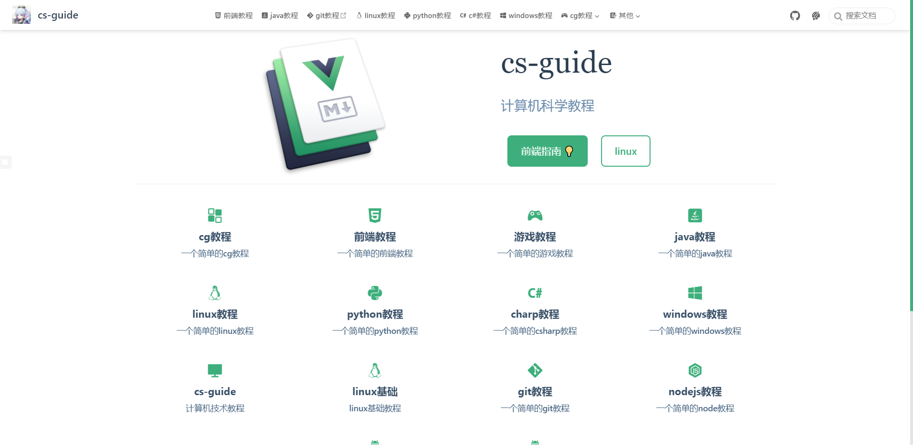

# cs-guide

运行

```bash

# 启动
pnpm  docs:dev

# 打包
pnpm  docs:build

```

## 其他相关

- [计算机技术教程](https://yzqdev.github.io/cs-guide/)
- [网道教程](https://yzqbooks.github.io/wangdoc)

 

## License

MIT License © 2022 [yzqdev](https://github.com/yzqdev)

## 鸣谢

- 感谢 JetBrains 提供的免费开源 License：  


