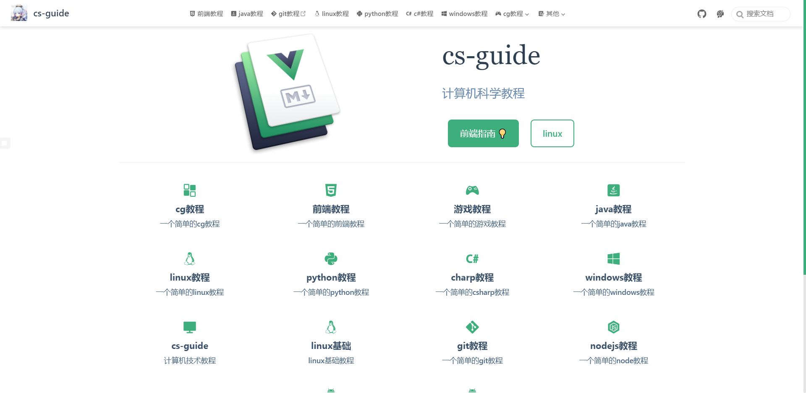

# cs-guide

计算机技术教程站。基于 VuePress 2 + vuepress-theme-hope 的静态文档站，汇总 15 个板块、约 1,286 篇技术笔记。

**线上地址**：https://yzqdev.github.io/cs-guide/



## 这是什么

`docs/` 目录下每篇 Markdown 就是站点上的一页。没有后端、没有 API、没有数据库，
全部内容随仓库一起提交，push 到 `main` 后由 GitHub Actions 自动构建并发布到 GitHub Pages。

站点能力：明暗主题切换、页内目录、Algolia 全文搜索、PWA 安装、Giscus 评论、iconify 图标。

## 目录结构

```text
cs-guide/
├── docs/                  # 全部内容，也是 VuePress 的 docsDir
│   ├── .vuepress/         # 站点配置层（唯一的代码）
│   │   ├── config.ts      # base / dest / markdown / bundler
│   │   ├── themeConfig.ts # 主题、导航、高亮、PWA、插件开关
│   │   ├── client.ts      # element-plus 注入 + 自定义组件注册
│   │   ├── navbar.ts      # 顶部导航
│   │   ├── sidebar.ts     # 侧边栏
│   │   ├── components/    # 自定义 Vue 组件
│   │   ├── styles/        # 样式（只有 index.scss 生效）
│   │   └── public/        # 静态资源
│   └── <15 个教程板块>/    # 每个板块根下有一个 README.md 作为入口
├── .github/workflows/     # GitHub Pages 部署
├── res/                   # 本文件用到的图片
└── package.json
```

`dist/` 是构建产物，已被 `.gitignore` 忽略，不入库。

## 环境要求

| 项 | 版本 |
|---|---|
| Node.js | 24 及以上（CI 固定 Node 24） |
| pnpm | 通过 corepack 启用 |
| 包管理 | pnpm（lockfile 为 `pnpm-lock.yaml`） |

## 快速开始

需要 pnpm。没有的话先用 corepack 启用：

```bash
corepack prepare pnpm@latest --activate
```

然后安装依赖并启动：

```bash
pnpm install
pnpm docs:dev
```

浏览器访问 http://localhost:8989/cs-guide/ （注意带 `/cs-guide/`，因为 `base` 不是根路径）。

## 常用命令

| 命令 | 作用 |
|---|---|
| `pnpm docs:dev` | 启动开发服务器，端口 8989 |
| `pnpm docs:build` | 构建产物到 `dist/` |
| `pnpm docs:clean-dev` | 清缓存后启动开发服务器 |
| `pnpm docs:update-package` | 升级 VuePress 相关依赖 |
| `pnpm lint` | Prettier 格式化整个 `docs/` |

`pnpm lint` 会重写 `docs/` 下所有 Markdown。当前绝大多数文件与 Prettier 3 的默认规则不一致
（行尾、列表内两空格硬换行、表格列宽都会被改动），跑一次会产生覆盖大半仓库的 diff，
**除非你就是要做一次全量格式化，否则不要随手执行**。

## 板块一览

| 板块 | 入口 |
|---|---|
| 前端 | [frontend](./docs/frontend/) |
| Java | [java-tutor](./docs/java-tutor/) |
| Node.js | [node-tutor](./docs/node-tutor/) |
| Go | [go-tutor](./docs/go-tutor/) |
| C# | [csharp-tutor](./docs/csharp-tutor/) |
| Python | [python-tutor](./docs/python-tutor/) |
| Kotlin | [kotlin-tutor](./docs/kotlin-tutor/) |
| Linux | [linux-tutor](./docs/linux-tutor/) |
| Windows | [windows-tutor](./docs/windows-tutor/) |
| Git | [git-tutor](./docs/git-tutor/) |
| Minecraft | [mc-tutor](./docs/mc-tutor/) |
| Android | [android-tutor](./docs/android-tutor/) |
| Android 技巧 | [android-tips](./docs/android-tips/) |
| Flutter | [flutter-tutor](./docs/flutter-tutor/) |
| 技巧合集 | [cs-tips](./docs/cs-tips/) |

新增板块需要在 `docs/.vuepress/navbar.ts` 和 `docs/.vuepress/sidebar.ts` 各加一项。

## 本地开发说明

- **不要改 `base`**。`config.ts` 里的 `base: '/cs-guide/'` 对应 GitHub Pages 子目录部署，
  改成 `/` 构建能通过，但线上所有资源都会 404。
- **主题插件不是本地目录**。插件全部来自 npm 依赖，在 `themeConfig.ts` 的 `plugins` 段开关；
  仓库里没有 `plugins/` 目录。
- **新增全站可用组件**：在 `docs/.vuepress/components/` 写 `.vue` 文件，
  然后在 `client.ts` 里 import 并 `app.component()` 注册，Markdown 里直接写标签名即可。
- **自定义样式**：写在 `docs/.vuepress/styles/index.scss`。同目录的其他 scss 不会被自动加载。
- **代码高亮**：使用 Prism.js（`themeConfig.ts` 的 `markdown.highlighter`），不是 Shiki。
- **没有测试**。验证改动靠本地起站看页面，或跑一次 `pnpm docs:build`。
- **`/android-tutor/` 的侧边栏是手写列表**，在这个板块加文章要同步改 `sidebar.ts`；
  其余 14 个板块是 `structure` 自动模式，无需改配置。

## 相关站点

- [计算机技术教程](https://yzqdev.github.io/cs-guide/)
- [网道教程](https://yzqbooks.github.io/wangdoc)
- [java编程思想](https://yzqbooks.github.io/think-in-java/)
- [css 教程](https://yzqdev.github.io/html-tutor)
- [node 教程](https://yzqdev.github.io/node-docs)

## License

MIT License © 2022-present [yzqdev](https://github.com/yzqdev)

## 鸣谢

感谢 JetBrains 提供的免费开源 License：


