# dart数据类型

## 声明变量类型

变量声明总结

- var: 如果没有初始值，可以变成任何类型
- dynamic:动态任意类型，编译阶段不检查类型
- Object 动态任意类型，编译阶段检查类型
区别：  
唯一区别 var 如果有初始值，类型被是锁定

> 注意:final 可以不用先赋值，const 声明时必须赋值，不然会报错，

## 变量类型

来自[https://juejin.cn/post/6844903683147169800](https://juejin.cn/post/6844903683147169800),作者:cekiasoo

### 一、Dart 有哪些数据类型

Dart 内置的数据类型有描述数字的 int 和 double，字符串的 String 类型，布尔 bool 类型，列表 List 类型，具有映射关系的  Map 类型。

### 二、数字类型

数字类型有 int 和 double 还有 num，

#### （一）int 类型

int 是 整型，即整数，如 1， 2， 10， 20 等

```dart
int number = 10;
```

或

```dart
var number = 10;
```

#### （二）double 类型

double 是浮点型，即包含小数的，如 0.1，0.2，10.1， 10.2 等,

```dart
double number = 10.1;
```

或

```dart
var number = 10.1;
```

double 是包含小数类型的，如果赋予整数会报错

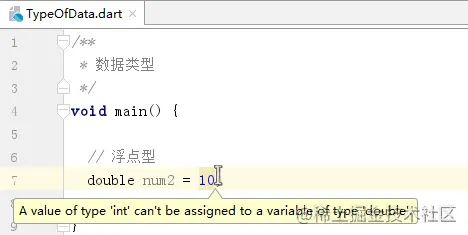

#### （三）num 类型

num 可以是整数或浮点数的类型，毕竟 num 是 int 和 double 的父类，

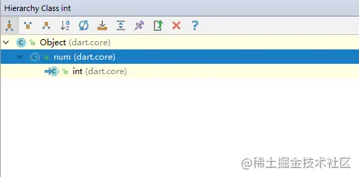

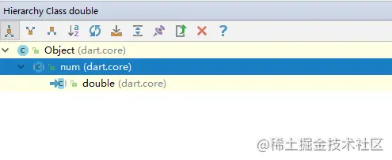

再来看一下 num 源码中的注释是怎么说的，嗯，整数或浮点数

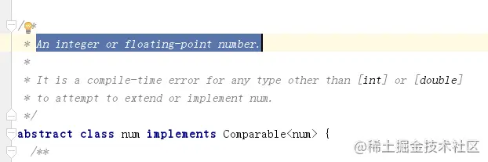

num 是可以这样定义的

```dart
num number = 1;
```

或浮点型

```dart
num number = 1.01;
```

num 既然可以是整型或浮点型，那么 num 类型的变量赋了整型的数也可以改为浮点型的数，

```dart
num number = 1;
num number = 1.01;
```

这样做是没问题的，

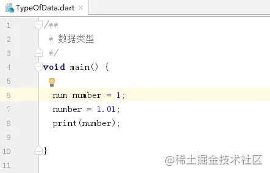

运行也是没问题的

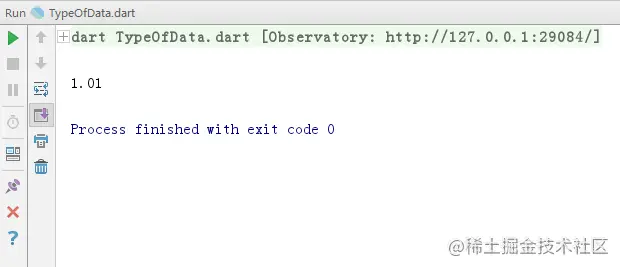

### 三、字符串类型

字符串类型在 Dart 中是用 String 表示，数据用单引号或双引号扩起来，

```dart
String name = 'xiaoming';
```

或

```dart
String name = "xiaoming";
```

也可以用 var

```dart
var name = 'xiaoming';
```

字符串还有一种是多行字符串用 '''（三个单引号） 或 """（三个双引号） 括起来，可以多行而不报错，

```dart
  String description = '''
  这
  是
  描述''';
```

或

```dart
  String description = """
  这
  是
  描述""";
```

输出到控制台也是多行的，

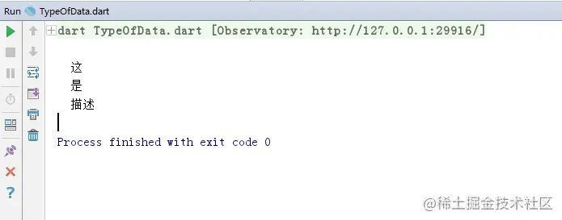

字符串类型还可以用 $ 和其他类型拼接，

```dart
  int a = 1;
  String str = "a = $a";
  print(str);
```

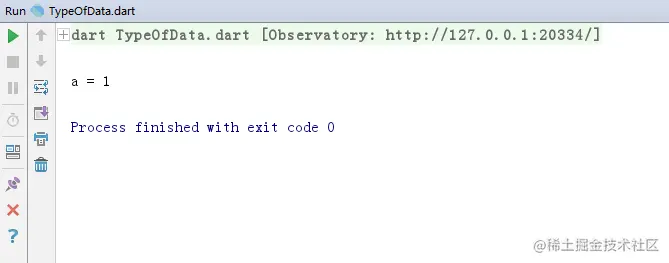

### 四、布尔类型

布尔类型比较简单，它的值只有 true 或 false，在 Dart 中用 bool 表示，

```dart
bool error = false;
```

或

```dart
bool error = true;
```

### 五、列表类型

列表简单来说就是存放着排成一列的数据，可以理解为一个存放数据的容器，列表中的每个数据称为元素，在 Dart 中用 List 表示，数据用 "[]" 括起来，元素之间用 "," 隔开，如果不指定 List 中存放的数据类型的话是可以存放任意类型的数据的，

```dart
List list = ['a', 'b', 'c', 1, 2, 3, true, false];
```

列表可以直接用 print 输出到控制台，

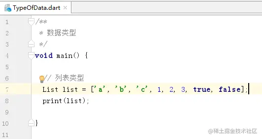

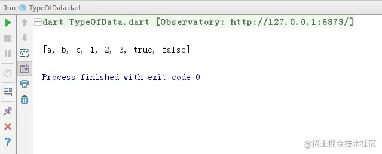

如果想要获取列表中的某个元素，可以用 列表名[元素在列表中的位置] 获取，列表元素的第一个位置是从 0 开始的，所以想要获取第一个位置的元素就是

```dart
List list = ['a', 'b', 'c'];
var element = list[0];
```

获取元素时，位置不能大于列表存放元素的个数 - 1，也不能小于 0，即位置的取值范围是 [0, 元素的个数 - 1]，全闭区间，超过列表存放元素的个数 - 1 或小于 0 是会报错的，比如列表存放着 3 个数据，取的时候用 list[5] ，5 比 3-1 大，会报错，

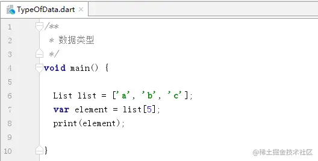

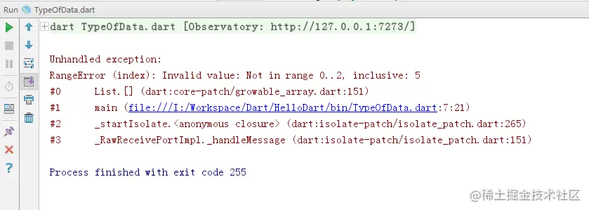

列表的元素个数可以用 列表名.length 获取

```dart
int length = list.length;
```

如果只想存一种数据类型的数据，那要借助泛型，

```dart
List<String> list3 = <String>['a', 'b', 'c'];
```

添加别的元素就会报错，

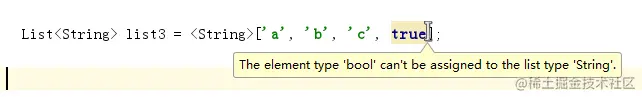

### 六、Map 类型

Map 就是存放具有键值对关系的数据的容器，在 Dart 中就是用 Map 表示，键是唯一的，值可以不相同，比如人的身份证，身份证号是唯一的，名字可以相同，如果两个人的身份证号相同那就乱了，Map 的数据是用 "{}" 括起来，里面的数据用 "键 : 值", 数据之间用 "," 隔开，如果没指定数据类型，键值的数据类型可以是任意的，

```dart
Map map = {'Apple' : '苹果', 'Banana' : '香蕉', 'Peach' : '桃子', 1 : '1', true : 0};
```

Map 也是可以直接用 print 输出的，

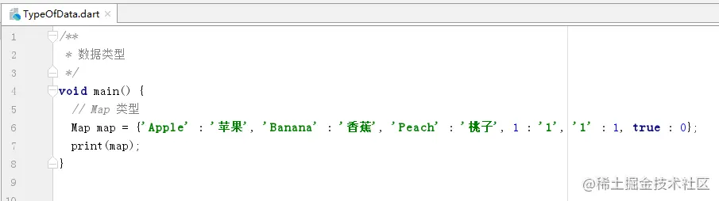

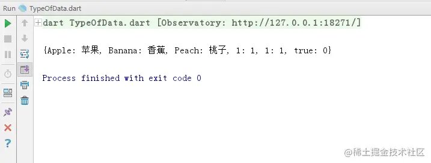

想获取某个键的值就用 "Map的名['键的名']"

```dart
Map map = {'Apple' : '苹果', 'Banana' : '香蕉', 'Peach' : '桃子'};
String value = map['Apple'];
print(value);
```

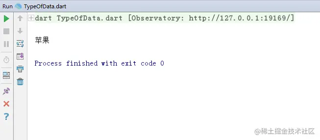

Map 的键和值的数据类型也可以是指定的，

```dart
Map<int, String> map = <int, String>{1 : 'a', 2 : 'b', 3 : 'c'};
```

存放其他的类型是会报错的，

```dart
Map<int, String> map2 = <int, String>{1 : 'a', 2 : 'b', 3 : 'c', 4 : 'd', '5' : 'e'};
```

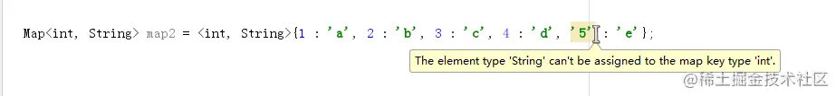
