# 线刷

开始之前先来科普一下，了解的可以略。什么是深度刷机？我们都知道Recovery卡刷，Fastboot线刷，而深度刷机则是比这二者更为底层的刷机方式，和处理器挂钩。理论上只要你手机硬件没坏，就可以深刷救砖。
深刷也是一个模式，需要用按键或者拆机短接方式进入，不同手机进入方法也不同。当然刷机失误把系统底层搞坏也是有可能自动进深刷的。需要注意的是，进入深刷时手机是黑屏无显示的，连接电脑在设备管理器里可见相应端口（前提装好驱动）。比如高通骁龙的深刷模式-9008

9008端口

当然联发科也有。

联发科深刷端口

如果你手机连接电脑出现以上端口，则说明手机当前处在深刷模式。
特别说明，通常情况下联发科的深刷端口是不稳定的，可能只出现1秒或几秒就断开了，只有通过Bypass处理后才能稳定住。连接到深刷端口后电脑也不会提示发现某某手机。所以不要认为电脑没啥反应就是识别不到设备。就我红米Note8Pro来说，如果刷机不当导致黑屏怎么按键都没反应，连电脑只闪呼吸灯，那就是进深刷了。
在什么情况下需要深刷救砖？比如连Fastboot都进不去，或者能进Fastboot但是BL上锁无法线刷（深刷无视BL锁），或者Fastboot线刷失败，或者干脆直接就自动进深刷了（也就是所谓黑砖）。总之就是常规救砖方法不管用的时候。
我们都知道，小米对深刷设了权限，只有售后有权限操作，这就很不方便。更何况很多售后根本就不会刷机，找去就是换主板。下面即将介绍的就是红米Note8Pro，红米6，红米6A，小米Play四款联发科机型的免售后深刷方法（以我的红米Note8Pro为例，其他机型方法相同）。
————————
首先准备一根连接稳定，能传输数据的数据线（最好是原厂线），一台电脑，电脑上预先准备好你手机的官方线刷包并解压，还有MiflashPro，MTK Bypass，LibUSB驱动，以及一双灵巧的双手。
小米官方线刷包下载地址：[查看链接](http://www.miui.com/shuaji-393.html)
最新版MiflashPro下载链接：[查看链接](https://kamiui.ml/E52shuaji/☆工具软件/MiFlash/MiFlash_Pro_v6.3.318.42_EN_Setup.exe?preview)
（注：MiflashPro版本过低可能导致刷机失败，请升级到最新版）
MTK Bypass和LibUSB：[查看链接](https://syxz.lanzous.com/b01cb80be) （密码:5yp9）
链接失效请评论区或私信告诉我。
————————
首先打开MiflashPro。登不登陆都可以。

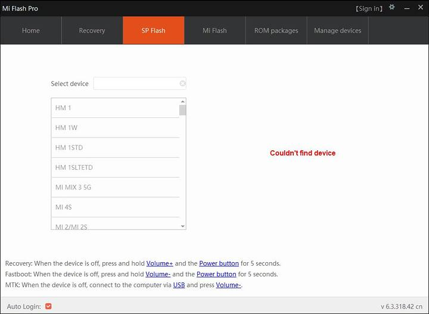

MiflashPro

点击上方SP Flash

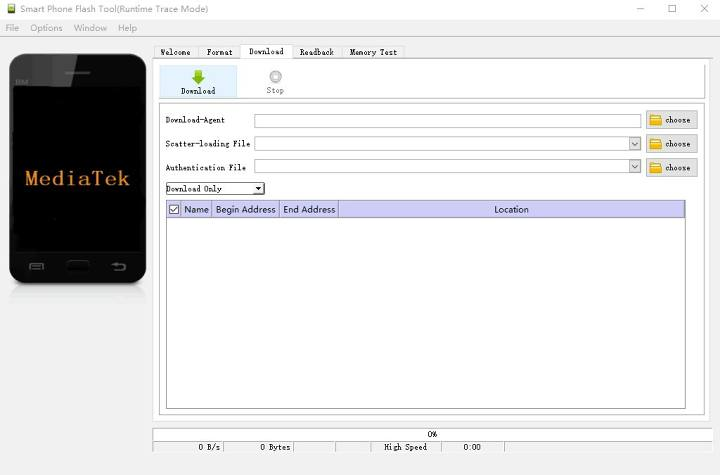

SP Flash

上面有三个选择项，先选第二个

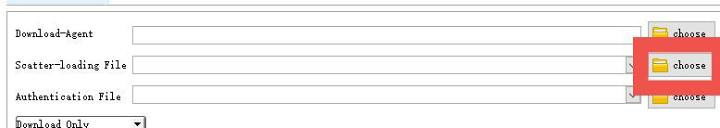

这个文件要在你解压后的的线刷包里找。在线刷包的images文件夹里，选择MTxxxx_Android_scatter.txt

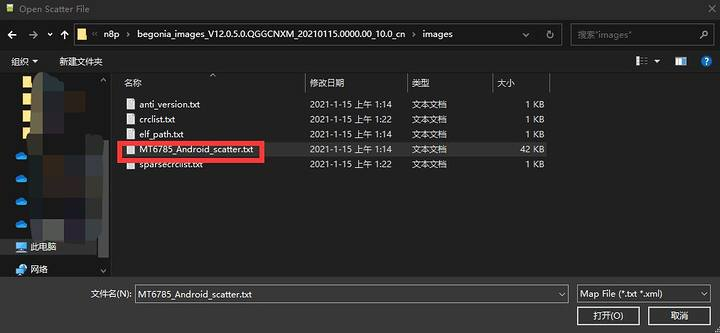

然后开始自动加载（校验）刷机包

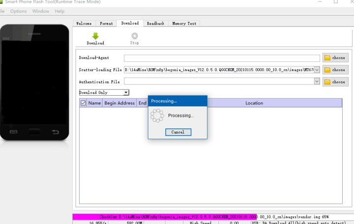

完成后再选择第一项

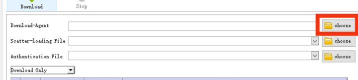

选择DA

这一项在SP Flash的软件目录里找。其实也不用找，一开始就自动定位到那个位置了。选择图示DA文件即可。

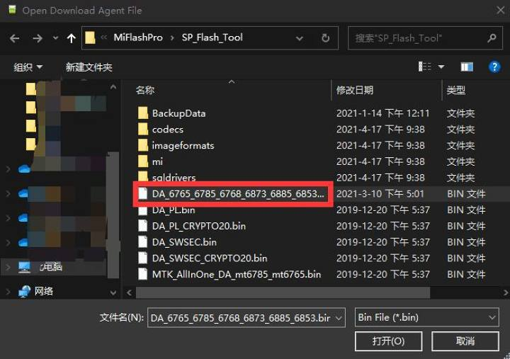

选择好后应该是这样的：

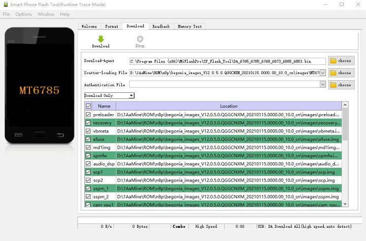

SP Flash准备就绪

下面安装LibUSB驱动，一路Next即可。

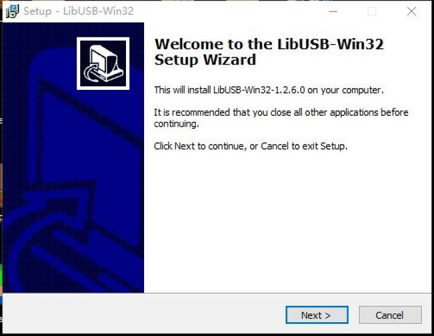

直到最后出现这个界面

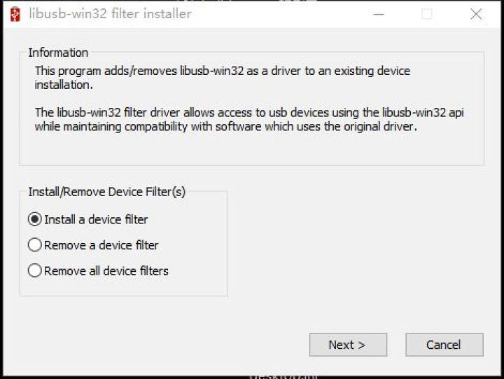

然后点击Cancel结束即可。
接着打开MTK Bypass

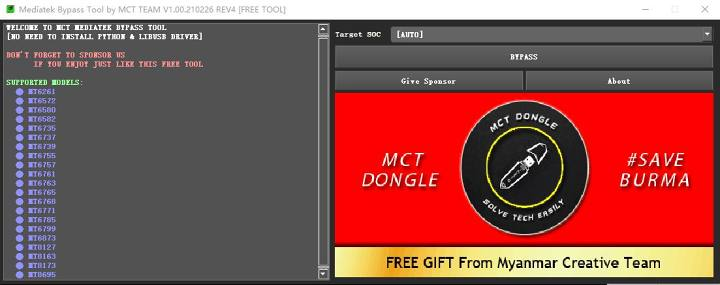

MTK Bypass

右上方选择一下你手机的处理器，红米Note8Pro是MT6785，红米6是MT6762，红米6A是MT6761，小米Play是MT6765。当然你懒得选也可以AUTO，但是可能报错。
然后点击BYPASS。杀软可能拦截，请放行。

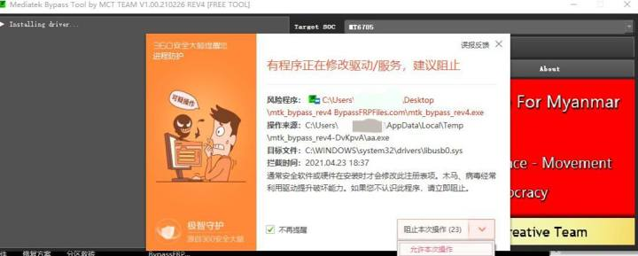

然后正常来说是这样的

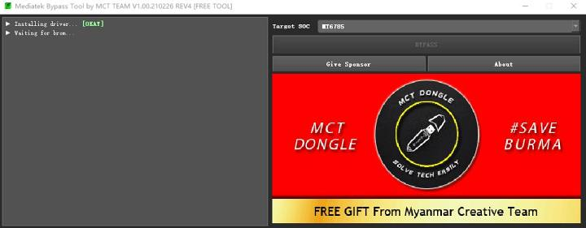

正在等待设备连接

这时，手机连接电脑进入深刷（红米Note8Pro的方法是长按电源键和音量加和音量减，不管手机什么状态在什么模式，直接按着等着就行了。别的机型我不清楚，有知道的机友可以在评论区告诉我）。
然后当MTK Bypass检测到端口，会自动完成处理。正常来说应该是这样的。

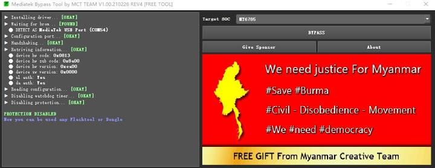

如果中间出现了红色报错，就重新点击BYPASS，再进一次重试。直到没有报错。
端口处理好后就不用按键了，可以松手了。现在你的手机已经稳定在了深刷模式。如果这时打开设备管理器就可以看到联发科深刷端口。

这个COM多少无所谓的

然后回到SP Flash，点击左上方绿色的Download。

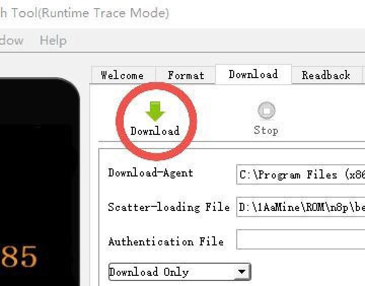

然后很快，左侧读取到设备信息，底部的进度条开始走动，刷机开始了。

因为我没刷，所以直接拿了无心的图

这里解释一下，这个Download的意思是把刷机包从电脑下载到手机，而不是通常所说的从网上下载。
最后刷机完成会出现大对勾。

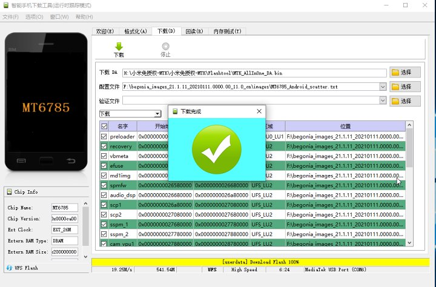

因为我没刷，所以直接拿了无心的图

然后就可以拔线开机啦!救砖完成
————————
深刷会清除所有数据且上锁BL。不过如果你之前解过锁是不需要等168的。
最后特别说明，方法虽好，但搞机还是要谨慎，NO ZUO NO DIE。希望大家永远也不会用到这个方法。
