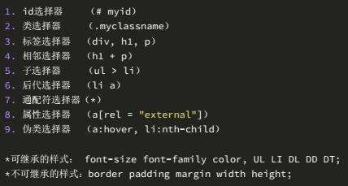
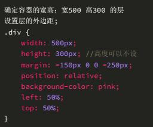
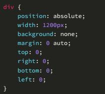
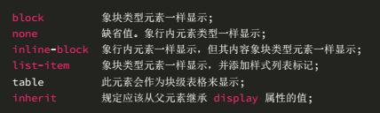
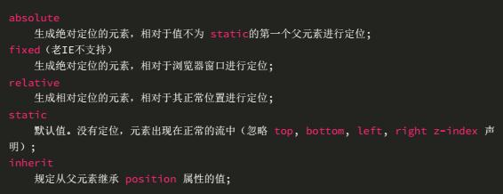
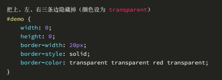
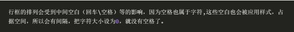
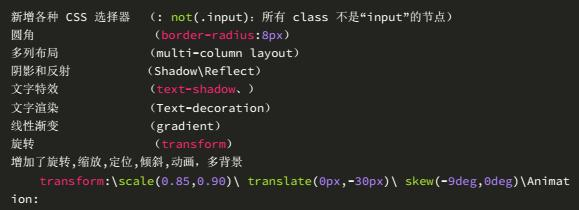

# 前端—css面试题

小海dedede 2017-03-17 16:31:18

1、CSS 选择符有哪些？

2、CSS 优先级的选择过程？

优先级复合就近原则，同权重的情况下有限选择最近的属性。

载入样式的话是以最后载入的定位为准。

优先级：

!important > id > class > tag（important要优先于内联样式）

3、阐述一下CSS3的新增伪类。

4、如何居中 div？如何居中一个浮动元素？如何让绝对定位的div居中？

div居中：给div一个宽度，然后添加margin: 0 auto;属性即可。

浮动元素居中：

绝对定位的div居中：

5、属性display 有哪些值？说明他们的作用。

6、position 的值 relative 和 absolute 定位原理？

7、用纯CSS 创建一个三角形的过程？

8、li 与 li 之间有看不见的空白间隔如何形成的？相应的解决办法？

9、为什么要初始化CSS样式？

因为浏览器的兼容性问题，不同的浏览器对某些标签有自己的默认值，如果没有实现css的初始化，也就是没有解决浏览器的兼容性问题，那么会造成页面在不同浏览器下显示差异的问题。

10、CSS3 有哪些新特性？

- [CSS](https://www.toutiao.com/search/?keyword=CSS)
- [科技](https://www.toutiao.com/search/?keyword=%E7%A7%91%E6%8A%80)
