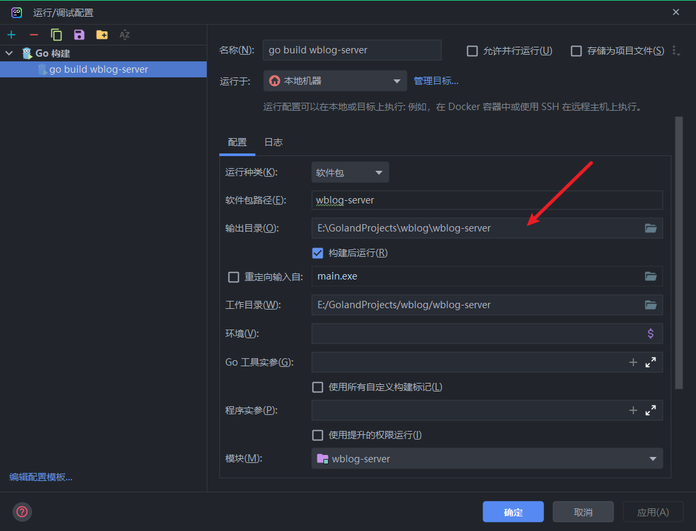

# golang配置

不配置gopath的话,gopath默认为   ~/go   这个文件夹

```shell
go env -w GO111MODULE=on
go env -w GOPROXY=https://goproxy.cn,direct

# 建议不要把gopath设置为go安装文件夹内
go env -w GOPATH=d:\golangmod
```

windows最后golang的全局配置会被保存在   `~\AppData\Roaming\go`这个位置
GO环境变量配置：

```shell
$GOROOT=/usr/local/go                        GO安装目录
$GOPATH=/usr/local/var/www/go          GO工作目录
$GOBIN=$GOPATH/bin                          GO可执行文件目录
$PATH=$PATH:$GOBIN:$GOROOT/bin  将GO可执行文件加入PATH中，使GO指令与我们编写的GO应用可以全局调用

```

​

## 安装air

打开网站[https://github.com/cosmtrek/air/releases](https://github.com/cosmtrek/air/releases)
下载i适合自己运行文件，然后放到 gopath下的bin文件夹(windows和linux默认在用户文件夹下的go文件夹)

```shell
go install github.com/cosmtrek/air@latest
```

## 安装 gf-cli

```shell
wget https://goframe.org/cli/linux_amd64/gf && chmod +x gf && ./gf install
```

## 快速记忆golang日期格式化

```shell
2006-01-02 15:04:05
```

仔细观察这个日期，06年，1月2日下午3点4分5秒，查阅相关资料还有 -7时区，Monday，数字1~7都有了，而且都不重复。

## 添加swaggerui

> 在go-swagger的github下载

地址：[https://github.com/go-swagger/go-swagger/releases](https://github.com/go-swagger/go-swagger/releases)

> 自行编译

```shell
go get https://github.com/go-swagger/go-swagger
# 然后进入您的gopath目录找到go-swagger 目录进入
# 执行
go install ./cmd/swagger
# 然后就会在go的bin目录或者其gopath的bin目录生成一个swag的可执行文件
# 在项目目录执行
swag init
# 就可以生成swaggerui的doc了
```

## 使用goland

配置编译go build

