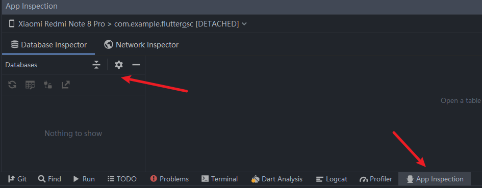

# 一些小技巧

## 改包名

在 Flutter 中，并没有统一地修改图标、应用名称和包名的地方，所以要在各自语言对应的地方进行修改:

### 包名

- Android 是在 `android` ▸ `app` ▸ `src` ▸ `main` ▸ `AndroidManifest.xml` 中修改`package="xxx.xxx.xxx"`;
  以及在 `android` ▸ `app` ▸ `src` ▸ `build.gradle`中修改`applicationId "xxx.xxx.xxx"`;
  并且需要修改`android` ▸ `app` ▸ `src` ▸ `main` ▸ `......` ▸ `MainActivity.java`对应的包路径
- iOS 在 `ios` ▸ `Runner` ▸ `Info.plist` 中修改`CFBundleIdentifier`对应的Value

写法与原生相同，并且可以不一致。

> PS:不推荐修改包名，包名最好在项目开始时定下...之后修改可能会出点什么小问题...

### 应用名称

- Android 是在 `android` ▸ `app` ▸ `src` ▸ `main` ▸ `AndroidManifest.xml` 中修改`android:label="XXX"`;
- iOS 在 `ios` ▸ `Runner` ▸ `Info.plist` 中修改`CFBundleName`对应的Value

### 图标

- Android 在`android` ▸ `app` ▸ `src` ▸ `res` ▸ `mipmap-...` 文件夹中替换相应图片
- iOS 在 `ios` ▸ `Runner` ▸ `Assets.xcassets` ▸ `AppIcon.appiconset`文件夹中替换相应尺寸的图片， 如果使用不同的文件名，那还必须更新同一目录中的`Contents.json`文件。

### 启动图片

- Android 在`android` ▸ `app` ▸ `src` ▸ `res` ▸ `drawable` ▸ `launch_background.xml` 通过自定义drawable来实现自定义启动界面。
- iOS 在 `ios` ▸ `Runner` ▸ `Assets.xcassets` ▸ `LaunchImage.imageset`文件夹中替换相应尺寸的图片， 如果使用不同的文件名，那还必须更新同一目录中的`Contents.json`文件。

### 其他方式

可以使用Xcode打开ios文件夹下的`Runner.xcworkspace`项目，像原生项目一样修改。

## 查看数据库和shared_references

> 查看数据库

点在android studio下面的`App Inspecttion`,找到连接的设备就可以看到sqlite数据库


点开android studio右侧的`Device File Explorer`,找到 `data => data => 包名`,下面有一个`shared_prefs`文件夹,就是shared_preference数据

## 响应式布局

### Flutter适配iPad和平板的原理

  其实吧，在Flutter中适配各种尺寸像iPad、平板甚至现在Flutter可以支持web、Desktop之后，有更多的屏幕适配。试着想一想我们在ios、Android原生中怎么做的适配？

  首先，我们的知道屏幕是什么尺寸的，然后给不同尺寸的屏幕定义一个范围，如：手机屏幕在一个范围内，pad在一个范围内。然后在获取当前的横竖屏状态，根据屏幕尺寸和横竖屏状态，给屏幕设置一个layout布局。

  其实，在Flutter中也一样。很多第三方库中设置了当屏幕最小边的范围小于600时就是手机屏幕。大于600就是pad...

```text
< 600: mobile
600 < ScreenSize < 950: tablet
大于950: desktop
```

定义好标准后，第三方库做的无非就是定义一些widget wrapper，(包装类)。一些定义设置值得方法。仅此而已。

## app更新

使用[https://github.com/xuexiangjys/flutter_xupdate](https://github.com/xuexiangjys/flutter_xupdate)

### 注意事项

json格式必须完全一样,`versionCode`,`VersionName`,`ApkMd5`必须认真检查(不过你可以自定义json)
md5可以用上面的md5工具判断

```json
{
  "Code": 0,
  "Msg": "",
  "UpdateStatus": 1,
  "VersionCode": 3,
  "VersionName": "1.0.1",
  "UploadTime": "2020-04-10 17:28:41",
  "ModifyContent": "\r\n1、优化api接口。\r\n2、添加使用demo演示。\r\n3、新增自定义更新服务API接口。\r\n4、优化更新提示界面。",
  "DownloadUrl": "http://localhost:5244/d/app-release.apk",
  "ApkSize": 2048,
  "ApkMd5": "03beecef824fb7e274bd858d39689fb4"
}
```

### 如何定义已经是最新版本?

下面的错误代码2004就是最新版本,按照这个来就好

```dart
void initXUpdate() {
    if (Platform.isAndroid || Platform.isWindows) {
      FlutterXUpdate.init(

              ///是否输出日志
              debug: true,

              ///是否使用post请求
              isPost: false,

              ///post请求是否是上传json
              isPostJson: false,

              ///请求响应超时时间
              timeout: 25000,

              ///是否开启自动模式
              isWifiOnly: false,

              ///是否开启自动模式
              isAutoMode: false,

              ///需要设置的公共参数
              supportSilentInstall: false,

              ///在下载过程中，如果点击了取消的话，是否弹出切换下载方式的重试提示弹窗
              enableRetry: false)
          .then((value) {})
          .catchError((error) {
        print(error);
      });

 

      FlutterXUpdate.setUpdateHandler(
          onUpdateError: (Map<String, dynamic>? message) async {
        print(message);
        //下载失败
        if (message!["code"] == 2004) {
          ToastUtils.success("已是最新版本!", duration: const Duration(seconds: 5));
        }
        if (message["code"] == 4000) {
          FlutterXUpdate.showRetryUpdateTipDialog(
              retryContent: '服务器故障无法继续下载，是否考虑切换码云下载？',
              retryUrl:
                  'https://gitee.com/yzqdev/app-release/attach_files/1040158/download');
        }
        setState(() {
          _message = '$message';
        });
      }, onUpdateParse: (String? json) async {
        //这里是自定义json解析
        return customParseJson(json ?? "");
      });
    } else {
      updateMessage('ios暂不支持XUpdate更新');
    }
  }
```

## flutter瘦身

### 分开打包

```powershell
flutter build apk --split-per-abi
```

这个命令会把arm64-v8a和armeabi v7a分开,只会有三十二位或者64位的包
安卓打包分为两种：

1. 拆分打包（上传应用市场使用）
2. 合并打包（分发使用）

## 1. 拆分打包

拆分打包是指的针对不同的CPU进行打包，比如arm和arm64指的是32位、64位的abi。

这种方式主要是为了上架google市场使用的。
 这种方式打的包，其中的版本号不是flutter的pubspec.yaml中填写的版本，而是会带上前缀。这是google官方推荐的方式（[https://developer.android.com/studio/build/configure-apk-splits#configure-APK-versions](https://developer.android.com/studio/build/configure-apk-splits#configure-APK-versions)）。

即如果我们版本code填10，那么会带有前缀，比如“1010”、“2010”，比如我们填写的版本号是10，那么通过反编译apk我们可以看到。

```text
app-armeabi-v7a-release.apk打出来的versionCode是1010。
 app-arm64-v8a-release.apk打出来的versionCode是2010。
 app-x86_64-release.apk打出来的versionCode是4010。
```

拆分打包命令

```powershell
flutter build apk --obfuscate --split-debug-info debuginfo   --target-platform android-arm,android-arm64,android-x64 --split-per-abi
```

此时会生成

```txt
app-arm64-v8a-release.apk   app-armeabi-v7a-release.apk   app-x86_64-release.apk 
```

对应不同CPU类型的包

### 合并打包

合并打包是指将两个版本或者三个版本的安装包，打到一个apk中，即会增加apk的大小，但是对于国内手机是比较友好的。比如2020款的红米9A居然还是32位版本。

这种方式可以用来在国内的各种分发平台或者直接发给用户使用。

```powershell
flutter build apk --obfuscate --split-debug-info debuginfo   --target-platform android-arm,android-arm64,android-x64
```

去掉--split-per-abi即可，target-platform选择自己想要加入的cpu架构，这种打包会生成

```text
app-release.apk
```

这种打包方式会增加apk包的大小。

### 设置extractNativeLibs

在`<application></application>`加上`android:extractNativeLibs="true"`进行so的压缩

类似这样

```xml
<application
        android:allowBackup="true"
        android:label="@string/app_name"
        android:usesCleartextTraffic="true"
        android:icon="@mipmap/ic_launcher"
        android:extractNativeLibs="true"
        tools:targetApi="n">
```

## 版本号不生效

Flutter的App版本号设置在pubspec.yaml中，+号前面是版本名称，后面是版本号，在此修改会自动应用到Android和IOS项目对应版本号中，修改完安装发现并未生效，解决方法：

1、修改后执行flutter get

2、执行flutter clean

现在重新build 安装就能生效了

```txt
version: 1.0.0+1
```

## The argument type 'Function' can't be assigned to the parameter type 'void Function()?' after null safety

Instead of

```dart
final Function? onPressed; // Bad
```

use

```dart
final void Function()? onPressed; // Good
final VoidCallback? onPressed; // Good
```
