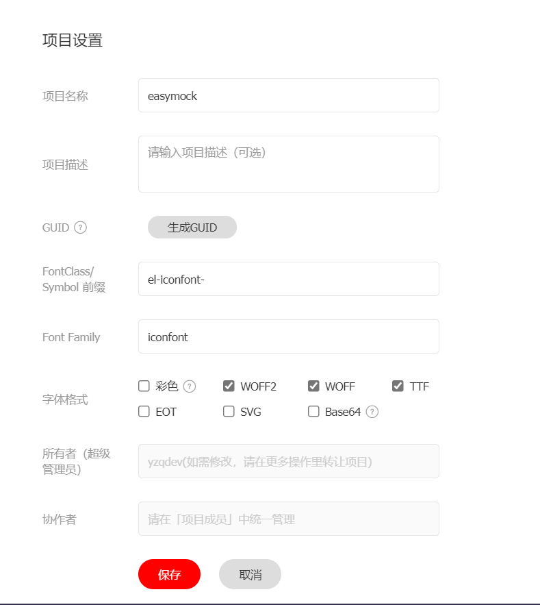

# iconfont 使用

在iconfont网站建好自己的项目,配置好前缀  

把生成的链接引入index.html

然后写一个`Econ.vue`文件,

@[code](@/components/Econ.vue)

然后就可以使用  `<icon name='图标名称' ></icon>`来调用了

演示如下

<econ name='python' size='25px' />

```vue
<econ name='python' size='25px' />
```
