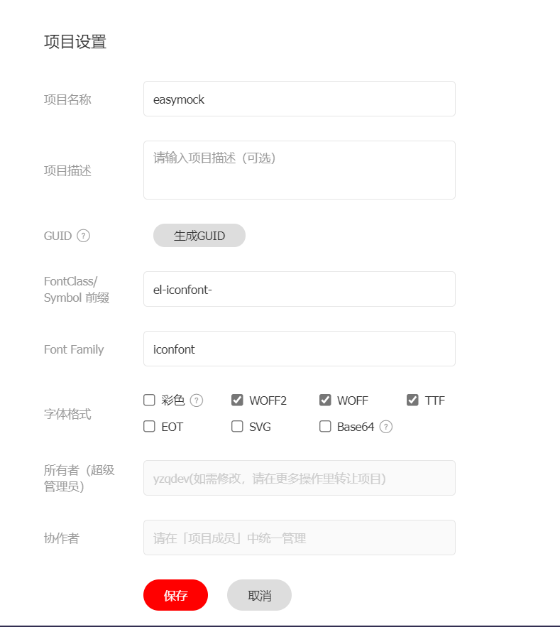

# 图标方案

## 图标资源网站

### 通用图标库

- [Icones](https://icones.js.org/) - 强大的图标搜索引擎，集成了 Iconify 所有图标
- [Iconify](https://iconify.design/) - 统一图标框架，支持 100+ 图标集
- [Feather Icons](https://feathericons.com/) - 简洁优雅的开源图标
- [Bootstrap Icons](https://icons.getbootstrap.com/) - Bootstrap 官方图标
- [Ionicons](https://ionic.io/ionicons) - Ionic 框架图标
- [Font Awesome](https://fontawesome.com/) - 经典图标库
- [Icons8](https://icons8.com/) - 丰富的图标/插画资源
- [Flaticon](https://www.flaticon.com/) - 海量图标资源
- [IconFinder](https://www.iconfinder.com/) - 专业图标市场
- [IcoMoon](https://icomoon.io/) - 图标字体生成器

### 国内图标库

- [Iconfont](https://www.iconfont.cn/) - 阿里巴巴矢量图标库（推荐）
- [IconPark](https://iconpark.oceanengine.com/) - 字节跳动图标库
- [CSS.GG](https://github.com/astrit/css.gg) - 纯 CSS 图标
- [SuperTinyIcons](https://github.com/edent/SuperTinyIcons) - 超小体积图标

### 其他资源

- [Uiverse](https://uiverse.io/) - UI 组件/图标集合

## Iconfont 使用

[Iconfont](https://www.iconfont.cn/) 是国内最常用的图标方案。以下是详细使用步骤：

### 1. 创建项目

在 Iconfont 网站右上角"图标管理"→"我的项目"，创建项目，配置好前缀。



### 2. 引入图标

将生成的链接引入 `index.html`：

```html
<link rel="stylesheet" href="//at.alicdn.com/t/font_xxxxx.css">
```

### 3. 封装组件

创建 `Econ.vue` 组件：

```vue
<template>
  <svg
    :class="['econ', `econ-${name}`]"
    :style="{ fontSize: size, width: size, height: size }"
    aria-hidden="true"
  >
    <use :xlink:href="`#icon-${name}`"></use>
  </svg>
</template>

<script>
export default {
  name: 'Econ',
  props: {
    name: { type: String, required: true },
    size: { type: String, default: '1em' },
  },
};
</script>

<style>
.econ {
  fill: currentColor;
  overflow: hidden;
}
</style>
```

### 4. 使用

```vue
<econ name="python" size="25px" />
<econ name="javascript" size="2em" />
```

## Vue 2 SVG 图标方案

使用 `svg-sprite-loader` 实现 SVG 图标组件化。

### 1. 安装

```bash
npm install svg-sprite-loader -D
```

### 2. 配置 vue.config.js

```javascript
chainWebpack: (config) => {
  const svgRule = config.module.rule("svg");
  svgRule.uses.clear();
  svgRule
    .test(/\.svg$/)
    .include.add(path.resolve(__dirname, "./src/icons"))
    .end()
    .use("svg-sprite-loader")
    .loader("svg-sprite-loader")
    .options({ symbolId: "icon-[name]" });

  const fileRule = config.module.rule("file");
  fileRule.uses.clear();
  fileRule
    .test(/\.svg$/)
    .exclude.add(path.resolve(__dirname, "./src/icons"))
    .end()
    .use("file-loader")
    .loader("file-loader");
},
```

### 3. 创建 SVG 组件

```vue
<template>
  <svg :class="svgClass" aria-hidden="true">
    <use :xlink:href="iconName"></use>
  </svg>
</template>

<script>
export default {
  name: "icon-svg",
  props: {
    iconClass: { type: String, required: true },
    className: { type: String, default: "" },
  },
  computed: {
    iconName() { return `#icon-${this.iconClass}`; },
    svgClass() { return "svg-icon " + (this.className || ""); },
  },
};
</script>

<style>
.svg-icon {
  width: 1em;
  height: 1em;
  vertical-align: -0.15em;
  fill: currentColor;
  overflow: hidden;
}
</style>
```

### 4. 引入图标

```javascript
// main.js
const requireAll = requireContext => requireContext.keys().map(requireContext);
const req = require.context('./icons', true, /\.svg$/);
requireAll(req);

import IconSvg from '@/components/IconSvg';
Vue.component('icon-svg', IconSvg);
```

## Vue 3 SVG 图标方案

Vue 3 推荐使用 Vite 插件，更简单高效。

### 使用 awesome-vite 查找

搜索 [awesome-vite](https://github.com/vitejs/awesome-vite) 中的 SVG 插件。

### 推荐插件

#### 1. vite-svg-loader

```bash
npm install vite-svg-loader -D
```

```ts
// vite.config.ts
import svgLoader from 'vite-svg-loader';

export default defineConfig({
  plugins: [vue(), svgLoader()],
});
```

```vue
<script setup>
import Logo from '@/assets/logo.svg?component';
</script>

<template>
  <Logo />
</template>
```

#### 2. vite-plugin-svg-icons

```bash
npm install vite-plugin-svg-icons -D
```

```ts
// vite.config.ts
import { createSvgIconsPlugin } from 'vite-plugin-svg-icons';

export default defineConfig({
  plugins: [
    vue(),
    createSvgIconsPlugin({
      iconDirs: [path.resolve(process.cwd(), 'src/icons')],
      symbolId: 'icon-[dir]-[name]',
    }),
  ],
});
```

### 使用 Unocss 图标

```bash
npm install @unocss/preset-icons -D
```

```ts
// unocss.config.ts
import presetIcons from '@unocss/preset-icons';

export default {
  presets: [presetIcons()],
};
```

```html
<!-- 使用 -->
<div class="i-carbon-logo-github"></div>
<div class="i-ic-baseline-ac-unit"></div>
```

## 在 React 中使用图标

- [react-icons](https://react-icons.github.io/react-icons/) - 最流行的 React 图标库
- [MUI Icons](https://mui.com/material-ui/material-icons/) - Material Design 图标
- [shadcn/ui Lucide Icons](https://ui.shadcn.com/) - 基于 Lucide 的图标

## 参考

- [Icones 交互式搜索](https://icones.js.org/)
- [Unocss 图标预设](https://unocss.dev/presets/icons)
- [Iconify 文档](https://iconify.design/docs/)