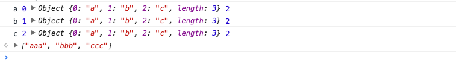

# 前端数组

## 目录

- [Array构造器](#array构造器)
- [ES6新增的构造函数方法](#es6新增的构造函数方法)
  - [Array.of](#arrayof)
  - [Array.from](#arrayfrom)
- [Array.isArray](#arrayisarray)
- [数组推导](#数组推导)
- [原型](#原型)
- [方法](#方法)
  - [改变自身值的方法(9个)](#改变自身值的方法9个)
  - [不会改变自身的方法(9个)](#不会改变自身的方法9个)
  - [遍历方法(12个)](#遍历方法12个)
- [小结](#小结)

数组是一种非常重要的数据类型，它语法简单、灵活、高效。 在多数编程语言中，数组都充当着至关重要的角色，以至于很难想象没有数组的编程语言会是什么模样。特别是JavaScript，它天生的灵活性，又进一步发挥了数组的特长，丰富了数组的使用场景。可以毫不夸张地说，不深入地了解数组，不足以写JavaScript。

截止ES7规范，数组共包含33个标准的API方法和一个非标准的API方法，使用场景和使用方案纷繁复杂，其中有不少浅坑、深坑、甚至神坑。下面将从Array构造器及ES6新特性开始，逐步帮助你掌握数组。

声明：以下未特别标明的方法均为ES5已实现的方法。

### Array构造器

Array构造器用于创建一个新的数组。通常，我们推荐使用对象字面量创建数组，这是一个好习惯，但是总有对象字面量乏力的时候，比如说，我想创建一个长度为8的空数组。请比较如下两种方式：

```javascript
// 使用Array构造器
let a = Array(8); // [undefined × 8]
// 使用对象字面量
let b = [];
b.length = 8; // [undefined × 8]
```

Array构造器明显要简洁一些，当然你也许会说，对象字面量也不错啊，那么我保持沉默。

如上，我使用了`Array(8)`而不是`new Array(8)`，这会有影响吗？实际上，并没有影响，这得益于Array构造器内部对this指针的判断，[ELS5_HTML规范](http://ecma262-5.com/ELS5_HTML.htm#Section_15.4.1)是这么说的：

> When `Array` is called as a function rather than as a constructor, it creates and initialises a new Array object. Thus the function call `Array(…)` is equivalent to the object creation expression `new Array(…)` with the same arguments.

从规范来看，浏览器内部大致做了如下类似的实现：

```javascript
function Array(){
  // 如果this不是Array的实例，那就重新new一个实例
  if(!(this instanceof arguments.callee)){
    return new arguments.callee();
  }
}
```

上面，我似乎跳过了对Array构造器语法的介绍，没事，接下来我补上。

Array构造器根据参数长度的不同，有如下两种不同的处理：

- new Array(arg1, arg2,…)，参数长度为0或长度大于等于2时，传入的参数将按照顺序依次成为新数组的第0至N项（参数长度为0时，返回空数组）。
- new Array(len)，当len不是数值时，处理同上，返回一个只包含len元素一项的数组；当len为数值时，根据如下[规范](http://ecma262-5.com/ELS5_HTML.htm#Section_15.4.2.2)，len最大不能超过32位无符号整型，即需要小于2的32次方（len最大为`Math.pow(2,32) -1`或`-1>>>0`），否则将抛出RangeError。

> If the argument _len_ is a Number and ToUint32(_len_) is equal to _len_, then the `length` property of the newly constructed object is set to ToUint32(_len_). If the argument len is a Number and ToUint32(_len_) is not equal to _len_, a **RangeError** exception is thrown.

以上，请注意Array构造器对于单个数值参数的特殊处理，如果仅仅需要使用数组包裹📦 若干参数，不妨使用Array.of，具体请移步下一节。

### ES6新增的构造函数方法

鉴于数组的常用性，ES6专门扩展了数组构造器`Array` ，新增2个方法：`Array.of`、`Array.from`。下面展开来聊。

#### Array.of

Array.of用于将参数依次转化为数组中的一项，然后返回这个新数组，而不管这个参数是数字还是其它。它基本上与Array构造器功能一致，唯一的区别就在单个数字参数的处理上。如下：

```javascript
Array.of(8.0); // [8]
Array(8.0); // [empty × 8]
```

参数为多个，或单个参数不是数字时，Array.of 与 Array构造器等同。

```javascript
Array.of(8.0, 5); // [8, 5]
Array(8.0, 5); // [8, 5]

Array.of('8'); // ["8"]
Array('8'); // ["8"]
```

因此，若是需要使用数组包裹元素，推荐优先使用Array.of方法。

目前，以下版本浏览器提供了对Array.of的支持。

| Chrome | Firefox | Edge | Safari |
| ------ | ------- | ---- | ------ |
| 45+    | 25+     | ✔️    | 9.0+   |

即使其他版本浏览器不支持也不必担心，由于Array.of与Array构造器的这种高度相似性，实现一个polyfill十分简单。如下：

```javascript
if (!Array.of){
  Array.of = function(){
    return Array.prototype.slice.call(arguments);
  };
}
```

#### Array.from

语法：_Array.from(arrayLike[, processingFn[, thisArg]])_

Array.from的设计初衷是快速便捷的基于其他对象创建新数组，准确来说就是从一个类似数组的可迭代对象创建一个新的数组实例，说人话就是，只要一个对象有迭代器，Array.from就能把它变成一个数组（当然，是返回新的数组，不改变原对象）。

从语法上看，Array.from拥有3个形参，第一个为类似数组的对象，必选。第二个为加工函数，新生成的数组会经过该函数的加工再返回。第三个为this作用域，表示加工函数执行时this的值。后两个参数都是可选的。我们来看看用法。

```javascript
let obj = {0: 'a', 1: 'b', 2:'c', length: 3};
Array.from(obj, function(value, index){
  console.log(value, index, this, arguments.length);
  return value.repeat(3); //必须指定返回值，否则返回undefined
}, obj);
```

执行结果如下：



可以看到加工函数的this作用域被obj对象取代，也可以看到加工函数默认拥有两个形参，分别为迭代器当前元素的值和其索引。

注意，一旦使用加工函数，必须明确指定返回值，否则将隐式返回undefined，最终生成的数组也会变成一个只包含若干个undefined元素的空数组。

实际上，如果不需要指定this，加工函数完全可以是一个箭头函数。上述代码可以简化如下：

```javascript
Array.from(obj, (value) => value.repeat(3));
```

除了上述obj对象以外，拥有迭代器的对象还包括这些：`String`，`Set`，`Map`，`arguments` 等，Array.from统统可以处理。如下所示：

```javascript
// String
Array.from('abc'); // ["a", "b", "c"]
// Set
Array.from(new Set(['abc', 'def'])); // ["abc", "def"]
// Map
Array.from(new Map([[1, 'abc'], [2, 'def']])); // [[1
, 'abc'], [2, 'def']]
// 天生的类数组对象arguments
function fn(){
  return Array.from(arguments);
}
fn(1, 2, 3); // [1, 2, 3]
```

到这你可能以为Array.from就讲完了，实际上还有一个重要的扩展场景必须提下。比如说生成一个从0到指定数字的新数组，Array.from就可以轻易的做到。

```javascript
Array.from({length: 10}, (v, i) => i); // [0, 1, 2, 3, 4, 5, 6, 7, 8, 9]
```

后面我们将会看到，利用数组的keys方法实现上述功能，可能还要简单一些。

目前，以下版本浏览器提供了对Array.from的支持。

| Chrome | Firefox | Edge | Opera | Safari |
| ------ | ------- | ---- | ----- | ------ |
| 45+    | 32+     | ✔️    | ✔️     | 9.0+   |

### Array.isArray

顾名思义，Array.isArray用来判断一个变量是否数组类型。JS的弱类型机制导致判断变量类型是初级前端开发者面试时的必考题，一般我都会将其作为考察候选人第一题，然后基于此展开。在ES5提供该方法之前，我们至少有如下5种方式去判断一个值是否数组：

```javascript
let a = [];
// 1.基于instanceof
a instanceof Array;
// 2.基于constructor
a.constructor === Array;
// 3.基于Object.prototype.isPrototypeOf
Array.prototype.isPrototypeOf(a);
// 4.基于getPrototypeOf
Object.getPrototypeOf(a) === Array.prototype;
// 5.基于Object.prototype.toString
Object.prototype.toString.apply(a) === '[object Array]';
```

以上，除了`Object.prototype.toString`外，其它方法都不能正确判断变量的类型。

要知道，代码的运行环境十分复杂，一个变量可能使用浑身解数去迷惑它的创造者。且看：

```javascript
let a = {
  __proto__: Array.prototype
};
// 分别在控制台试运行以下代码
// 1.基于instanceof
a instanceof Array; // true
// 2.基于constructor
a.constructor === Array; // true
// 3.基于Object.prototype.isPrototypeOf
Array.prototype.isPrototypeOf(a); // true
// 4.基于getPrototypeOf
Object.getPrototypeOf(a) === Array.prototype; // true
```

以上，4种方法将全部返回`true`，为什么呢？我们只是手动指定了某个对象的`__proto__`属性为`Array.prototype`，便导致了该对象继承了Array对象，这种毫不负责任的继承方式，使得基于继承的判断方案瞬间土崩瓦解。

不仅如此，我们还知道，Array是堆数据，变量指向的只是它的引用地址，因此每个页面的Array对象引用的地址都是不一样的。iframe中声明的数组，它的构造函数是iframe中的Array对象。如果在iframe声明了一个数组`x`，将其赋值给父页面的变量`y`，那么在父页面使用`y instanceof Array` ，结果一定是`false`的。而最后一种返回的是字符串，不会存在引用问题。实际上，多页面或系统之间的交互只有字符串能够畅行无阻。

鉴于上述的两点原因，故笔者推荐使用最后一种方法去撩面试官（别提是我说的），如果你还不信，这里恰好有篇文章跟我持有相同的观点：[Determining with absolute accuracy whether or not a JavaScript object is an array](http://web.mit.edu/jwalden/www/isArray.html)。

相反，使用Array.isArray则非常简单，如下：

```javascript
Array.isArray([]); // true
Array.isArray({0: 'a', length: 1}); // false
```

目前，以下版本浏览器提供了对Array.isArray的支持。

| Chrome | Firefox | IE  | Opera | Safari |
| ------ | ------- | --- | ----- | ------ |
| 5+     | 4+      | 9+  | 10.5+ | 5+     |

实际上，通过`Object.prototype.toString`去判断一个值的类型，也是各大主流库的标准。因此Array.isArray的polyfill通常长这样：

```javascript
if (!Array.isArray){
  Array.isArray = function(arg){
    return Object.prototype.toString.call(arg) === '[object Array]';
  };
}
```

### 数组推导

ES6对数组的增强不止是体现在api上，还包括语法糖。比如说`for of`，它就是借鉴其它语言而成的语法糖，这种基于原数组使用`for of`生成新数组的语法糖，叫做**数组推导**。**数组推导最初起早在ES6的草案中，但在第27版（2014年8月）中被移除，目前只有Firefox v30+支持，推导有风险，使用需谨慎。**所幸如今这些语言都还支持推导：CoffeeScript、Python、Haskell、Clojure，我们可以从中一窥端倪。这里我们以python的`for in`推导打个比方：

```javascript
# python for in 推导
a = [1, 2, 3, 4]
print [i * i for i in a if i == 3] # [9]
```

如下是SpiderMonkey引擎（Firefox）之前基于ES4规范实现的数组推导(与python的推导十分相似)：

```javascript
[i * i for (i of a)] // [1, 4, 9, 16]
```

ES6中数组有关的`for of`在ES4的基础上进一步演化，for关键字居首，in在中间，最后才是运算表达式。如下：

```javascript
[for (i of [1, 2, 3, 4]) i * i] // [1, 4, 9, 16]
```

同python的示例，ES6中数组有关的`for of`也可以使用if语句：

```javascript
// 单个if
[for (i of [1, 2, 3, 4]) if (i == 3) i * i] // [9]
// 甚至是多个if
[for (i of [1, 2, 3, 4]) if (i > 2) if (i < 4) i * i] // [9]
```

更为强大的是，ES6数组推导还允许多重`for of`。

```javascript
[for (i of [1, 2, 3]) for (j of [10, 100]) i * j] // [10, 100, 20, 200, 30, 300]
```

甚至，数组推导还能够嵌入另一个数组推导中。

```javascript
[for (i of [1, 2, 3]) [for (j of [10, 100]) i * j] ] // [[10, 100], [20, 200], [30, 300]]
```

对于上述两个表达式，前者和后者唯一的区别，就在于后者的第二个推导是先返回数组，然后与外部的推导再进行一次运算。

除了多个数组推导嵌套外，ES6的数组推导还会为每次迭代分配一个新的作用域（目前Firefox也没有为每次迭代创建新的作用域）：

```javascript
// ES6规范
[for (x of [0, 1, 2]) () => x][0]() // 0
// Firefox运行
[for (x of [0, 1, 2]) () => x][0]() // 2
```

通过上面的实例，我们看到使用数组推导来创建新数组比`forEach`，`map`，`filter`等遍历方法更加简洁，只是非常可惜，它不是标准规范。

ES6不仅新增了对Array构造器相关API，还新增了8个原型的方法。接下来我会在原型方法的介绍中穿插着ES6相关方法的讲解，请耐心往下读。

### 原型

继承的常识告诉我们，js中所有的数组方法均来自于Array.prototype，和其他构造函数一样，你可以通过扩展 `Array` 的 `prototype` 属性上的方法来给所有数组实例增加方法。

值得一说的是，Array.prototype本身就是一个数组。

```javascript
Array.isArray(Array.prototype); // true
console.log(Array.prototype.length);// 0
```

以下方法可以进一步验证：

```javascript
console.log([].__proto__.length);// 0
console.log([].__proto__);// [Symbol(Symbol.unscopables): Object]
```

有关Symbol(Symbol.unscopables)的知识，这里不做详述，具体请移步后续章节。

### 方法

数组原型提供的方法非常之多，主要分为三种，一种是会改变自身值的，一种是不会改变自身值的，另外一种是遍历方法。

由于 Array.prototype 的某些属性被设置为[[DontEnum]]，因此不能用一般的方法进行遍历，我们可以通过如下方式获取 Array.prototype 的所有方法：

```javascript
Object.getOwnPropertyNames(Array.prototype); // ["length", "constructor", "toString", "toLocaleString", "join", "pop", "push", "reverse", "shift", "unshift", "slice", "splice", "sort", "filter", "forEach", "some", "every", "map", "indexOf", "lastIndexOf", "reduce", "reduceRight", "copyWithin", "find", "findIndex", "fill", "includes", "entries", "keys", "concat"]
```

#### 改变自身值的方法(9个)

基于ES6，改变自身值的方法一共有9个，分别为pop、push、reverse、shift、sort、splice、unshift，以及两个ES6新增的方法copyWithin 和 fill。

对于能改变自身值的数组方法，日常开发中需要特别注意，尽量避免在循环遍历中去改变原数组的项。接下来，我们一起来深入地了解这些方法。

##### pop

pop() 方法删除一个数组中的最后的一个元素，并且返回这个元素。如果是栈的话，这个过程就是栈顶弹出。

```javascript
let array = ["cat", "dog", "cow", "chicken", "mouse"];
let item = array.pop();
console.log(array); // ["cat", "dog", "cow", "chicken"]
console.log(item); // mouse
```

由于设计上的巧妙，pop方法可以应用在类数组对象上，即 `鸭式辨型`. 如下：

```javascript
let o = {0:"cat", 1:"dog", 2:"cow", 3:"chicken", 4:"mouse", length:5}
let item = Array.prototype.pop.call(o);
console.log(o); // Object {0: "cat", 1: "dog", 2: "cow", 3: "chicken", length: 4}
console.log(item); // mouse
```

但如果类数组对象不具有length属性，那么该对象将被创建length属性，length值为0。如下：

```javascript
let o = {0:"cat", 1:"dog", 2:"cow", 3:"chicken", 4:"mouse"}
let item = Array.prototype.pop.call(o);
console.log(array); // Object {0: "cat", 1: "dog", 2: "cow", 3: "chicken", 4: "mouse", length: 0}
console.log(item); // undefined
```

##### push

push()方法添加一个或者多个元素到数组末尾，并且返回数组新的长度。如果是栈的话，这个过程就是栈顶压入。

语法：_arr.push(element1, …, elementN)_

```javascript
let array = ["football", "basketball", "volleyball", "Table tennis", "badminton"];
let i = array.push("golfball");
console.log(array); // ["football", "basketball", "volleyball", "Table tennis", "badminton", "golfball"]
console.log(i); // 6
```

同pop方法一样，push方法也可以应用到类数组对象上，如果length不能被转成一个数值或者不存在length属性时，则插入的元素索引为0，且length属性不存在时，将会创建它。

```javascript
let o = {0:"football", 1:"basketball"};
let i = Array.prototype.push.call(o, "golfball");
console.log(o); // Object {0: "golfball", 1: "basketball", length: 1}
console.log(i); // 1
```

实际上，push方法是根据length属性来决定从哪里开始插入给定的值。

```javascript
let o = {0:"football", 1:"basketball",length:1};
let i = Array.prototype.push.call(o,"golfball");
console.log(o); // Object {0: "football", 1: "golfball", length: 2}
console.log(i); // 2
```

利用push根据length属性插入元素这个特点，可以实现数组的合并，如下：

```javascript
let array = ["football", "basketball"];
let array2 = ["volleyball", "golfball"];
let i = Array.prototype.push.apply(array,array2);
console.log(array); // ["football", "basketball", "volleyball", "golfball"]
console.log(i); // 4
```

##### reverse

reverse()方法颠倒数组中元素的位置，第一个会成为最后一个，最后一个会成为第一个，该方法返回对数组的引用。

语法：_arr.reverse()_

```javascript
let array = [1,2,3,4,5];
let array2 = array.reverse();
console.log(array); // [5,4,3,2,1]
console.log(array2===array); // true
```

同上，reverse 也是鸭式辨型的受益者，颠倒元素的范围受length属性制约。如下:

```javascript
let o = {0:"a", 1:"b", 2:"c", length:2};
let o2 = Array.prototype.reverse.call(o);
console.log(o); // Object {0: "b", 1: "a", 2: "c", length: 2}
console.log(o === o2); // true
```

如果 length 属性小于2 或者 length 属性不为数值，那么原类数组对象将没有变化。即使 length 属性不存在，该对象也不会去创建 length 属性。特别的是，当 length 属性较大时，类数组对象的『索引』会尽可能的向 length 看齐。如下:

```javascript
let o = {0:"a", 1:"b", 2:"c",length:100};
let o2 = Array.prototype.reverse.call(o);
console.log(o); // Object {97: "c", 98: "b", 99: "a", length: 100}
console.log(o === o2); // true
```

##### shift

shift()方法删除数组的第一个元素，并返回这个元素。如果是栈的话，这个过程就是栈底弹出。

语法：_arr.shift()_

```javascript
let array = [1,2,3,4,5];
let item = array.shift();
console.log(array); // [2,3,4,5]
console.log(item); // 1
```

同样受益于鸭式辨型，对于类数组对象，shift仍然能够处理。如下：

```javascript
let o = {0:"a", 1:"b", 2:"c", length:3};
let item = Array.prototype.shift.call(o);
console.log(o); // Object {0: "b", 1: "c", length: 2}
console.log(item); // a
```

如果类数组对象length属性不存在，将添加length属性，并初始化为0。如下：

```javascript
let o = {0:"a", 1:"b", 2:"c"};
let item = Array.prototype.shift.call(o);
console.log(o); // Object {0: "a", 1: "b", 2:"c" length: 0}
console.log(item); // undefined
```

##### sort

sort()方法对数组元素进行排序，并返回这个数组。sort方法比较复杂，这里我将多花些篇幅来讲这块。

语法：_arr.sort([comparefn])_

comparefn是可选的，如果省略，数组元素将按照各自转换为字符串的Unicode(万国码)位点顺序排序，例如”Boy”将排到”apple”之前。当对数字排序的时候，25将会排到8之前，因为转换为字符串后，”25”将比”8”靠前。例如：

```javascript
let array = ["apple","Boy","Cat","dog"];
let array2 = array.sort();
console.log(array); // ["Boy", "Cat", "apple", "dog"]
console.log(array2 == array); // true

array = [10, 1, 3, 20];
let array3 = array.sort();
console.log(array3); // [1, 10, 20, 3]
```

如果指明了comparefn，数组将按照调用该函数的返回值来排序。若 a 和 b 是两个将要比较的元素：

- 若 comparefn(a, b) < 0，那么a 将排到 b 前面；
- 若 comparefn(a, b) = 0，那么a 和 b 相对位置不变；
- 若 comparefn(a, b) > 0，那么a , b 将调换位置；

如果数组元素为数字，则排序函数comparefn格式如下所示：

```javascript
function compare(a, b){
  return a-b;
}
```

如果数组元素为非ASCII字符的字符串(如包含类似 e、é、è、a、ä 或中文字符等非英文字符的字符串)，则需要使用String.localeCompare。下面这个函数将排到正确的顺序。

```javascript
let array = ['互','联','网','改','变','世','界'];
let array2 = array.sort();

let array = ['互','联','网','改','变','世','界']; // 重新赋值,避免干扰array2
let array3 = array.sort(function (a, b) {
  return a.localeCompare(b);
});

console.log(array2); // ["世", "互", "变", "改", "界", "网", "联"]
console.log(array3); // ["变", "改", "互", "界", "联", "世", "网"]
```

如上，『互联网改变世界』这个数组，sort函数默认按照数组元素unicode字符串形式进行排序，然而实际上，我们期望的是按照拼音先后顺序进行排序，显然String.localeCompare 帮助我们达到了这个目的。

为什么上面测试中需要重新给array赋值呢，这是因为sort每次排序时改变的是数组本身，并且返回数组引用。如果不这么做，经过连续两次排序后，array2 和 array3 将指向同一个数组，最终影响我们测试。array重新赋值后就断开了对原数组的引用。

同上，sort一样受益于鸭式辨型，比如：

```javascript
let o = {0:'互',1:'联',2:'网',3:'改',4:'变',5:'世',6:'界',length:7};
Array.prototype.sort.call(o,function(a, b){
  return a.localeCompare(b);
});
console.log(o); // Object {0: "变", 1: "改", 2: "互", 3: "界", 4: "联", 5: "世", 6: "网", length: 7}, 可见同上述排序结果一致
```

注意：使用sort的鸭式辨型特性时，若类数组对象不具有length属性，它并不会进行排序，也不会为其添加length属性。

```javascript
let o = {0:'互',1:'联',2:'网',3:'改',4:'变',5:'世',6:'界'};
Array.prototype.sort.call(o,function(a, b){
  return a.localeCompare(b);
});
console.log(o); // Object {0: "互", 1: "联", 2: "网", 3: "改", 4: "变", 5: "世", 6: "界"}, 可见并未添加length属性
```

###### 使用映射改善排序

comparefn 如果需要对数组元素多次转换以实现排序，那么使用map辅助排序将是个不错的选择。基本思想就是将数组中的每个元素实际比较的值取出来，排序后再将数组恢复。

```javascript
// 需要被排序的数组
let array = ['dog', 'Cat', 'Boy', 'apple'];
// 对需要排序的数字和位置的临时存储
let mapped = array.map(function(el, i) {
  return { index: i, value: el.toLowerCase() };
})
// 按照多个值排序数组
mapped.sort(function(a, b) {
  return +(a.value > b.value) || +(a.value === b.value) - 1;
});
// 根据索引得到排序的结果
let result = mapped.map(function(el){
  return array[el.index];
});
console.log(result); // ["apple", "Boy", "Cat", "dog"]
```

###### 奇怪的chrome

实际上，ECMAscript规范中并未规定具体的sort算法，这就势必导致各个浏览器不尽相同的sort算法，请看sort方法在Chrome浏览器下表现：

```javascript
let array = [{ n: "a", v: 1 }, { n: "b", v: 1 }, { n: "c", v: 1 }, { n: "d", v: 1 }, { n: "e", v: 1 }, { n: "f", v: 1 }, { n: "g", v: 1 }, { n: "h", v: 1 }, { n: "i", v: 1 }, { n: "j", v: 1 }, { n: "k", v: 1 }, ];
array.sort(function (a, b) {
    return a.v - b.v;
});
for (let i = 0,len = array.length; i < len; i++) {
    console.log(array[i].n);
}
// f a c d e b g h i j k
```

由于v值相等，array数组排序前后应该不变，然而Chrome却表现异常，而其他浏览器(如IE 或 Firefox) 表现正常。

这是因为v8引擎为了高效排序(采用了不稳定排序)。即数组长度超过10条时，会调用另一种排序方法(快速排序)；而10条及以下采用的是插入排序，此时结果将是稳定的，如下：

```javascript
let array = [{ n: "a", v: 1 }, { n: "b", v: 1 }, { n: "c", v: 1 }, { n: "d", v: 1 }, { n: "e", v: 1 }, { n: "f", v: 1 }, { n: "g", v: 1 }, { n: "h", v: 1 }, { n: "i", v: 1 }, { n: "j", v: 1 },];
array.sort(function (a, b) {
  return a.v - b.v;
});
for (let i = 0,len = array.length; i < len; i++) {
  console.log(array[i].n);
}
// a b c d e f g h i j
```

从a 到 j 刚好10条数据。

那么我们该如何规避Chrome浏览器的这种”bug”呢？其实很简单，只需略动手脚，改变排序方法的返回值即可，如下：

```javascript
// 由于快速排序会打乱值相同的元素的默认排序，因此我们需要先标记元素的默认位置
array.forEach(function(v, k){
  v.__index = k;
});
array.sort(function (a, b) {
  // 由于__index标记了初始顺序，这样的返回才保证了值相同元素的顺序不变，进而使得排序稳定
  return a.v - b.v || a.__index - b.__index;
});
```

使用数组的sort方法需要注意一点：各浏览器的针对sort方法内部算法实现不尽相同，排序函数尽量只返回-1、0、1三种不同的值，不要尝试返回true或false等其它数值，因为可能导致不可靠的排序结果。

###### 问题分析

sort方法传入的排序函数如果返回布尔值会导致什么样的结果呢？

以下是常见的浏览器以及脚本引擎：

| Browser Name             | ECMAScript Engine                    |
| ------------------------ | ------------------------------------ |
| Internet Explorer 6 - 8  | JScript                              |
| Internet Explorer 9 - 10 | Chakra                               |
| Firefox                  | SpiderMonkey, IonMonkey, TraceMonkey |
| Chrome                   | V8                                   |
| Safair                   | JavaScriptCore(SquirrelFish Extreme) |
| Opera                    | Carakan                              |

分析以下代码，预期将数组元素进行升序排序：

```javascript
let array = [7, 6, 5, 4, 3, 2, 1, 0, 8, 9];
let comparefn = function (x, y) {
  return x > y;
};
array.sort(comparefn);
```

代码中，comparefn 函数返回值为 bool 类型，并非为规范规定的 -1、0、1 值。那么执行此代码，各 JS 脚本引擎实现情况如何？

|                         | 输出结果                       | 是否符合预期 |
| ----------------------- | ------------------------------ | ------------ |
| JScript                 | [2, 3, 5, 1, 4, 6, 7, 0, 8, 9] | 否           |
| Carakan                 | [0, 1, 3, 8, 2, 4, 9, 5, 6, 7] | 否           |
| Chakra & JavaScriptCore | [7, 6, 5, 4, 3, 2, 1, 0, 8, 9] | 否           |
| SpiderMonkey            | [0, 1, 2, 3, 4, 5, 6, 7, 8, 9] | 是           |
| V8                      | [0, 1, 2, 3, 4, 5, 6, 7, 8, 9] | 是           |

**根据表中数据可见，当数组内元素个数小于等于 10 时，现象如下：**

- JScript & Carakan 排序结果有误
- Chakra & JavaScriptCore 看起来没有进行排序
- SpiderMonkey 返回了预期的正确结果
- V8 暂时看起来排序正确

**将数组元素扩大至 11 位，现象如下：**

```javascript
let array = [7, 6, 5, 4, 3, 2, 1, 0, 10, 9, 8];
let comparefn = function (x, y) {
  return x > y;
};
array.sort(comparefn);
```

| JavaScript引擎          | 输出结果                           | 是否符合预期 |
| ----------------------- | ---------------------------------- | ------------ |
| JScript                 | [2, 3, 5, 1, 4, 6, 7, 0, 8, 9, 10] | 否           |
| Carakan                 | [0, 1, 3, 8, 2, 4, 9, 5, 10, 6, 7] | 否           |
| Chakra & JavaScriptCore | [7, 6, 5, 4, 3, 2, 1, 0, 10, 8, 9] | 否           |
| IonMonkey               | [0, 1, 2, 3, 4, 5, 6, 7, 8, 9, 10] | 是           |
| V8                      | [5, 0, 1, 2, 3, 4, 6, 7, 8, 9, 10] | 否           |

**根据表中数据可见，当数组内元素个数大于 10 时：**

- JScript & Carakan 排序结果有误
- Chakra & JavaScriptCore 看起来没有进行排序
- SpiderMonkey 返回了预期的正确结果
- V8 **排序结果由正确转为不正确**

##### splice

splice()方法用新元素替换旧元素的方式来修改数组。它是一个常用的方法，复杂的数组操作场景通常都会有它的身影，特别是需要维持原数组引用时，就地删除或者新增元素，splice是最适合的。

语法：_arr.splice(start,deleteCount[, item1[, item2[, …]]])_

start 指定从哪一位开始修改内容。如果超过了数组长度，则从数组末尾开始添加内容；如果是负值，则其指定的索引位置等同于 length+start (length为数组的长度)，表示从数组末尾开始的第 -start 位。

deleteCount 指定要删除的元素个数，若等于0，则不删除。这种情况下，至少应该添加一位新元素，若大于start之后的元素总和，则start及之后的元素都将被删除。

itemN 指定新增的元素，如果缺省，则该方法只删除数组元素。

返回值 由原数组中被删除元素组成的数组，如果没有删除，则返回一个空数组。

下面来举栗子说明：

```javascript
let array = ["apple","boy"];
let splices = array.splice(1,1);
console.log(array); // ["apple"]
console.log(splices); // ["boy"] ,可见是从数组下标为1的元素开始删除,并且删除一个元素,由于itemN缺省,故此时该方法只删除元素

array = ["apple","boy"];
splices = array.splice(2,1,"cat");
console.log(array); // ["apple", "boy", "cat"]
console.log(splices); // [], 可见由于start超过数组长度,此时从数组末尾开始添加元素,并且原数组不会发生删除行为

array = ["apple","boy"];
splices = array.splice(-2,1,"cat");
console.log(array); // ["cat", "boy"]
console.log(splices); // ["apple"], 可见当start为负值时,是从数组末尾开始的第-start位开始删除,删除一个元素,并且从此处插入了一个元素

array = ["apple","boy"];
splices = array.splice(-3,1,"cat");
console.log(array); // ["cat", "boy"]
console.log(splices); // ["apple"], 可见即使-start超出数组长度,数组默认从首位开始删除

array = ["apple","boy"];
splices = array.splice(0,3,"cat");
console.log(array); // ["cat"]
console.log(splices); // ["apple", "boy"], 可见当deleteCount大于数组start之后的元素总和时,start及之后的元素都将被删除
```

同上, splice一样受益于鸭式辨型, 比如:

```javascript
let o = {0:"apple",1:"boy",length:2};
let splices = Array.prototype.splice.call(o,1,1);
console.log(o); // Object {0: "apple", length: 1}, 可见对象o删除了一个属性,并且length-1
console.log(splices); // ["boy"]
```

注意：如果类数组对象没有length属性，splice将为该类数组对象添加length属性，并初始化为0。（此处忽略举例，如果需要请在评论里反馈）

如果需要删除数组中一个已存在的元素，可参考如下：

```javascript
let array = ['a','b','c'];
array.splice(array.indexOf('b'),1);
```

##### unshift

unshift() 方法用于在数组开始处插入一些元素(就像是栈底插入)，并返回数组新的长度。

语法：_arr.unshift(element1, …, elementN)_

```javascript
let array = ["red", "green", "blue"];
let length = array.unshift("yellow");
console.log(array); // ["yellow", "red", "green", "blue"]
console.log(length); // 4
```

如果给unshift方法传入一个数组呢？

```javascript
let array = ["red", "green", "blue"];
let length = array.unshift(["yellow"]);
console.log(array); // [["yellow"], "red", "green", "blue"]
console.log(length); // 4, 可见数组也能成功插入
```

同上，unshift也受益于鸭式辨型，呈上栗子：

```javascript
let o = {0:"red", 1:"green", 2:"blue",length:3};
let length = Array.prototype.unshift.call(o,"gray");
console.log(o); // Object {0: "gray", 1: "red", 2: "green", 3: "blue", length: 4}
console.log(length); // 4
```

注意：如果类数组对象不指定length属性，则返回结果是这样的 `Object {0: "gray", 1: "green", 2: "blue", length: 1}`，shift会认为数组长度为0，此时将从对象下标为0的位置开始插入，相应位置属性将被替换，此时初始化类数组对象的length属性为插入元素个数。

##### copyWithin(ES6)

copyWithin() 方法基于**ECMAScript 2015（ES6）规范**，用于数组内元素之间的替换，即替换元素和被替换元素均是数组内的元素。

语法：_arr.copyWithin(target, start[, end = this.length])_

taget 指定被替换元素的索引，start 指定替换元素起始的索引，end 可选，指的是替换元素结束位置的索引。

如果start为负，则其指定的索引位置等同于length+start，length为数组的长度。end也是如此。

注：目前只有Firefox（版本32及其以上版本）实现了该方法。

```javascript
let array = [1,2,3,4,5]; 
let array2 = array.copyWithin(0,3);
console.log(array===array2,array2); // true [4, 5, 3, 4, 5]

let array = [1,2,3,4,5]; 
console.log(array.copyWithin(0,3,4)); // [4, 2, 3, 4, 5]

let array = [1,2,3,4,5]; 
console.log(array.copyWithin(0,-2,-1)); // [4, 2, 3, 4, 5]
```

同上，copyWithin一样受益于鸭式辨型，例如：

```javascript
let o = {0:1, 1:2, 2:3, 3:4, 4:5,length:5}
let o2 = Array.prototype.copyWithin.call(o,0,3);
console.log(o===o2,o2); // true Object { 0=4,  1=5,  2=3,  更多...}
```

如需在Firefox之外的浏览器使用copyWithin方法，请参考 [Polyfill](https://developer.mozilla.org/zh-CN/docs/Web/JavaScript/Reference/Global_Objects/Array/copyWithin#Polyfill)。

##### fill(ES6)

fill() 方法基于**ECMAScript 2015（ES6）规范**，它同样用于数组元素替换，但与copyWithin略有不同，它主要用于将数组指定区间内的元素替换为某个值。

语法：_arr.fill(value, start[, end = this.length])_

value 指定被替换的值，start 指定替换元素起始的索引，end 可选，指的是替换元素结束位置的索引。

如果start为负，则其指定的索引位置等同于length+start，length为数组的长度。end也是如此。

注：目前只有Firefox（版本31及其以上版本）实现了该方法。

```javascript
let array = [1,2,3,4,5];
let array2 = array.fill(10,0,3);
console.log(array===array2,array2); // true [10, 10, 10, 4, 5], 可见数组区间[0,3]的元素全部替换为10
// 其他的举例请参考copyWithin
```

同上，fill 一样受益于鸭式辨型，例如：

```javascript
let o = {0:1, 1:2, 2:3, 3:4, 4:5,length:5}
let o2 = Array.prototype.fill.call(o,10,0,2);
console.log(o===o2,o2); true Object { 0=10,  1=10,  2=3,  更多...}
```

如需在Firefox之外的浏览器使用fill方法,请参考 [Polyfill](https://developer.mozilla.org/zh-CN/docs/Web/JavaScript/Reference/Global_Objects/Array/fill#Compatibility)。

#### 不会改变自身的方法(9个)

基于ES7，不会改变自身的方法一共有9个，分别为concat、join、slice、toString、toLocateString、indexOf、lastIndexOf、未标准的toSource以及ES7新增的方法includes。

##### concat

concat() 方法将传入的数组或者元素与原数组合并，组成一个新的数组并返回。

语法：_arr.concat(value1, value2, …, valueN)_

```javascript
let array = [1, 2, 3];
let array2 = array.concat(4,[5,6],[7,8,9]);
console.log(array2); // [1, 2, 3, 4, 5, 6, 7, 8, 9]
console.log(array); // [1, 2, 3], 可见原数组并未被修改
```

若concat方法中不传入参数，那么将基于原数组**浅复制**生成一个一模一样的新数组（指向新的地址空间）。

```javascript
let array = [{a: 1}];
let array3 = array.concat();
console.log(array3); // [{a: 1}]
console.log(array3 === array); // false
console.log(array[0] === array3[0]); // true，新旧数组第一个元素依旧共用一个同一个对象的引用
```

同上，concat 一样受益于鸭式辨型，但其效果可能达不到我们的期望，如下：

```javascript
let o = {0:"a", 1:"b", 2:"c",length:3};
let o2 = Array.prototype.concat.call(o,'d',{3:'e',4:'f',length:2},['g','h','i']);
console.log(o2); // [{0:"a", 1:"b", 2:"c", length:3}, 'd', {3:'e', 4:'f', length:2}, 'g', 'h', 'i']
```

可见，类数组对象合并后返回的是依然是数组，并不是我们期望的对象。

##### join

join() 方法将数组中的所有元素连接成一个字符串。

语法：_arr.join([separator = ‘,’])_ separator可选，缺省默认为逗号。

```javascript
let array = ['We', 'are', 'Chinese'];
console.log(array.join()); // "We,are,Chinese"
console.log(array.join('+')); // "We+are+Chinese"
console.log(array.join('')); // "WeareChinese"
```

同上，join 一样受益于鸭式辨型，如下：

```javascript
let o = {0:"We", 1:"are", 2:"Chinese", length:3};
console.log(Array.prototype.join.call(o,'+')); // "We+are+Chinese"
console.log(Array.prototype.join.call('abc')); // "a,b,c"
```

##### slice

slice() 方法将数组中一部分元素浅复制存入新的数组对象，并且返回这个数组对象。

语法：_arr.slice([start[, end]])_

参数 start 指定复制开始位置的索引，end如果有值则表示复制结束位置的索引（不包括此位置）。

如果 start 的值为负数，假如数组长度为 length，则表示从 length+start 的位置开始复制，此时参数 end 如果有值，只能是比 start 大的负数，否则将返回空数组。

slice方法参数为空时，同concat方法一样，都是浅复制生成一个新数组。

```javascript
let array = ["one", "two", "three","four", "five"];
console.log(array.slice()); // ["one", "two", "three","four", "five"]
console.log(array.slice(2,3)); // ["three"]
```

**浅复制** 是指当对象的被复制时，只是复制了对象的引用，指向的依然是同一个对象。下面来说明slice为什么是浅复制。

```javascript
let array = [{color:"yellow"}, 2, 3];
let array2 = array.slice(0,1);
console.log(array2); // [{color:"yellow"}]
array[0]["color"] = "blue";
console.log(array2); // [{color:"bule"}]
```

由于slice是浅复制，复制到的对象只是一个引用，改变原数组array的值，array2也随之改变。

同时，稍微利用下 slice 方法第一个参数为负数时的特性，我们可以非常方便的拿到数组的最后一项元素，如下：

```javascript
console.log([1,2,3].slice(-1));//[3]
```

同上，slice 一样受益于鸭式辨型。如下：

```javascript
let o = {0:{"color":"yellow"}, 1:2, 2:3, length:3};
let o2 = Array.prototype.slice.call(o,0,1);
console.log(o2); // [{color:"yellow"}] ,毫无违和感...
```

鉴于IE9以下版本对于该方法支持性并不是很好，如需更好的支持低版本IE浏览器，请参考[polyfill](https://developer.mozilla.org/zh-CN/docs/Web/JavaScript/Reference/Global_Objects/Array/slice)。

##### toString

toString() 方法返回数组的字符串形式，该字符串由数组中的每个元素的 `toString()` 返回值经调用 `join()` 方法连接（由逗号隔开）组成。

语法： _arr.toString()_

```javascript
let array = ['Jan', 'Feb', 'Mar', 'Apr'];
let str = array.toString();
console.log(str); // Jan,Feb,Mar,Apr
```

当数组直接和字符串作连接操作时，将会自动调用其toString() 方法。

```javascript
let str = ['Jan', 'Feb', 'Mar', 'Apr'] + ',May';
console.log(str); // "Jan,Feb,Mar,Apr,May"
// 下面我们来试试鸭式辨型
let o = {0:'Jan', 1:'Feb', 2:'Mar', length:3};
let o2 = Array.prototype.toString.call(o);
console.log(o2); // [object Object]
console.log(o.toString()==o2); // true
```

可见，`Array.prototype.toString()`方法处理类数组对象时，跟类数组对象直接调用`Object.prototype.toString()`方法结果完全一致，说好的鸭式辨型呢？

根据ES5语义，toString() 方法是通用的，可被用于任何对象。如果对象有一个join() 方法，将会被调用，其返回值将被返回，没有则调用`Object.prototype.toString()`，为此，我们给o对象添加一个join方法。如下：

```javascript
let o = {
  0:'Jan', 
  1:'Feb', 
  2:'Mar', 
  length:3, 
  join:function(){
    return Array.prototype.join.call(this);
  }
};
console.log(Array.prototype.toString.call(o)); // "Jan,Feb,Mar"
```

##### toLocaleString

toLocaleString() 类似toString()的变型，该字符串由数组中的每个元素的 `toLocaleString()` 返回值经调用 `join()` 方法连接（由逗号隔开）组成。

语法：_arr.toLocaleString()_

数组中的元素将调用各自的 toLocaleString 方法：

- `Object`：`[Object.prototype.toLocaleString()](https://developer.mozilla.org/zh-CN/docs/Web/JavaScript/Reference/Global_Objects/Object/toLocaleString)`
- `Number`：`[Number.prototype.toLocaleString()](https://developer.mozilla.org/zh-CN/docs/Web/JavaScript/Reference/Global_Objects/Number/toLocaleString)`
- `Date`：`[Date.prototype.toLocaleString()](https://developer.mozilla.org/zh-CN/docs/Web/JavaScript/Reference/Global_Objects/Date/toLocaleString)`

```javascript
let array= [{name:'zz'}, 123, "abc", new Date()];
let str = array.toLocaleString();
console.log(str); // [object Object],123,abc,2016/1/5 下午1:06:23
```

其鸭式辨型的写法也同toString 保持一致，如下：

```javascript
let o = {
  0:123, 
  1:'abc', 
  2:new Date(), 
  length:3, 
  join:function(){
    return Array.prototype.join.call(this);
  }
};
console.log(Array.prototype.toLocaleString.call(o)); // 123,abc,2016/1/5 下午1:16:50
```

##### indexOf

indexOf() 方法用于查找元素在数组中第一次出现时的索引，如果没有，则返回-1。

语法：_arr.indexOf(element, fromIndex=0)_

element 为需要查找的元素。

fromIndex 为开始查找的位置，缺省默认为0。如果超出数组长度，则返回-1。如果为负值，假设数组长度为length，则从数组的第 length + fromIndex项开始往数组末尾查找，如果length + fromIndex<0 则整个数组都会被查找。

indexOf使用严格相等（即使用 === 去匹配数组中的元素）。

```javascript
let array = ['abc', 'def', 'ghi','123'];
console.log(array.indexOf('def')); // 1
console.log(array.indexOf('def',-1)); // -1 此时表示从最后一个元素往后查找,因此查找失败返回-1
console.log(array.indexOf('def',-4)); // 1 由于4大于数组长度,此时将查找整个数组,因此返回1
console.log(array.indexOf(123)); // -1, 由于是严格匹配,因此并不会匹配到字符串'123'
```

得益于鸭式辨型，indexOf 可以处理类数组对象。如下：

```javascript
let o = {0:'abc', 1:'def', 2:'ghi', length:3};
console.log(Array.prototype.indexOf.call(o,'ghi',-4));//2
```

然而该方法并不支持IE9以下版本，如需更好的支持低版本IE浏览器（IE6~8）， 请参考 [Polyfill](https://developer.mozilla.org/zh-CN/docs/Web/JavaScript/Reference/Global_Objects/Array/indexOf#Polyfill)。

##### lastIndexOf

lastIndexOf() 方法用于查找元素在数组中最后一次出现时的索引，如果没有，则返回-1。并且它是indexOf的逆向查找，即从数组最后一个往前查找。

语法：_arr.lastIndexOf(element, fromIndex=length-1)_

element 为需要查找的元素。

fromIndex 为开始查找的位置，缺省默认为数组长度length-1。如果超出数组长度，由于是逆向查找，则查找整个数组。如果为负值，则从数组的第 length + fromIndex项开始往数组开头查找，如果length + fromIndex<0 则数组不会被查找。

同 indexOf 一样，lastIndexOf 也是严格匹配数组元素。

举例请参考 `indexOf` ，不再详述，兼容低版本IE浏览器（IE6~8），请参考 [Polyfill](https://developer.mozilla.org/zh-CN/docs/Web/JavaScript/Reference/Global_Objects/Array/lastIndexOf#Compatibility)。

##### includes(ES7)

includes() 方法基于**ECMAScript 2016（ES7）规范**，它用来判断当前数组是否包含某个指定的值，如果是，则返回 true，否则返回 false。

语法：_arr.includes(element, fromIndex=0)_

element 为需要查找的元素。

fromIndex 表示从该索引位置开始查找 element，缺省为0，它是正向查找，即从索引处往数组末尾查找。

```javascript
let array = [-0, 1, 2];
console.log(array.includes(+0)); // true
console.log(array.includes(1)); // true
console.log(array.includes(2,-4)); // true
```

以上，includes似乎忽略了 `-0` 与 `+0` 的区别，这不是问题，因为JavaScript一直以来都是不区分 `-0` 和 `+0` 的。

你可能会问，既然有了indexOf方法，为什么又造一个includes方法，`arr.indexOf(x)>-1`不就等于`arr.includes(x)`？看起来是的，几乎所有的时候它们都等同，唯一的区别就是includes能够发现NaN，而indexOf不能。

```javascript
let array = [NaN];
console.log(array.includes(NaN)); // true
console.log(arra.indexOf(NaN)>-1); // false
```

该方法同样受益于鸭式辨型。如下：

```javascript
let o = {0:'a', 1:'b', 2:'c', length:3};
let bool = Array.prototype.includes.call(o, 'a');
console.log(bool); // true
```

该方法只有在Chrome 47、opera 34、Safari 9版本及其更高版本中才被实现。如需支持其他浏览器，请参考 [Polyfill](https://developer.mozilla.org/zh-CN/docs/Web/JavaScript/Reference/Global_Objects/Array/includes#Polyfill)。

##### toSource(非标准)

toSource() 方法是**非标准的**，该方法返回数组的源代码，目前只有 Firefox 实现了它。

语法：_arr.toSource()_

```javascript
let array = ['a', 'b', 'c'];
console.log(array.toSource()); // ["a", "b", "c"]
// 测试鸭式辨型
let o = {0:'a', 1:'b', 2:'c', length:3};
console.log(Array.prototype.toSource.call(o)); // ["a","b","c"]
```

#### 遍历方法(12个)

基于ES6，不会改变自身的方法一共有12个，分别为forEach、every、some、filter、map、reduce、reduceRight 以及ES6新增的方法entries、find、findIndex、keys、values。

##### forEach

forEach() 方法指定数组的每项元素都执行一次传入的函数，返回值为undefined。

语法：_arr.forEach(fn, thisArg)_

fn 表示在数组每一项上执行的函数，接受三个参数：

- value 当前正在被处理的元素的值
- index 当前元素的数组索引
- array 数组本身

thisArg 可选，用来当做fn函数内的this对象。

forEach 将为数组中每一项执行一次 fn 函数，那些已删除，新增或者从未赋值的项将被跳过（但不包括值为 undefined 的项）。

遍历过程中，fn会被传入上述三个参数。

```javascript
let array = [1, 3, 5];
let obj = {name:'cc'};
let sReturn = array.forEach(function(value, index, array){
  array[index] = value * value;
  console.log(this.name); // cc被打印了三次
},obj);
console.log(array); // [1, 9, 25], 可见原数组改变了
console.log(sReturn); // undefined, 可见返回值为undefined
```

得益于鸭式辨型，虽然forEach不能直接遍历对象，但它可以通过call方式遍历类数组对象。如下：

```javascript
let o = {0:1, 1:3, 2:5, length:3};
Array.prototype.forEach.call(o,function(value, index, obj){
  console.log(value,index,obj);
  obj[index] = value * value;
},o);
// 1 0 Object {0: 1, 1: 3, 2: 5, length: 3}
// 3 1 Object {0: 1, 1: 3, 2: 5, length: 3}
// 5 2 Object {0: 1, 1: 9, 2: 5, length: 3}
console.log(o); // Object {0: 1, 1: 9, 2: 25, length: 3}
```

参考前面的文章 `[详解JS遍历](http://louiszhai.github.io/2015/12/18/traverse/#forEach)` 中 forEach的讲解，我们知道，forEach无法直接退出循环，只能使用return 来达到for循环中continue的效果，并且forEach不能在低版本IE（6~8）中使用，兼容写法请参考 [Polyfill](https://developer.mozilla.org/zh-CN/docs/Web/JavaScript/Reference/Global_Objects/Array/forEach#%E5%85%BC%E5%AE%B9%E6%97%A7%E7%8E%AF%E5%A2%83%EF%BC%88Polyfill%EF%BC%89)。

##### every

every() 方法使用传入的函数测试所有元素，只要其中有一个函数返回值为 false，那么该方法的结果为 false；如果全部返回 true，那么该方法的结果才为 true。因此 every 方法存在如下规律：

- 若需检测数组中存在元素大于100 （即 one > 100），那么我们需要在传入的函数中构造 “false” 返回值 （即返回 item <= 100），同时整个方法结果为 false 才表示数组存在元素满足条件；（简单理解为：若是单项判断，可用 one false ===> false）
- 若需检测数组中是否所有元素都大于100 （即all > 100）那么我们需要在传入的函数中构造 “true” 返回值 （即返回 item > 100），同时整个方法结果为 true 才表示数组所有元素均满足条件。(简单理解为：若是全部判断，可用 all true ===> true）

语法同上述forEach，具体还可以参考 `[详解JS遍历](http://louiszhai.github.io/2015/12/18/traverse/#every)` 中every的讲解。

以下是鸭式辨型的写法：

```javascript
let o = {0:10, 1:8, 2:25, length:3};
let bool = Array.prototype.every.call(o,function(value, index, obj){
  return value >= 8;
},o);
console.log(bool); // true
```

every 一样不能在低版本IE(6~8)中使用，兼容写法请参考 [Polyfill](https://developer.mozilla.org/zh-CN/docs/Web/JavaScript/Reference/Global_Objects/Array/every#Compatibility)。

##### some

some() 方法刚好同 every() 方法相反，some 测试数组元素时，只要有一个函数返回值为 true，则该方法返回 true，若全部返回 false，则该方法返回 false。some 方法存在如下规律：

- 若需检测数组中存在元素大于100 (即 one > 100)，那么我们需要在传入的函数中构造 “true” 返回值 (即返回 item > 100)，同时整个方法结果为 true 才表示数组存在元素满足条件；（简单理解为：若是单项判断，可用 one true ===> true）
- 若需检测数组中是否所有元素都大于100（即 all > 100），那么我们需要在传入的函数中构造 “false” 返回值 （即返回 item <= 100），同时整个方法结果为 false 才表示数组所有元素均满足条件。（简单理解为：若是全部判断，可用 all false ===> false）

你注意到没有，some方法与includes方法有着异曲同工之妙，他们都是探测数组中是否拥有满足条件的元素，一旦找到，便返回true。多观察和总结这种微妙的关联关系，能够帮助我们深入理解它们的原理。

some 的鸭式辨型写法可以参照every，同样它也不能在低版本IE（6~8）中使用，兼容写法请参考 [Polyfill](https://developer.mozilla.org/zh-CN/docs/Web/JavaScript/Reference/Global_Objects/Array/some#Compatibility)。

##### filter

filter() 方法使用传入的函数测试所有元素，并返回所有通过测试的元素组成的新数组。它就好比一个过滤器，筛掉不符合条件的元素。

语法：_arr.filter(fn, thisArg)_

```javascript
let array = [18, 9, 10, 35, 80];
let array2 = array.filter(function(value, index, array){
  return value > 20;
});
console.log(array2); // [35, 80]
```

filter一样支持鸭式辨型，具体请参考every方法鸭式辨型写法。其在低版本IE（6~8）的兼容写法请参考 [Polyfill](https://developer.mozilla.org/zh-CN/docs/Web/JavaScript/Reference/Global_Objects/Array/filter#Compatibility)。

##### map

map() 方法遍历数组，使用传入函数处理每个元素，并返回函数的返回值组成的新数组。

语法：_arr.map(fn, thisArg)_

参数介绍同 forEach 方法的参数介绍。

具体用法请参考 `[详解JS遍历](http://louiszhai.github.io/2015/12/18/traverse/#map)` 中 map 的讲解。

map 一样支持鸭式辨型, 具体请参考every方法鸭式辨型写法。

其在低版本IE（6~8）的兼容写法请参考 [Polyfill](https://developer.mozilla.org/zh-CN/docs/Web/JavaScript/Reference/Global_Objects/Array/map#Compatibility)。

##### reduce

reduce() 方法接收一个方法作为累加器，数组中的每个值(从左至右) 开始合并，最终为一个值。

语法：_arr.reduce(fn, initialValue)_

fn 表示在数组每一项上执行的函数，接受四个参数：

- previousValue 上一次调用回调返回的值，或者是提供的初始值
- value 数组中当前被处理元素的值
- index 当前元素在数组中的索引
- array 数组自身

initialValue 指定第一次调用 fn 的第一个参数。

当 fn 第一次执行时：

- 如果 initialValue 在调用 reduce 时被提供，那么第一个 previousValue 将等于 initialValue，此时 item 等于数组中的第一个值；
- 如果 initialValue 未被提供，那么 previousVaule 等于数组中的第一个值，item 等于数组中的第二个值。此时如果数组为空，那么将抛出 TypeError。
- 如果数组仅有一个元素，并且没有提供 initialValue，或提供了 initialValue 但数组为空，那么fn不会被执行，数组的唯一值将被返回。

```javascript
let array = [1, 2, 3, 4];
let s = array.reduce(function(previousValue, value, index, array){
  return previousValue * value;
},1);
console.log(s); // 24
// ES6写法更加简洁
array.reduce((p, v) => p * v); // 24
```

以上回调被调用4次，每次的参数和返回见下表：

| callback | previousValue | currentValue | index | array     | return value |
| -------- | ------------- | ------------ | ----- | --------- | ------------ |
| 第1次    | 1             | 1            | 0     | [1,2,3,4] | 1            |
| 第2次    | 1             | 2            | 1     | [1,2,3,4] | 2            |
| 第3次    | 2             | 3            | 2     | [1,2,3,4] | 6            |
| 第4次    | 6             | 4            | 3     | [1,2,3,4] | 24           |

reduce 一样支持鸭式辨型，具体请参考every方法鸭式辨型写法。

其在低版本IE（6~8）的兼容写法请参考 [Polyfill](https://developer.mozilla.org/zh-CN/docs/Web/JavaScript/Reference/Global_Objects/Array/reduce#%E5%85%BC%E5%AE%B9%E6%97%A7%E7%8E%AF%E5%A2%83%EF%BC%88Polyfill%EF%BC%89)。

##### reduceRight

reduceRight() 方法接收一个方法作为累加器，数组中的每个值（从右至左）开始合并，最终为一个值。除了与reduce执行方向相反外，其他完全与其一致，请参考上述 reduce 方法介绍。

其在低版本IE（6~8）的兼容写法请参考 [Polyfill](https://developer.mozilla.org/zh-CN/docs/Web/JavaScript/Reference/Global_Objects/Array/reduceRight#.E5.85.BC.E5.AE.B9.E6.80.A7.E6.97.A7.E7.8E.AF.E5.A2.83.EF.BC.88Polyfill.EF.BC.89)。

##### entries(ES6)

entries() 方法基于**ECMAScript 2015（ES6）规范**，返回一个数组迭代器对象，该对象包含数组中每个索引的键值对。

语法：_arr.entries()_

```javascript
let array = ["a", "b", "c"];
let iterator = array.entries();
console.log(iterator.next().value); // [0, "a"]
console.log(iterator.next().value); // [1, "b"]
console.log(iterator.next().value); // [2, "c"]
console.log(iterator.next().value); // undefined, 迭代器处于数组末尾时, 再迭代就会返回undefined
```

很明显，entries 也受益于鸭式辨型，如下：

```javascript
let o = {0:"a", 1:"b", 2:"c", length:3};
let iterator = Array.prototype.entries.call(o);
console.log(iterator.next().value); // [0, "a"]
console.log(iterator.next().value); // [1, "b"]
console.log(iterator.next().value); // [2, "c"]
```

由于该方法基于ES6，因此目前并不支持所有浏览器，以下是各浏览器支持版本：

| Browser       | Chrome | Firefox (Gecko)                                               | Internet Explorer | Opera | Safari |
| ------------- | ------ | ------------------------------------------------------------- | ----------------- | ----- | ------ |
| Basic support | 38     | [28](https://developer.mozilla.org/en-US/Firefox/Releases/28) |
| (28)          | 未实现 | 25                                                            | 7.1               |

##### find&findIndex(ES6)

find() 方法基于**ECMAScript 2015（ES6）规范**，返回数组中第一个满足条件的元素（如果有的话）， 如果没有，则返回undefined。

findIndex() 方法也基于**ECMAScript 2015（ES6）规范**，它返回数组中第一个满足条件的元素的索引（如果有的话）否则返回-1。

语法：_arr.find(fn, thisArg)_，_arr.findIndex(fn, thisArg)_

我们发现它们的语法与forEach等十分相似，其实不光语法，find（或findIndex）在参数及其使用注意事项上，均与forEach一致。因此此处将略去 find（或findIndex）的参数介绍。下面我们来看个例子🌰 ：

```javascript
let array = [1, 3, 5, 7, 8, 9, 10];
function f(value, index, array){
  return value%2==0; // 返回偶数
}
function f2(value, index, array){
  return value > 20; // 返回大于20的数
}
console.log(array.find(f)); // 8
console.log(array.find(f2)); // undefined
console.log(array.findIndex(f)); // 4
console.log(array.findIndex(f2)); // -1
```

由于其鸭式辨型写法也与forEach方法一致，故此处略去。

兼容性上我没有详测，可以知道的是，最新版的Chrome v47，以及Firefox的版本25均实现了它们。

##### keys(ES6)

keys() 方法基于**ECMAScript 2015（ES6）规范**，返回一个数组索引的迭代器。（浏览器实际实现可能会有调整）

语法：_arr.keys()_

```javascript
let array = ["abc", "xyz"];
let iterator = array.keys();
console.log(iterator.next()); // Object {value: 0, done: false}
console.log(iterator.next()); // Object {value: 1, done: false}
console.log(iterator.next()); // Object {value: undefined, done: false}
```

索引迭代器会包含那些没有对应元素的索引，如下：

```javascript
let array = ["abc", , "xyz"];
let sparseKeys = Object.keys(array);
let denseKeys = [...array.keys()];
console.log(sparseKeys); // ["0", "2"]
console.log(denseKeys);  // [0, 1, 2]
```

其鸭式辨型写法请参考上述 entries 方法。

前面我们用Array.from生成一个从0到指定数字的新数组，利用keys也很容易实现。

```javascript
[...Array(10).keys()]; // [0, 1, 2, 3, 4, 5, 6, 7, 8, 9]
[...new Array(10).keys()]; // [0, 1, 2, 3, 4, 5, 6, 7, 8, 9]
```

由于Array的特性，new Array 和 Array 对单个数字的处理相同，因此以上两种均可行。

keys基于ES6，并未完全支持，以下是各浏览器支持版本：

| Browser       | Chrome | Firefox (Gecko)                                               | Internet Explorer | Opera | Safari |
| ------------- | ------ | ------------------------------------------------------------- | ----------------- | ----- | ------ |
| Basic support | 38     | [28](https://developer.mozilla.org/en-US/Firefox/Releases/28) |
| (28)          | 未实现 | 25                                                            | 7.1               |

##### values(ES6)

values() 方法基于**ECMAScript 2015（ES6）规范**，返回一个数组迭代器对象，该对象包含数组中每个索引的值。其用法基本与上述 entries 方法一致。

语法：_arr.values()_

遗憾的是，现在没有浏览器实现了该方法，因此下面将就着看看吧。

```javascript
let array = ["abc", "xyz"];
let iterator = array.values();
console.log(iterator.next().value);//abc
console.log(iterator.next().value);//xyz
```

##### Symbol.iterator(ES6)

该方法基于**ECMAScript 2015（ES6）规范**，同 values 方法功能相同。

语法：_arrSymbol.iterator_

```javascript
let array = ["abc", "xyz"];
let iterator = array[Symbol.iterator]();
console.log(iterator.next().value); // abc
console.log(iterator.next().value); // xyz
```

其鸭式辨型写法请参考上述 entries 方法。

由于该方法基于ES6，并未完全支持，以下是各浏览器支持版本：

| Browser                                                        | Chrome | Firefox (Gecko)                                               | Internet Explorer | Opera | Safari |
| -------------------------------------------------------------- | ------ | ------------------------------------------------------------- | ----------------- | ----- | ------ |
| Basic support                                                  | 38     | [36](https://developer.mozilla.org/en-US/Firefox/Releases/36) |
| (36) [1](http://louiszhai.github.io/2017/04/28/array/#respond) | 未实现 | 25                                                            | 未实现            |

### 小结

以上，Array.prototype 的各方法基本介绍完毕，这些方法之间存在很多共性。比如：

- 所有插入元素的方法, 比如 push、unshift，一律返回数组新的长度；
- 所有删除元素的方法，比如 pop、shift、splice 一律返回删除的元素，或者返回删除的多个元素组成的数组；
- 部分遍历方法，比如 forEach、every、some、filter、map、find、findIndex，它们都包含`function(value,index,array){}` 和 `thisArg` 这样两个形参。

Array.prototype 的所有方法均具有鸭式辨型这种神奇的特性。它们不止可以用来处理数组对象，还可以处理类数组对象。

例如 javascript 中一个纯天然的类数组对象字符串（String），像join方法（不改变当前对象自身）就完全适用，可惜的是 Array.prototype 中很多方法均会去试图修改当前对象的 length 属性，比如说 pop、push、shift, unshift 方法，操作 String 对象时，由于String对象的长度本身不可更改，这将导致抛出TypeError错误。

还记得么，Array.prototype本身就是一个数组，并且它的长度为0。

后续章节我们将继续探索Array的一些事情。感谢您的阅读！
