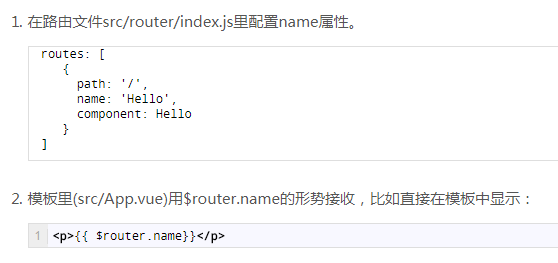
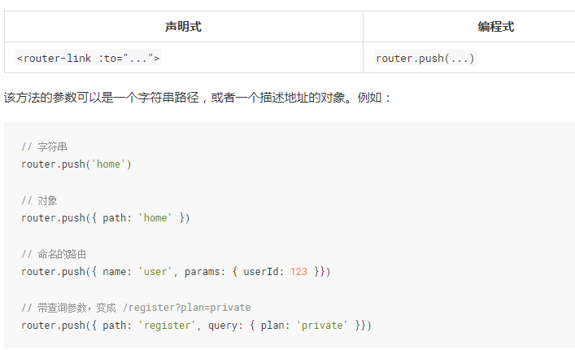
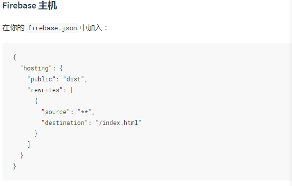

# vue-router教程

## 一、安装

如果你用vue-cli脚手架来搭建项目，配置过程会选择是否用到路由（详细见[vue-cli 脚手架](https://mp.csdn.net/postedit/80488674)），如果选择y，后面下载依赖会自动下载vue-router。
这里还是说一下安装：`npm install vue-router`

## 二、创建组件

如果在一个模块化工程中使用它，必须要通过 Vue.use() 明确地安装路由功能，用vue-cli生产了我们的项目结构，**src文件目录下会有一个router文件夹**，此处就是编写路由组件的地方。在src/router/index.js，这个文件就是路由的核心文件：

```jsscript
import Vue from 'vue'   //引入Vue
import Router from 'vue-router'  //引入vue-router
import Hello from '@/components/Hello'  //引入根目录下的Hello.vue组件
 
Vue.use(Router)  //Vue全局使用Router
 
export default new Router({
  routes: [              //配置路由，这里是个数组
    {                    //每一个链接都是一个对象
      path: '/',         //链接路径
      name: 'Hello',     //路由名称，
      component: Hello   //对应的组件模板
    }，{
      path:'/hi',
      component:Hi,
      children:[        //子路由,嵌套路由 （此处偷个懒，免得单独再列一点）
        {path:'/',component:Hi},
        {path:'hi1',component:Hi1},
        {path:'hi2',component:Hi2},
      ]
    }
  ]
})
```

## 三、router-link制作导航

**1.router-link** 是一个组件，它默认会被渲染成一个带有链接的a标签，通过to属性指定链接地址。
注意：被选中的router-link将自动添加一个class属性值.router-link-active。

```html
<router-link to="/">[text]</router-link>
```

- to：导航路径，要填写的是你在router/index.js文件里配置的path值，如果要导航到默认首页，只需要写成 to="/" ，
- [text] ：就是我们要显示给用户的导航名称。
**2.router-view** 用于渲染匹配到的组件。
①.可以给router-view组件设置**transition过渡**（[Vue2.0 Transition常见用法全解惑](https://link.jianshu.com/?t=http%3A%2F%2Fhyuhan.com%2F2016%2F12%2F08%2Fvue-transition%2F)）。

```jsscript
<transition name="fade">
  <router-view ></router-view>
</transition>
```

**css过渡类名：**
组件过渡过程中，会有四个CSS类名进行切换，这四个类名与transition的name属性有关，比如name="fade",会有如下四个CSS类名：

- fade-enter:进入过渡的开始状态，元素被插入时生效，只应用一帧后立刻删除。
- fade-enter-active:进入过渡的结束状态，元素被插入时就生效，在过渡过程完成后移除。
- fade-leave:离开过渡的开始状态，元素被删除时触发，只应用一帧后立刻删除。
- fade-leave-active:离开过渡的结束状态，元素被删除时生效，离开过渡完成后被删除。
从上面四个类名可以看出，**fade-enter-active**和**fade-leave-active**在整个进入或离开过程中都有效，所以CSS的transition属性在这两个类下进行设置。
**过渡模式mode：**
- in-out(mode默认in-out模式）：新元素先进入过渡，完成之后当前元素过渡离开。
- out-in：当前元素先进行过渡离开，离开完成后新元素过渡进入。
②.还可以配合`<keep-alive>`使用，**keep-alive**可以缓存数据，这样不至于重新渲染路由组件的时候，之前那个路由组件的数据被清除了。比如对当前的路由组件a进行了一些DOM操作之后，点击进入另一个路由组件b，再回到路由组件a的时候之前的DOM操作还保存在，如果不加keep-alive再回到路由组件a时，之前的DOM操作就没有了，得重新进行。如果你的应用里有一个购物车组件，就需要用到keep-alive。

```html
<transition>
  <keep-alive>
    <router-view></router-view>
  </keep-alive>
</transition>
```

## 四、动态路由匹配

我们经常需要把某种模式匹配到的所有路由，全都映射到同个组件。
调用router的map方法映射路由，每条路由以key-value的形式存在，key是路径，value是组件。例如：'/home'是一条路由的key，它表示路径；{component: Home}则表示该条路由映射的组件：

```js
router.map({
    '/home': { component: Home },
    '/about': { component: About }
})
```

例如，我们有一个 User 组件，对于所有 ID 各不相同的用户，都要使用这个组件来渲染。那么，我们可以在 vue-router 的路由路径中使用『动态路径参数』来达到这个效果。

```js
const User = {
  template: '<div>User</div>'
}
 
const router = new VueRouter({
  routes: [
    // 动态路径参数 以冒号开头
    { path: '/user/:id', component: User }
  ]
})
```

例如： /user/foo 和 /user/bar 都将映射到相同的路由。
一个『路径参数』使用冒号 : 标记。当匹配到一个路由时，参数值会被设置到**this.$route.params** 中。例如：


## 五、vue-router参数传递

1.用name传值（不推荐）

2.通过 标签中的to传参

```
<router-link :to="{name:‘dxl’,params:{key:value}}">东西里</router-link>
```

- name：就是我们在路由配置文件中起的name值。
另：**命名路由**就是用一个名称来标识一个路由，在定义路由的时候设置一个name属性即可。**在router-link中也可以用路由的名字来链接到一个路由。**
- params：就是我们要传的参数，它也是对象形势，在对象里可以传递多个值。
最后用`$route.params.username`进行接收.
3.用url传参
上面第五点也有提到。 **:冒号的形式传递参数**
(1).在router路由配置文件里以冒号的形式设置参数

```
{
    path:'/params/:newsId/:userName,
    component:Params
}
```

(2).组件形式，在src/components目录下建立我们params.vue组件。
我们在页面里输出了url传递的参数。

```
<template>
    <div>
        <h2>{{ msg }}</h2>
        <p>新闻ID：{{ $route.params.newsId}}</p>
        <p>用户名：{{ $route.params.userName}}</p>
    </div>
</template>
<script>
export default {
  name: 'params',
  data () {
    return {
      msg: 'params page'
    }
  }
}
</script>
```

(3).标签path路径中传值

```
<router-link to="/params/888/dxl shuai>params</router-link>
```

(4).正则表达式在URL传值中的应用
希望我们传递的新闻ID只能是数字的形式，这时候我们就需要在传递时有个基本的类型判断，`path:'/params/:newsId(\\d+)/:userName'`

## 六.响应路由参数的变化

当使用路由参数时，例如从 /user/foo 导航到 /user/bar，原来的组件实例会被复用。因为两个路由都渲染同个组件，比起销毁再创建，复用则显得更加高效。不过，这也意味着组件的生命周期钩子不会再被调用。
复用组件时，想对路由参数的变化作出响应的话:
(1). watch（监测变化） $route 对象：

```jsscript
const User = {
  template: '...',
  watch: {
    '$route' (to, from) {
      // 对路由变化作出响应...
    }
  }
}
```

(2).beforeRouteUpdate 导航守卫
如果目的地和当前路由相同，只有参数发生了改变 (比如从一个用户资料到另一个 `/users/1` -> `/users/2`)，你需要使用 `beforeRouteUpdate`来响应这个变化 (比如抓取用户信息)。

```jsscript
const User = {
  template: '...',
  beforeRouteUpdate (to, from, next) {
    // react to route changes...
    // don't forget to call next()
  }
}
```

## 七、实现不同路由不同页面标题

```jsscript
// 定义路由的时候如下定义，name也可为中文
const routes = [
  { path: '/goods', component: goods, name: 'goods' },
  { path: '/orders', component: orders, name: 'orders' },
  { path: '/seller', component: seller, name: 'seller' }
];
// 创建路由实例
const router = new VueRouter({
  routes: routes
})
// 关键在这里，设置afterEach钩子函数
router.afterEach((to, from, next) => {
  document.title = to.name;
})
```

## 八、重定向

刚进入应用都是进入到“/”这个路由的，如果想直接进入到“/goods”怎么办，有两种方法。一种是利用重定向，另一种是利用vue-router的导航式编程。
redirect基本重定向：

```js
const routes = [
  { path: '/', redirect: '/goods'}
]
重定向的目标也可以是一个命名的路由。
const routes = [
  { path: '/', redirect: { name: 'goods' }}
]
重定向时也可以传递参数
{
  path:'/',
  redirect:'/goods/:newsId(\\d+)/:userName'
}
```

★.这里不得不提到**alias**别名的使用。
1.首先我们在路由配置文件里给路径起一个别名，dxl。

```css
{
    path: '/hi',
    component: Hi,
    alias:'/dxl'
 }
```

2.配置我们的，起过别名之后，可以直接使用标签里的to属性，进行重新定向。

```
<router-link to="/dxl">jspang</router-link>
```

区别：

- redirect：仔细观察URL，redirect是直接改变了url的值，把url变成了真实的path路径。
- alias：URL路径没有别改变，这种情况更友好，让用户知道自己访问的路径，只是改变了中的内容。
★★★.注意一个大坑：
**别名alias在path为'/'中，是不起作用的。**

```css
{
  path: '/',
  component: Hello,
  alias:'/home'
}
```

## 九、编程式导航

**1.router.push( )**
想要导航到不同的 URL，则使用 **router.push (在创建vue实例并挂载后调用)**。router.push方法就是用来动态导航到不同的链接的，这个方法会向 history 栈添加一个新的记录，所以，当用户点击浏览器后退按钮时，则回到之前的 URL。
当你点击  时，这个方法会在内部调用，所以说，点击  等同于调用 router.push(...)。

**注意：
如果提供了 path，params 会被忽略，而 query 并不属于这种情况。取而代之的是下面例子的做法，你需要提供路由的 name 或手写完整的带有参数的 path：**

```jsscript
const userId = 123
router.push({ name: 'user', params: { userId }}) // -> /user/123
router.push({ path: `/user/${userId}` }) // -> /user/123
// 这里的 params 不生效
router.push({ path: '/user', params: { userId }}) // -> /user
```

**2.router.replace( )**
router.replace跟 router.push 很像，唯一的不同就是，它不会向 history 添加新记录，而是跟它的方法名一样 —— 替换掉当前的 history 记录。

**3.router.go(n)**
这个方法的参数是一个整数，意思是在 history 记录中向前或者后退多少步，类似 window.history.go(n)。

```cpp
// 在浏览器记录中前进一步，等同于 history.forward()
router.go(1)
// 后退一步记录，等同于 history.back()
router.go(-1)
```

自定义一个goback()方法，并使用this.$router.go(-1),进行后退操作

```
<script>
export default {
  name: 'app',
  methods:{
    goback(){
      this.$router.go(-1);
    },
    goHome(){
      this.$router.push('/');
    }
  }
}
</script>
```

## 十、路由中的钩子

**1.路由配置文件中的钩子函数：**
在路由文件中我们只能写一个beforeEnter,就是在进入此路由配置时：

```jsscript
{
      path:'/params/:newsId(\\d+)/:userName',
      component:Params,
      beforeEnter:(to,from,next)=>{
        console.log('我进入了params模板');
        console.log(to);
        console.log(from);
        next();
},
```

三个参数：

- to:路由将要跳转的路径信息，信息是包含在对像里边的。
- from:路径跳转前的路径信息，也是一个对象的形式。
- next:路由的控制参数，常用的有next(true)和next(false)。
**2.写在模板中的钩子函数：**
写在模板中就可以有两个钩子函数可以使用。
beforeRouteEnter：在路由进入前的钩子函数。
beforeRouteLeave：在路由离开前的钩子函数。

```jsscript
export default {
  name: 'params',
  data () {
    return {
      msg: 'params page'
    }
  },
  beforeRouteEnter:(to,from,next)=>{
    console.log("准备进入路由模板");
    next();
  },
  beforeRouteLeave: (to, from, next) => {
    console.log("准备离开路由模板");
    next();
  }
}
```

★此处常用于**数据获取**。

- **导航完成之后获取**：先完成导航，然后在接下来的组件生命周期钩子中获取数据。在数据获取期间显示『加载中』之类的指示。
当你使用这种方式时，我们会马上导航和渲染组件，然后在组件的 **created** 钩子中获取数据。这让我们有机会在数据获取期间展示一个 loading 状态，还可以在不同视图间展示不同的 loading 状态。
假设我们有一个 Post 组件，需要基于 `$route.params.id` 获取文章数据：

```
<template>
  <div class="post">
    <div class="loading" v-if="loading">
      Loading...
    </div>
    <div v-if="error" class="error">
      {{ error }}
    </div>
    <div v-if="post" class="content">
      <h2>{{ post.title }}</h2>
      <p>{{ post.body }}</p>
    </div>
  </div>
</template>
export default {
  data () {
    return {
      loading: false,
      post: null,
      error: null
    }
  },
  created () {
    // 组件创建完后获取数据，
    // 此时 data 已经被 observed 了
    this.fetchData()
  },
  watch: {
    // 如果路由有变化，会再次执行该方法
    '$route': 'fetchData'
  },
  methods: {
    fetchData () {
      this.error = this.post = null
      this.loading = true
      // replace getPost with your data fetching util / API wrapper
      getPost(this.$route.params.id, (err, post) => {
        this.loading = false
        if (err) {
          this.error = err.toString()
        } else {
          this.post = post
        }
      })
    }
  }
}
```

- **导航完成之前获取**：导航完成前，在路由进入的守卫中获取数据，在数据获取成功后再执行导航。
通过这种方式，我们在导航转入新的路由前获取数据。我们可以在接下来的组件的 beforeRouteEnter 守卫中获取数据，当数据获取成功后只调用 next 方法。

```jsscript
export default {
  data () {
    return {
      post: null,
      error: null
    }
  },
  beforeRouteEnter (to, from, next) {
    getPost(to.params.id, (err, post) => {
      next(vm => vm.setData(err, post))
    })
  },
  // 路由改变前，组件就已经渲染完了
  // 逻辑稍稍不同
  beforeRouteUpdate (to, from, next) {
    this.post = null
    getPost(to.params.id, (err, post) => {
      this.setData(err, post)
      next()
    })
  },
  methods: {
    setData (err, post) {
      if (err) {
        this.error = err.toString()
      } else {
        this.post = post
      }
    }
  }
}
```

## 十一、History 模式

vue-router 默认 hash 模式 —— 使用 URL 的 hash 来模拟一个完整的 URL，于是当 URL 改变时，页面不会重新加载。
如果不想要很丑的 hash，我们可以用路由的 history 模式，这种模式充分利用 history.pushState API 来完成 URL 跳转而无须重新加载页面。

```js
const router = new VueRouter({
  mode: 'history',
  routes: [...]
})
```

在学习过渡效果的时候，我们学了mode的设置，但是在路由的属性中还有一个mode。
**mode的两个值：**

- histroy:当你使用 history 模式时，URL 就像正常的 url，
[http://www.dxl.com/user/id](http://www.dxl.com/user/id)
不过这种模式要玩好，还需要后台配置支持。因为我们的应用是个单页客户端应用，如果后台没有正确的配置，当用户在浏览器直接访问
[http://www.dxl.com/user/id](http://www.dxl.com/user/id)
就会返回 404，。所以要在服务端增加一个覆盖所有情况的候选资源：如果 URL 匹配不到任何静态资源，则应该返回同一个 index.html 页面，这个页面就是你 app 依赖的页面。

这么做以后，你的服务器就不再返回 404 错误页面，因为对于所有路径都会返回 index.html 文件。
为了避免这种情况，你应该在 Vue 应用里面覆盖所有的路由情况，然后在给出一个 404 页面。

```jsscript
const router = new VueRouter({
  mode: 'history',
  routes: [
    { path: '*', component: Error}
  ]
})
```

这里的path:'*'就是找不到页面时的配置，component是我们新建的一个Error.vue的文件

- hash:默认’hash’值，但是hash看起来就像无意义的字符排列，不太好看也不符合我们一般的网址浏览习惯。不配置时是这样的：[http://localhost:8080/#/users](https://link.jianshu.com/?t=http%3A%2F%2Flocalhost%3A8080%2F%23%2Fusers)，多个#号。

## 十二、路由组件传参

（这点是直接粘贴的vue官网上的教程，此处是重点要多看多体会！）
在组件中使用 $route 会使之与其对应路由形成高度耦合，从而使组件只能在某些特定的 URL 上使用，限制了其灵活性。
**解耦前：**
`id`不能直接拿出来使用

```js
const User = {
  template: '<div>User {{ $route.params.id }}</div>'
}
const router = new VueRouter({
  routes: [
    { path: '/user/:id', component: User }
  ]
})
```

**使用 props 将组件和路由解耦：**

```js
const User = {
  props: ['id'],
  template: '<div>User {{ id }}</div>'
}
const router = new VueRouter({
  routes: [
    { path: '/user/:id', component: User, props: true },
 
    // 对于包含命名视图的路由，你必须分别为每个命名视图添加 `props` 选项：
    {
      path: '/user/:id',
      components: { default: User, sidebar: Sidebar },
      props: { default: true, sidebar: false }
    }
  ]
})
```

这样你便可以在任何地方使用该组件，使得该组件更易于重用和测试。
**1.布尔模式**
如果 props 被设置为 true，route.params 将会被设置为组件属性。
**2.对象模式**
如果 props 是一个对象，它会被按原样设置为组件属性。当 props 是静态的时候有用。

```js
const router = new VueRouter({
  routes: [
    { path: '/promotion/from-newsletter', component: Promotion, props: { newsletterPopup: false } }
  ]
})
```

**3.函数模式**
你可以创建一个函数返回 props。这样你便可以将参数转换成另一种类型，将静态值与基于路由的值结合等等。

```jsscript
const router = new VueRouter({
  routes: [
    { path: '/search', component: SearchUser, props: (route) => ({ query: route.query.q }) }
  ]
})
```

`/search?q=vue`会将`{query: 'vue'}`作为属性传递给 SearchUser 组件。
请尽可能保持 props 函数为无状态的，因为它只会在路由发生变化时起作用。如果你需要状态来定义 props，请使用包装组件，这样 Vue 才可以对状态变化做出反应。

```jsscript
function dynamicPropsFn (route) {
  const now = new Date()
  return {
    name: (now.getFullYear() + parseInt(route.params.years)) + '!'
  }
}
const router = new VueRouter({
  mode: 'history',
  base: __dirname,
  routes: [
    { path: '/', component: Hello }, // No props, no nothing
    { path: '/hello/:name', component: Hello, props: true }, // Pass route.params to props
    { path: '/static', component: Hello, props: { name: 'world' }}, // static values
    { path: '/dynamic/:years', component: Hello, props: dynamicPropsFn }, // custom logic for mapping between route and props
    { path: '/attrs', component: Hello, props: { name: 'attrs' }}
  ]
})
```
