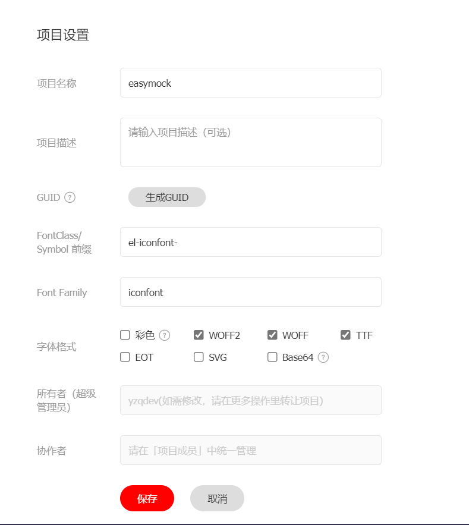

# iconfont 使用

在iconfont网站建好自己的项目,配置好前缀

把生成的链接引入index.html

然后写一个`Econ.vue`文件,

```vue
<template>
  <i
    class="iconfont"
    :class="`el-iconfont-${name}`"
    :style="{ color: color, size: size }"
  ></i>
</template>

<script>
export default {
  name: "EIcon",

  props: {
    name: {
      type: String,
      require: true,
    },
    color: {
      type: String,
    },
    size: {
      type: String,
    },
  },
};
</script>
```

然后就可以使用  `<icon name='图标名称' ></icon>`来调用了
