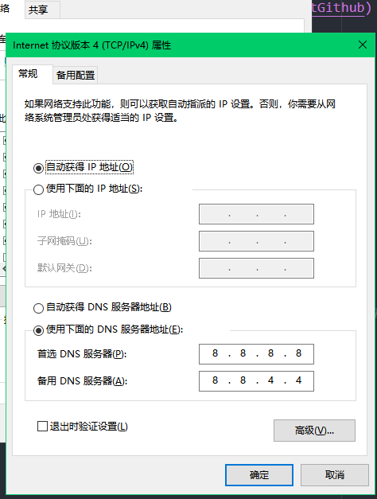
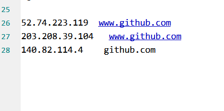

# github无法访问

首先添加谷歌的dns服务
在windows上打开`控制面板\网络和 Internet\网络连接`
在dns添加`8.8.8.8`和`8.8.4.4`  


## 最好的方案fastgithub

[https://github.com/dotnetcore/FastGithub](https://github.com/dotnetcore/FastGithub)

### linux-x64终端

* `sudo ./fastgithub`
* 设置系统自动代理为`http://127.0.0.1:38457`，或手动代理http/https为`127.0.0.1:38457`
  
### linux-x64服务

* `sudo ./fastgithub start` // 以systemd服务安装并启动
* `sudo ./fastgithub stop` // 以systemd服务卸载并删除
* 设置系统自动代理为`http://127.0.0.1:38457`，或手动代理http/https为`127.0.0.1:38457`

可以自己写一个脚本来启动fastgithub

```bash
nohup /opt/fastgithub_linux-x64/fastgithub 2>&1 &    #将程序挂载后台运行且不输出日志文件
# 配置自动代理
# 编辑 /etc/profile ,加上下面的内容
export http_proxy=http://127.0.0.1:38457

export https_proxy=http://127.0.0.1:38457

```

## 使用steam++加速

地址在这里  
[https://steampp.net/](https://steampp.net/)

## 使用hellogithub生成

[https://github.com/521xueweihan/GitHub520](https://github.com/521xueweihan/GitHub520)

## 手动设置ip

反复打开这几个地址:
[https://github.com.ipaddress.com/](https://github.com.ipaddress.com/)  
[https://fastly.net.ipaddress.com/github.global.ssl.fastly.net](https://fastly.net.ipaddress.com/github.global.ssl.fastly.net)  
添加到hosts  
然后`ipconfig /flushdns`

1. 打开域名解析网站

点击打开[https://www.ipaddress.com/](https://www.ipaddress.com/)

2. 在上图箭头所指区域的输入框中分别输入两个网站：

github.com
github.global.ssl.fastly.net
[assets-cdn.github.com/](https://assets-cdn.github.com/)  


3. 将响应出的两个对应IP地址复制下来，打开 `C:\Windows\System32\drivers\etc`中的host文件



重新访问有关github的网址，就可以打开了

github下载太慢

都是基于加速通道来解决的，这里罗列一下加速通道地址：
[https://github.com.cnpmjs.org/](https://github.com.cnpmjs.org/)

* [http://CNPMJS.ORG](https://link.zhihu.com/?target=http%3A//CNPMJS.ORG)
* [http://FastGit.ORG](https://link.zhihu.com/?target=http%3A//FastGit.ORG)
* Cloudflare Workers
* [http://github.zhlh6.cn](https://link.zhihu.com/?target=http%3A//github.zhlh6.cn)
* [https://git.sdut.me/](https://git.sdut.me/)
* [https://shrill-pond-3e81.hunsh.workers.dev/](https://shrill-pond-3e81.hunsh.workers.dev/)
* [http://gitd.cc/](http://gitd.cc/)
* [https://gitclone.com/](https://gitclone.com/)

这里，给大家分享两款基于这些加速通道加速的插件和脚本（插件下载地址见文末）

## Chrome插件

这是一款基于Chrome插件的解决方案，界面设计完全与Github融合，简直完美~
官方地址：[https://chrome.google.com/webstore/detail/github%E5%8A%A0%E9%80%9F/mfnkflidjnladnkldfonnaicljppahpg](https://link.zhihu.com/?target=https%3A//chrome.google.com/webstore/detail/github%25E5%258A%25A0%25E9%2580%259F/mfnkflidjnladnkldfonnaicljppahpg)
是不是这个按钮挺漂亮的^_^
如何使用SSH通道?
配置用户配置文件 (~/.ssh/config)

```text
Host github.com
HostName github.com
User git
IdentityFile 指定密钥认证使用的私钥文件路径
# 新增如下内容
Host git.zhlh6.cn
HostName git.zhlh6.cn
User git
IdentityFile 使用github.com的秘钥


 测试连接
 ssh -T git@git.zhlh6.cn
```

经常要clone github中的一些项目，无奈如果不爬梯子的话速度实在是龟速，经常1k/s，于是搜了下解决方法，改HOSTS大法。
Windows下在C:/Windows/system32/drivers/etc/hosts(打开火绒->更多工具->修改host文件)
Ubuntu等linux系一般在/etc/hosts
在hosts中添加如下内容：(需要自己更新)

```text
# Github Hosts
# Update 20210606
140.82.114.4 github.com
140.82.112.3 github.com
140.82.114.9 nodeload.github.com

140.82.112.5 api.github.com
140.82.112.10 codeload.github.com
185.199.108.133 raw.github.com
185.199.108.153 training.github.com

185.199.108.153 assets-cdn.github.com
185.199.109.153 assets-cdn.github.com
185.199.108.153 assets-cdn.github.com
185.199.110.153 assets-cdn.github.com
185.199.111.153 documentcloud.github.com

185.199.108.154 help.github.com

185.199.108.153 githubstatus.com
199.232.69.194 github.global.ssl.fastly.net

185.199.108.133 raw.githubusercontent.com
185.199.108.133 cloud.githubusercontent.com
185.199.108.133 gist.githubusercontent.com
185.199.108.133 marketplace-screenshots.githubusercontent.com
185.199.108.133 repository-images.githubusercontent.com
185.199.108.133 user-images.githubusercontent.com
185.199.108.133 desktop.githubusercontent.com

185.199.108.133 avatars.githubusercontent.com
185.199.109.133 avatars.githubusercontent.com
185.199.110.133 avatars.githubusercontent.com
185.199.111.133 avatars.githubusercontent.com
185.199.108.133 avatars0.githubusercontent.com
185.199.108.133 avatars1.githubusercontent.com
185.199.108.133 avatars2.githubusercontent.com
185.199.108.133 avatars3.githubusercontent.com
185.199.108.133 avatars4.githubusercontent.com
185.199.108.133 avatars5.githubusercontent.com
185.199.108.133 avatars6.githubusercontent.com
185.199.108.133 avatars7.githubusercontent.com
185.199.108.133 avatars8.githubusercontent.com
# End of the section
```

改完之后立刻刷新，
Windows：ipconfig /flushdns
Ubuntu：sudo systemctl restart nscd
Mac：sudo killall -HUP mDNSResponder

## 一些dns服务推荐

如下整理一些好用的DNS，设置DNS后可以加速哦

### Centos设置DNS方法

vi /etc/resolv.conf
这个文件包含了DNS的地址信息，可以自己在这里添加，如下：

```text
# Generated by NetworkManager
nameserver 8.8.8.8
nameserver 114.114.114.114
```

------

### 1、阿里DNS

223.5.5.5
223.6.6.6

### 2、Google DNS

8.8.8.8
8.8.4.4

### 3、Cloudflare的快速、保护隐私的DNS

1.1.1.1
1.0.0.1（推荐）

### 4、老牌的114DNS，全国三网通用高速，纯净无劫持

114.114.114.144
114.114.115.115

### 5、拦截钓鱼、病毒、木马，高度安全

114.114.114.119
114.114.115.119

### 6、拦截色情不良网站

114.114.114.110
114.114.115.110

### 7、SDNS,中国互联网络信息中心与国内外运营商推迟的，高速、安全、智能无劫持

1.2.4.8
210.2.4.8（推荐）

### 8、openDNS

208.67.222.222
208.67.220.220

------

the End.
