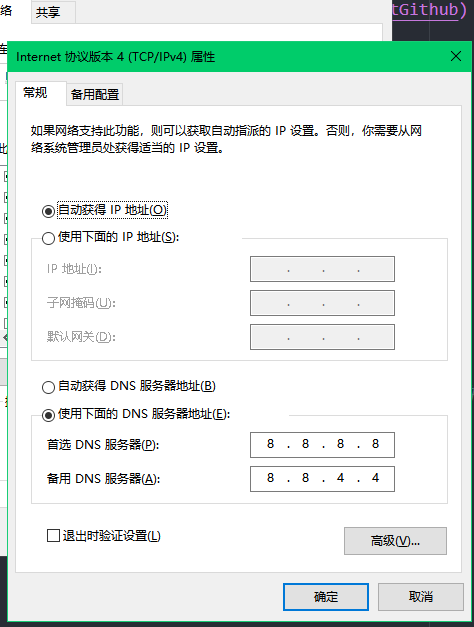
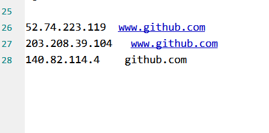

# GitHub 访问加速

国内访问 GitHub 速度慢或无法访问的解决方案。

## 方案一：修改 DNS

在 Windows 中打开 `控制面板 → 网络和 Internet → 网络连接`，为网络适配器添加 Google DNS：

```
8.8.8.8
8.8.4.4
```



## 方案二：FastGithub（推荐）

[FastGithub](https://github.com/dotnetcore/FastGithub) 是一个开源的 GitHub 加速工具。

### Linux 使用

```bash
# 终端运行
sudo ./fastgithub

# 以 systemd 服务安装并启动
sudo ./fastgithub start

# 卸载服务
sudo ./fastgithub stop
```

设置系统代理：`http://127.0.0.1:38457`

后台运行脚本：

```bash
nohup /opt/fastgithub_linux-x64/fastgithub 2>&1 &

# 配置自动代理（添加到 /etc/profile）
export http_proxy=http://127.0.0.1:38457
export https_proxy=http://127.0.0.1:38457
```

## 方案三：Steam++

[Steam++](https://steampp.net/) 提供 GitHub 加速功能。

## 方案四：GitHub520

[GitHub520](https://github.com/521xueweihan/GitHub520) 通过定时更新 hosts 文件实现加速。

## 方案五：手动修改 hosts

1. 查询 GitHub 相关域名的 IP：

   - [github.com IP](https://github.com.ipaddress.com/)
   - [github.global.ssl.fastly.net IP](https://fastly.net.ipaddress.com/github.global.ssl.fastly.net)

2. 将获取的 IP 添加到 hosts 文件：

   - Windows: `C:\Windows\System32\drivers\etc\hosts`
   - Linux/Mac: `/etc/hosts`

   

3. 刷新 DNS 缓存：

```bash
# Windows
ipconfig /flushdns

# Ubuntu
sudo systemctl restart nscd

# Mac
sudo killall -HUP mDNSResponder
```

## GitHub 下载加速

使用镜像加速 clone：

| 镜像地址 | 说明 |
|----------|------|
| [github.com.cnpmjs.org](https://github.com.cnpmjs.org/) | CNPM 镜像 |
| [gitclone.com](https://gitclone.com/) | GitClone 镜像 |
| [git.sdut.me](https://git.sdut.me/) | SDUT 镜像 |
| [gitd.cc](http://gitd.cc/) | GitD 镜像 |

### SSH 通道加速

编辑 `~/.ssh/config`：

```text
Host github.com
  HostName github.com
  User git
  IdentityFile ~/.ssh/id_rsa

Host git.zhlh6.cn
  HostName git.zhlh6.cn
  User git
  IdentityFile ~/.ssh/id_rsa
```

测试连接：

```bash
ssh -T git@git.zhlh6.cn
```

## 常用 DNS 服务

| DNS 服务 | 地址 | 说明 |
|----------|------|------|
| 阿里 DNS | `223.5.5.5` / `223.6.6.6` | 国内推荐 |
| Google DNS | `8.8.8.8` / `8.8.4.4` | 全球通用 |
| Cloudflare DNS | `1.1.1.1` / `1.0.0.1` | 快速、保护隐私 |
| 114 DNS | `114.114.114.114` / `114.114.115.115` | 全国三网通用 |
| 安全 DNS | `114.114.114.119` / `114.114.115.119` | 拦截钓鱼和病毒 |
| SDNS | `1.2.4.8` / `210.2.4.8` | 中国互联网络信息中心推荐 |
| OpenDNS | `208.67.222.222` / `208.67.220.220` | 老牌 DNS |
