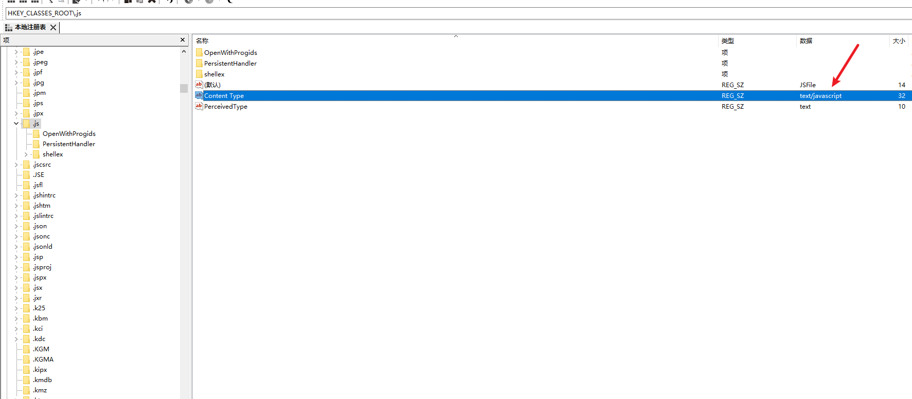

# go内嵌资源

:::tip
如果出现

```text
Failed to load module script: Expected a JavaScript module script but the server responded with a MIME type of "text/html". Strict MIME type checking is enforced for module scripts per HTML spec.
```

则需要在注册表里面把关联给改掉
`HKEY_CLASSES_ROOT\.js`


:::

## embed 的基本用法

Go embed的使用非常简单，通过//go:embed指令即可，下面我通过一个例子说明：

```go
package main
import (
   "embed"
   "fmt"
)
//go:embed fire
var s string
//go:embed fire
var b []byte
//go:embed templates
var fs embed.FS
func main() {
   fmt.Println(s)
   fmt.Println(string(b))
   data, err := fs.ReadFile("templates/index.tmpl")
   fmt.Println(err,string(data))
}
```

以上代码中，主要是通过`//go:embed`指令达到读取文件内容的目的。`//go:embed`指令后可以是一个文件，也可以是多个文件（空格隔开即可），也可以是一个目录。 其中`string`和`[]byte`类型都只能匹配一个文件，如果要匹配多个文件或者一个目录，就要使用`embed.FS`类型。

## embed 在http web中的使用

看到embed这个功能，你首先想到的应该是把以前开发Web应用时使用的静态文件、模板文件打包进应用程序中，所以接下来就来看下embed如何在http web中使用。

下面先来看一个使用http托管静态文件的示例

```go
package main
import (
   "embed"
   "net/http"
)
//go:embed static
var static embed.FS
func main() {
   http.ListenAndServe(":8080", http.FileServer(http.FS(static)))
}
```

看到了吧就是这么简单，就是这么魔幻，几行代码就实现了静态文件的Web托管，并且可以结合`embed`特性把静态`static`目录里的内容全部打包到生成的应用程序中，部署非常方便。 以上代码的核心除了`//go:embed`指令外，还有通过`http.FS`这个函数，把`embed.FS`类型的`static`转换为`http.FileServer`函数可以识别的`http.FileSystem`类型。

## embed 在模板中的应用

在Go Web的开发中，除了静态文件外，还有Go Template，可以更好的帮助我们渲染Web网页。下面来下看`embed`是如何被Go 模板使用的。

```go
package main
import (
   "embed"
   "html/template"
   "net/http"
)
//go:embed templates
var tmpl embed.FS
func main() {
   t, _ := template.ParseFS(tmpl, "templates/*.tmpl")
   http.HandleFunc("/", func(rw http.ResponseWriter, r *http.Request) {
      t.ExecuteTemplate(rw,"index.tmpl",map[string]string{"title":"Golang Embed 测试"})
   })
   http.ListenAndServe(":8080",nil)
}
```

从以上示例中可以看到，`template`包提供了`ParseFS`函数，可以直接从一个`embed.FS`中加载模板，然后用于`HTTP Web`中。模板文件夹的结构如下所示：

```go
templates
└── index.tmpl
```
## Gin静态文件服务

Gin框架中托管一个静态文件服务非常简单，使用`Static`方法即可，下面看个例子：

```go
package main
import (
   "embed"
   "github.com/gin-gonic/gin"
   "net/http"
)
//go:embed static
var static embed.FS
func main() {
   r:=gin.Default()
   r.StaticFS("/",http.FS(static))
   r.Run(":8080")
}
```

从以上示例中可以看到，在`Gin`中使用`embed`作为静态文件，也是用过`http.FS`函数转化的。

## Gin HTML 模板

同样的，`embed`也可以用于Gin的HTML模板中，示例如下：

```go
package main
import (
   "embed"
   "github.com/gin-gonic/gin"
   "html/template"
)
//go:embed templates
var tmpl embed.FS
//go:embed static
var static embed.FS
func main() {
   r:=gin.Default()
   t, _ := template.ParseFS(tmpl, "templates/*.tmpl")
   r.SetHTMLTemplate(t)
   r.GET("/", func(ctx *gin.Context) {
      ctx.HTML(200,"index.tmpl",gin.H{"title":"Golang Embed 测试"})
   })
   r.Run(":8080")
}
```

和前面的模板例子一样，也是通过`template.ParseFS`函数先加载`embed`中的模板，然后通过Gin的`SetHTMLTemplate`设置后就可以使用了。
