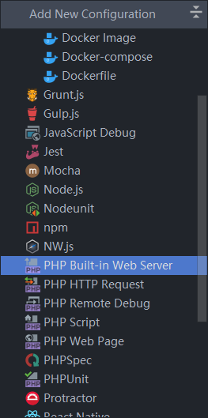

# 环境搭建

## 安装php

windows版本php下载: [https://windows.php.net/download](https://windows.php.net/download)  
xdebug下载: [https://xdebug.org/](https://xdebug.org/)
把php的压缩包解压后放在`c:\php`文件夹

## 安装composer

如果出现如下错误，说明伟大的防火墙阻止了你获取存在国外服务器的文件，需要手动下载一下


### 第一步：添加php.exe到环境变量

方法：计算机-->右键-->属性-->高级系统设置-->环境变量（这一步相信大家都是妥妥的）


复制php.exe的路径，粘贴到path环境变量中（注意前面有一个分号;），图片如下：


> **php -v** 执行成功会返回版本信息，这里是PHP 7.0.12


### 第二步：开启openssl扩展

方法：在PHP目录下，打开**php.ini**文件，去掉**extension=php_openssl.dll**前面的分号(**;**)


### 第三：下载[composer.phar](https://link.jianshu.com?t=https://getcomposer.org/composer.phar)并放到PHP目录下，在PHP目录下新建`composer.cmd`， 内容为

```powershell
**@php "%~dp0composer.phar" %\***
```


保存后，**运行这个文件，**打开cmd，输入 `composer -V` 查看是否成功


#### 第四：更改 Packagist 为国内镜像

```powershell
composer config -g repo.packagist composer  https://packagist.phpcomposer.com 
```


## phpstorm运行项目

配置好php环境,然后,选择`php build in web server`:  

