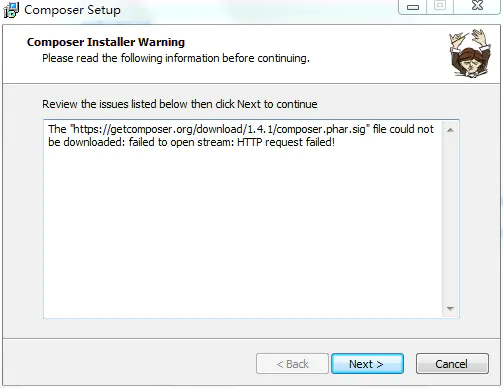
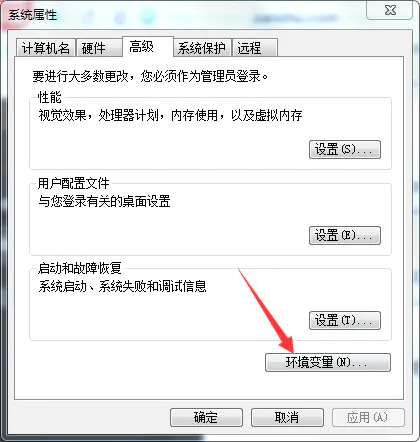
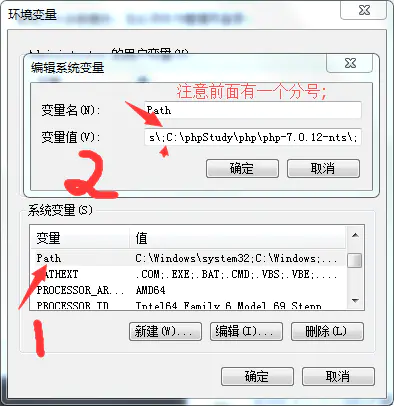
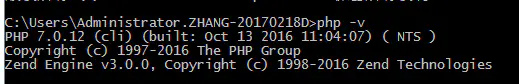
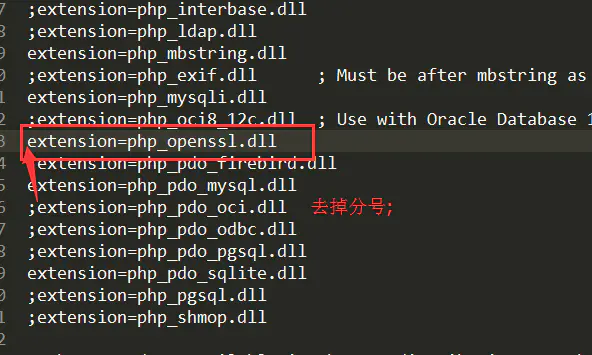
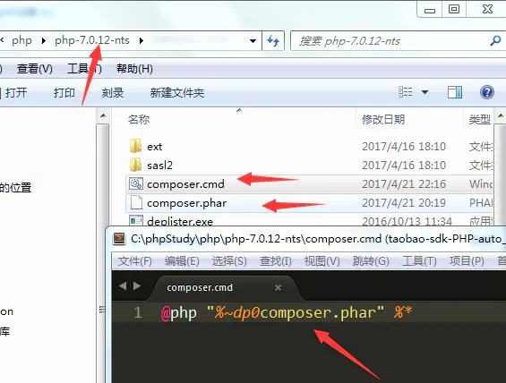
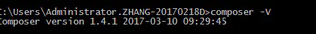
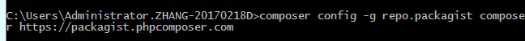
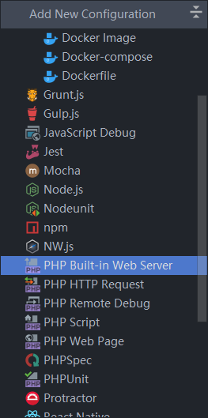

# 环境搭建

## 安装php

windows版本php下载: [https://windows.php.net/download](https://windows.php.net/download)  
xdebug下载: [https://xdebug.org/](https://xdebug.org/)
把php的压缩包解压后放在`c:\php`文件夹

## 安装composer

如果出现如下错误，说明伟大的防火墙阻止了你获取存在国外服务器的文件，需要手动下载一下



### 第一步：添加php.exe到环境变量

方法：计算机-->右键-->属性-->高级系统设置-->环境变量（这一步相信大家都是妥妥的）



复制php.exe的路径，粘贴到path环境变量中（注意前面有一个分号;），图片如下：



> **php -v** 执行成功会返回版本信息，这里是PHP 7.0.12



### 第二步：开启openssl扩展

方法：在PHP目录下，打开**php.ini**文件，去掉**extension=php_openssl.dll**前面的分号(**;**)



### 第三：下载[composer.phar](https://link.jianshu.com?t=https://getcomposer.org/composer.phar)并放到PHP目录下，在PHP目录下新建`composer.cmd`， 内容为

```powershell
**@php "%~dp0composer.phar" %\***
```



保存后，**运行这个文件，**打开cmd，输入 `composer -V` 查看是否成功



#### 第四：更改 Packagist 为国内镜像

```powershell
composer config -g repo.packagist composer  https://packagist.phpcomposer.com 
```



## composer运行出现问题

1. 建议先将Composer版本升级到最新：

```shell
composer self-update
```

2. 执行诊断命令：

```shell
composer diagnose
```

3. 清除缓存：

```shell
composer clear
```

4. 若项目之前已通过其他源安装，则需要更新 composer.lock 文件，执行命令：

```shell
composer update --lock
```

## composer管理依赖

要使用 Composer，我们需要先在项目的目录下创建一个 composer.json 文件，文件描述了项目的依赖关系

```json
{
    "require": {
        "monolog/monolog": "1.2.*"
    }
}
```

### 安装依赖

```shell
composer install
```

### 指定安装依赖

```shell
 composer require monolog/monolog
```

### 更新依赖

```shell
# 更新所有依赖
composer update

# 更新指定的包
composer update monolog/monolog

# 更新指定的多个包
composer update monolog/monolog symfony/dependency-injection

# 还可以通过通配符匹配包
composer update monolog/monolog symfony/*
```

### 移除依赖

```shell

composer remove monolog/monolog
```

## phpstorm运行项目

配置好php环境,然后,选择`php build in web server`:  


使用命令行运行

```shell
# 其中php-tutor是文件夹名称
php.exe -S localhost:82 -t  php-tutor

```
