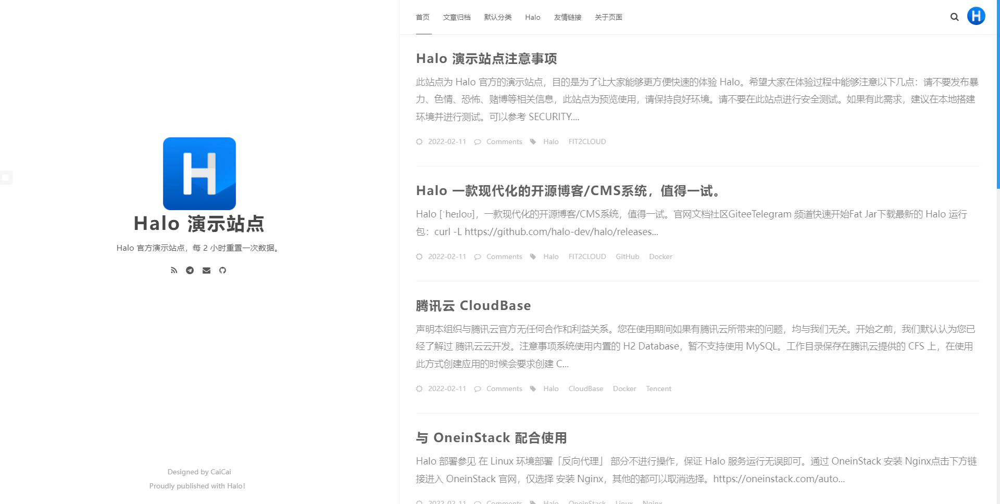
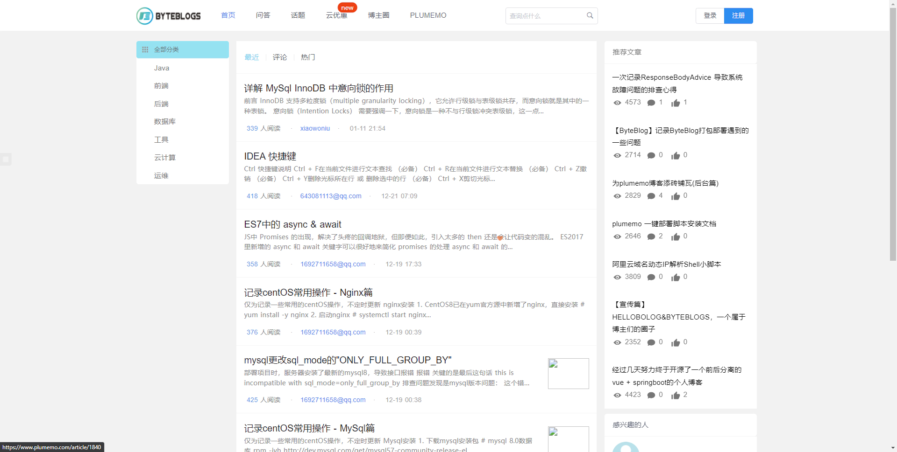

# 博客推荐

## **halo**

- Github 地址 ：**<https://github.com/halo-dev/halo>**
- Star : 16.2k
- 简介 ：✍ 一个优秀的开源博客发布应用。
- 技术 ：Spring Boot+JPA+Hutool
- 推荐等级 ：⭐⭐⭐⭐⭐
- 评价 ：这款博客生态非常好（可选主题也非常多），使用的人也非常多。并且！！**还提供了小程序端！** 另外，搭建步骤也非常简单，基本是傻瓜式的。

**Halo 首页：**

Halo首页-halo.run

**Halo 主题仓库 ：**

主题仓库- Halo-halo.run

**Halo 博客效果：**

halo-寒山志-baozi.fun

## **OneBlog**

- Github 地址：**<https://gitee.com/yadong.zhang/DBlog>**
- Star : 2.3k
- 简介 ：一个简洁美观、功能强大并且自适应的 Java 博客。使用 Spring Boot 开发，前端使用 Bootstrap。支持移动端自适应，配有完备的前台和后台管理功能。
- 技术 : Springboot + Shiro + [MySQL](https://cloud.tencent.com/product/cdb?from=10680) + Mybatis + [Redis](https://cloud.tencent.com/product/crs?from=10680)
- 推荐等级 ：⭐⭐⭐⭐
- 评价 ：我个人比较喜欢的一款博客样式类型（*不过，需要花更多时间自定义和完善。没精力折腾的，慎入！*），自带评论系统、SEO 等功能。比较适合做知识沉淀类网站。

Artificial-Intelligence-Algorithm-Scientist-www.piqiandong.com

## **solo**

- Github 地址：**<https://github.com/88250/solo>**
- Star : 0.8k
- 简介 ：Solo 是一款小而美的开源博客系统，专为程序员设计。? Solo是 B3log 分布式社区的 Java 博客端节点系统，欢迎加入下一代社区网络。
- 技术 ：Docker+H2+Nginx+Latke （作者自研的以 JSON 为主的 Java Web 框架）
- 推荐等级：⭐⭐⭐⭐
- 评价 ：和 halo 一样，都是比较成熟的博客系统了，并且生态特别好。Solo 第一个版本是在 2020 年发布，到现在为止，Solo 项目的作者已经维护这个项目快 10 年了。为你们点赞！感谢你们的付出！另外，需要格外说明一下：**项目框架不是选用的主流的 Spring Boot 而是作者自己写的一个叫做 Latke 的 web 框架。**

**solo 博客效果：**

## **蘑菇博客**

- Github 地址：**<https://gitee.com/moxi159753/mogu_blog_v2>**
- Star: 1.2k
- 简介：基于SpringBoot实现零配置让系统的配置更简单，使用了Mybatis-Plus快速开发框架，在不是复杂的查询操作下，无需写 sql 就可以快速完成接口编写。后台管理系统使用了 vue 中流行的ant，另外前后交互使用了JWT作为令牌，进行权限、登录校验。。
- 技术 ：Spring boot + MyBatis-Plus + JWT
- 推荐等级：⭐⭐⭐⭐
- 评价：第一次看到基于微服务架构的个人博客系统。我觉得作者可能是为了检验自己对于微服务相关框架的掌握，正如作者说的那样：“现在挺多是 SSM 或者 SSH 的博客管理系统，想用 spring boot + spring cloud + vue 的微服务架构进行尝试项目的构建，里面很多功能可能只是为了满足自己的学习需求而引入的，因此本博客也是一个非常好的 SpringBoot、SpringCloud 以及 Vue 技术的入门学习项目。”

**蘑菇博客前台效果：**

蘑菇博客-专注于技术分享的博客平台-demoweb.moguit.cn

**蘑菇博客后台效果：**

蘑菇云后台管理系统-demoadmin.moguit.cn

## **plumemo**

- Github 地址 ：**<https://github.com/byteblogs168/plumemo>**。
- Star: 0.3k
- 简介：蘑菇博客(MoguBlog)，一个基于微服务架构的前后端分离博客系统。
- 技术 ：Spring Boot + Spring Cloud Alibaba + MyBatis-Plus + ElasticSearch
- 推荐等级：⭐⭐⭐⭐
- 评价 ：界面简单美观，基于 Spring Boot 开发，适合用来学习，同时适合用来作为自己的博客。

**plumemo 博客后台效果：**

 <https://www.plumemo.com/>
