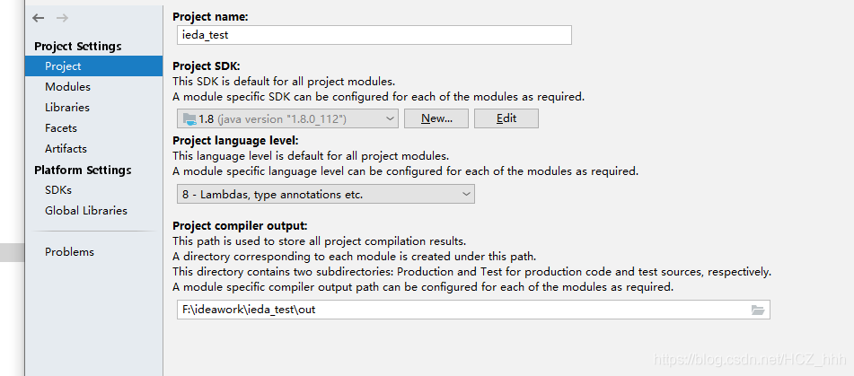
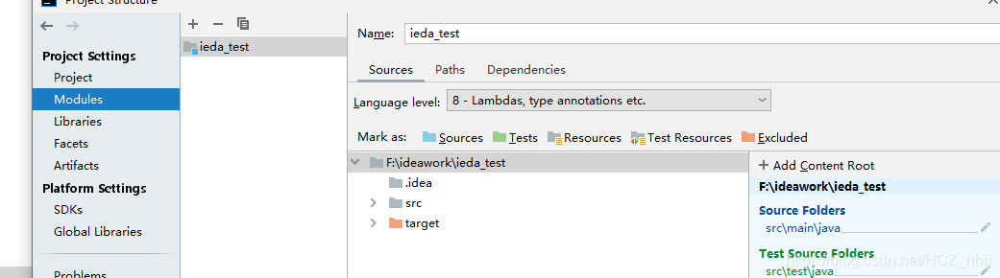
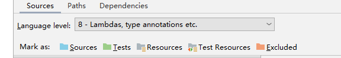
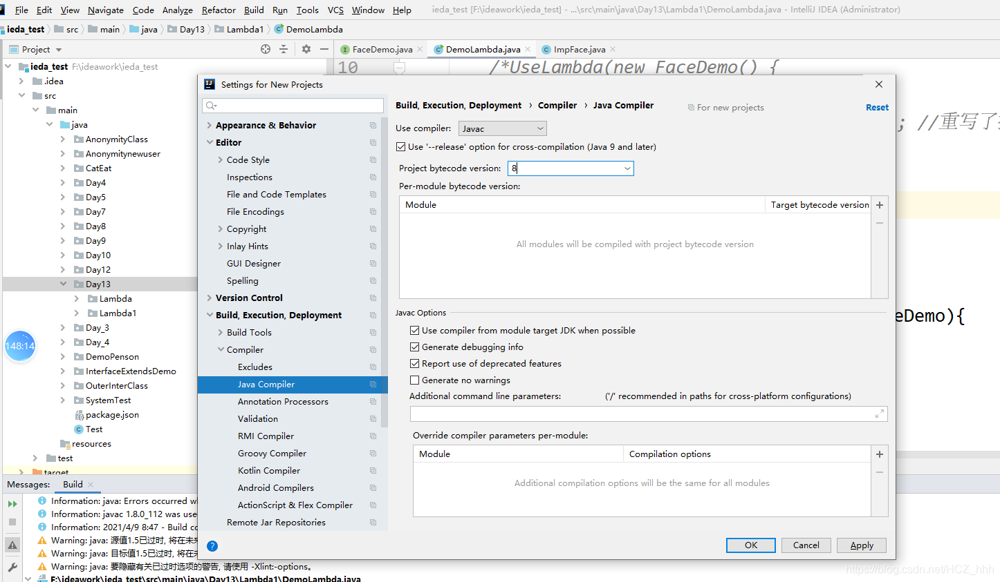

# java常见错误

java: -source 1.5 中不支持 lambda 表达式

## 解决方案






file->other settering->seting for now project


[https://alda.io/install/](https://alda.io/install/)
博主技术笔记  [http://notes.xiyanit.cn/#/](http://notes.xiyanit.cn/#/)
org.hibernate.validator找不到

下面这个变红

```java
import org.hibernate.validator.constraints.Length;
import javax.validation.constraints.*;
```

添加下面这个依赖

```xml
<!-- https://mvnrepository.com/artifact/org.hibernate.validator/hibernate-validator -->
<dependency>
    <groupId>org.hibernate.validator</groupId>
    <artifactId>hibernate-validator</artifactId>
    <version>6.2.0.Final</version>
</dependency>
```

​

或者使用springboot的validator

```xml
    <dependency>
            <groupId>org.springframework.boot</groupId>
            <artifactId>spring-boot-starter-validation</artifactId>
            
        </dependency>
```
