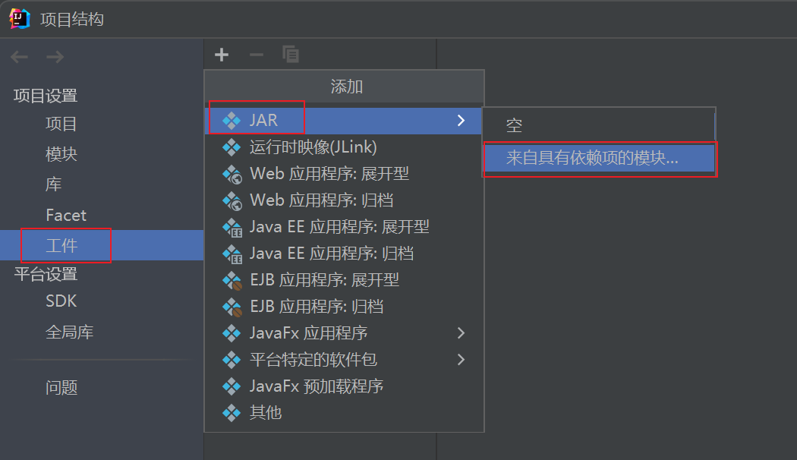
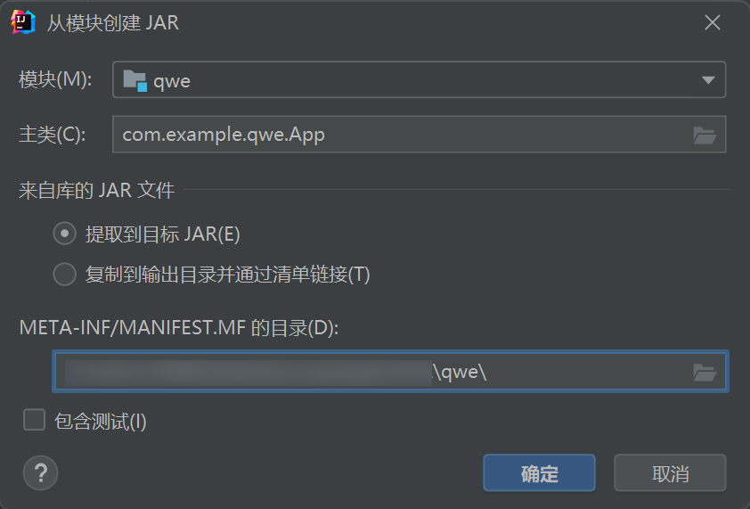
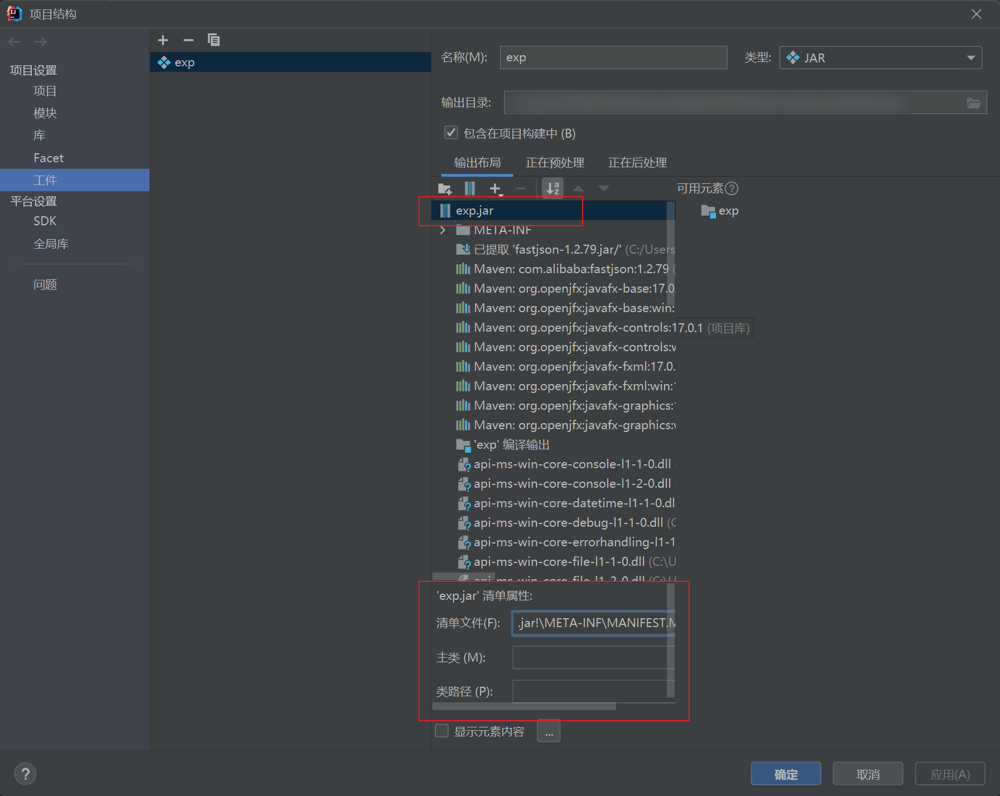
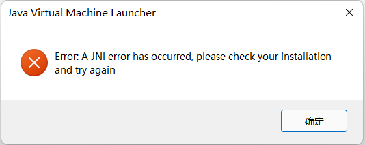
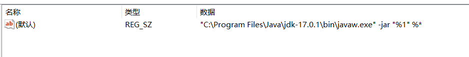

# javafx打包

## JavaFX SDK包导入方法

### 方法一：在IDEA中导入

**文件 --> 项目结构 --> 项目设置 --> 库 --> “+” --> 添加下载的JavaFx SDK中lib目录下的所有jar文件即可**

### 方法二：使用Maven导入

在 pom.xml 文件中添加

xml

```xml
<dependency>
  <groupId>org.openjfx</groupId>
  <artifactId>javafx-controls</artifactId>
  <!--指定版本-->
  <version>17.0.2</version>
</dependency>
<dependency>
  <groupId>org.openjfx</groupId>
  <artifactId>javafx-fxml</artifactId>
  <!--指定版本-->
  <version>17.0.2</version>
</dependency>
```

然后重载项目

## 将项目打包成 jar文件

:::tip

先决条件
**新建一个java文件作为main文件，用来加载含有JavaFX项目的文件**

```java
package net.yzq.fxdemo;
 
public class App {
    public static void main(String[] args) {
        HelloApplication.main(args);
    }
}
```

:::

**文件 --> 项目结构 --> 项目设置 --> 工件 --> “+” --> JAR --> 来自具有依赖项的模块**



**这里要注意文件位置**


**选择JavaFX SDK中 bin目录下所有 dll 文件添加进去，如果JavaFX的其他jar没有自动添加，也需要进行添加**

**再在，构建 --> 构建工件 --> 点击构建**

**之后可以看见，项目中生成了个 jar文件。此时右键 jar文件点击运行，程序正常启动，去目录下双击，程序也会正常启动。**

### 方法二：使用 Maven打包

**首先还是要新建一个java文件作为main文件，用来加载含有JavaFX项目的文件。具体可参考上面的步骤。**
**再在 pom.xml文件中添加插件**

### 使用默认openjfx的javafx-maven-plugin

```xml
<plugin>
    <groupId>org.openjfx</groupId>
    <artifactId>javafx-maven-plugin</artifactId>
    <version>0.0.8</version>
    <executions>
        <execution>
            <!-- Default configuration for running with: mvn clean javafx:run -->
            <id>default-cli</id>
            <configuration>
                <mainClass>com.example.fxdemo/net.yzq.fxdemo.App</mainClass>
                <launcher>app</launcher>
                <jlinkZipName>app</jlinkZipName>
                <jlinkImageName>app</jlinkImageName>
                <noManPages>true</noManPages>
                <stripDebug>true</stripDebug>
                <noHeaderFiles>true</noHeaderFiles>
            </configuration>
        </execution>
    </executions>
</plugin>
```

然后`mvn clean javafx:jlink`即可

### 使用zenjava的javafx-maven-plugin

(注意:8.8.3版本仅支持java1.8)
<https://github.com/javafx-maven-plugin/javafx-maven-plugin>

```xml
<plugin>
    <groupId>com.zenjava</groupId>
    <artifactId>javafx-maven-plugin</artifactId>
    <version>8.8.3</version>
    <configuration>
        <mainClass>com.example.exp.App</mainClass>
    </configuration>
</plugin>
```

### 使用 maven-shade-plugin

xml

```xml
<plugin>
  <groupId>org.apache.maven.plugins</groupId>
  <artifactId>maven-shade-plugin</artifactId>
  <version>RELEASE</version>

  <configuration>
    <shadedArtifactAttached>true</shadedArtifactAttached>
    <transformers>
      <transformer implementation="org.apache.maven.plugins.shade.resource.ManifestResourceTransformer">
  <!--指定主类，这里填你新建的那个java文件-->
             <mainClass>net.yzq.fxdemo.App</mainClass>
      </transformer>
    </transformers>
  </configuration>

  <executions>
    <execution>
      <phase>package</phase>
      <goals>
        <goal>shade</goal>
      </goals>
    </execution>
  </executions>
</plugin>
```

在IDEA右侧 Maven中点击 package进行打包

或者

```shell
mvn clean package
```

生成的 jar文件有两个，那个名字为 xxx-shaded.jar 才是可以运行的。此时右键 运行，双击 jar文件，都是可以正常运行的。

### 使用 maven-assembly-plugin

xml

```xml
<plugin>
  <groupId>org.apache.maven.plugins</groupId>
  <artifactId>maven-assembly-plugin</artifactId>
  <version>3.3.0</version>
  <configuration>
    <archive>
      <manifest>
        <!-- <mainClass>入口类，main 方法所在位置</mainClass> -->
        <mainClass>com.example.exp.App</mainClass>
      </manifest>
    </archive>
    <descriptorRefs>
      <!-- jar 携带依赖 -->
      <descriptorRef>jar-with-dependencies</descriptorRef>
    </descriptorRefs>
  </configuration>
  <executions>
    <execution>
      <phase>package</phase>
      <goals>
        <goal>single</goal>
      </goals>
    </execution>
  </executions>
</plugin>
```

生成的 xxx-jar-with-dependencies.jar 为可运行的 jar文件

### 使用 maven-jar-plugin

需要使用 maven-dependency-plugin 来配合生成一个存放依赖的文件夹，才能达到双击 jar文件执行的效果。

xml

```xml
<plugin>
  <groupId>org.apache.maven.plugins</groupId>
  <artifactId>maven-jar-plugin</artifactId>
  <version>3.2.0</version>
  <!-- 对要打的jar包进行配置 -->
  <configuration>
    <archive>
      <!--生成的jar中，不要包含pom.xml和pom.properties这两个文件-->
      <addMavenDescriptor>false</addMavenDescriptor>
      <manifest>
        <!--是否要把第三方jar放到manifest的classpath中-->
        <addClasspath>true</addClasspath>
        <!--生成的manifest中classpath的前缀，
            因为要把第三方jar放到lib目录下，
            所以classpath的前缀是lib/-->
        <classpathPrefix>lib/</classpathPrefix>
        <!--指定主类-->
        <mainClass>com.example.exp.App</mainClass>
      </manifest>
      <manifestEntries>
        <Class-Path>./</Class-Path>
      </manifestEntries>
    </archive>
  </configuration>
</plugin>
```

xml

```xml
<!--在打包阶段将依赖的jar包导出到lib目录下-->
<plugin>
  <groupId>org.apache.maven.plugins</groupId>
  <artifactId>maven-dependency-plugin</artifactId>
  <executions>
    <execution>
      <id>copy-dependencies</id>
      <phase>package</phase>
      <goals>
        <goal>copy-dependencies</goal>
      </goals>
      <configuration>
        <type>jar</type>
        <includeTypes>jar</includeTypes>
        <outputDirectory>${project.build.directory}/lib</outputDirectory>
      </configuration>
    </execution>
  </executions>
</plugin>
```

### 使用javapackager打包为exe

```xml
<plugin>
    <groupId>io.github.fvarrui</groupId>
    <artifactId>javapackager</artifactId>
    <version>1.6.7</version>
    <executions>
        <execution>
            <phase>package</phase>
            <goals>
                <goal>package</goal>
            </goals>
            <configuration>
                <!-- mandatory -->
                <mainClass>net.yzq.fxdemo.App</mainClass>
                <!-- optional -->
                <bundleJre>false</bundleJre>
                <generateInstaller>false</generateInstaller>
                <administratorRequired>false</administratorRequired>
                <platform>windows</platform>
                <customizedJre>true</customizedJre>
                <winConfig>
                    <!-- general properties -->
                    <generateSetup>true</generateSetup>
                    <generateMsi>false</generateMsi>
                    <!-- setup generation properties -->
                    <setupMode>installForAllUsers</setupMode>
                    <createDesktopIconTask>true</createDesktopIconTask>
                    <disableDirPage>false</disableDirPage>
                    <disableFinishedPage>false</disableFinishedPage>
                    <disableRunAfterInstall>false</disableRunAfterInstall>
                    <disableWelcomePage>false</disableWelcomePage>
                    <createDesktopIconTask>false</createDesktopIconTask>
                </winConfig>
            </configuration>
        </execution>
    </executions>
</plugin>

```

然后`mvn clean package`即可  
javapackager打包生成的文件目录

```txt
-target
 -fxdemo
    -libs文件夹
    -fxdemo.exe
```

需要将生成的 jar文件与 lib目录在同一文件夹下才能执行。
并且需要使用命令来完整的执行程序。命令如下：
`java --module-path ./lib --add-modules=javafx.controls,javafx.fxml,javafx.base -jar .\exp-1.0.jar`
其中，`--add-modules=` 指定的是 module-info.java 文件中的 requires 内容。不能少输入，不然会导致GUI能运行，功能不会实现。

## 打包成 jar出现的问题

> 出现了以下问题可以参考一下

### 问题一：xx.jar中没有主清单属性

使用IDEA打包后的 jar文件运行显示没有主清单属性

出现这种情况，去检查 META-INF文件位置是否选择正确，主类是否填写



### 问题二：缺少 JavaFX 运行时组件

运行时提示 ***错误: 缺少 JavaFX 运行时组件, 需要使用该组件来运行此应用程序***

出现这里原因，可能是因为没有按照前面做的，***新建一个java文件作为main文件，用来加载含有JavaFX项目的文件***，或者是在构建项目时，没有指定成这个新建的main文件作为主类。
检查项目工件中或者 pom.xml中指定的主类是否正确

### 问题三：双击不可运行，在项目中右键可运行

在IDEA项目中，右键 jar文件可以运行，但是在 windows目录下双击运行，会出现和下图一样的错误  


这是因为你项目的JDK版本与你电脑环境变量上的JDK版本不一致导致的。将环境变量配置成你项目所使用的JDK版本即可。

如果，JDK版本正确，双击依旧报错，并且在命令行中使用 `java -jar xx.jar` 可以运行。如下图所示:

这真的是个神奇的问题，去官网重新下载安装项目对应的JDK版本能解决这个问题。我 windows下载的是 `.msi` 版本的，重装JDK之后就好了。

也可以尝试下去查看注册表 `计算机\HKEY_CLASSES_ROOT\jarfile\shell\open\command` 看是否与你项目的JDK版本一致。当然也可以直接用从openlist添加java.exe作为


:::tip
双击jar文件运行  
在注册表编辑器中，找到“HKEY_CLASSES_ROOT\Applications\javaw.exe\shell\open\command”，在其中文件打开命令中加入参数“-jar”（无引号），修改后的数值类似：“"C:\ProgramFiles\Java\jre17\bin\javaw.exe" -jar "%1"”（只需要添加-jar参数，无需修改其他信息），保存并退出注册表编辑器
:::

### 问题四：在 JDK17中运行 JDK1.8的JavaFx项目

因为 JDK1.8以上版本去除了JavaFx，需要自己再从下载好的JavaFx SDK中添加参数加入所需模块。

```ruby
01java -Dfile.encoding="UTF-8" --module-path "C:\javafx-sdk-17.0.1\lib" --add-modules "javafx.controls,javafx.fxml,javafx.web,javafx.base" -jar "xxx.jar
```

## 将 jar打包成 exe

使用工具 EXE4J 进行打包
下载地址：<https://www.ej-technologies.com/download/exe4j/files>

生成一个单文件的exe(fxdemo.exe)
