[[toc]]

# 安装postgres

## 1.1 PostgreSQL 下载

- 首先打开[PostgreSQL 官网](https://www.postgresql.org/)，我们可以看到如下内容
  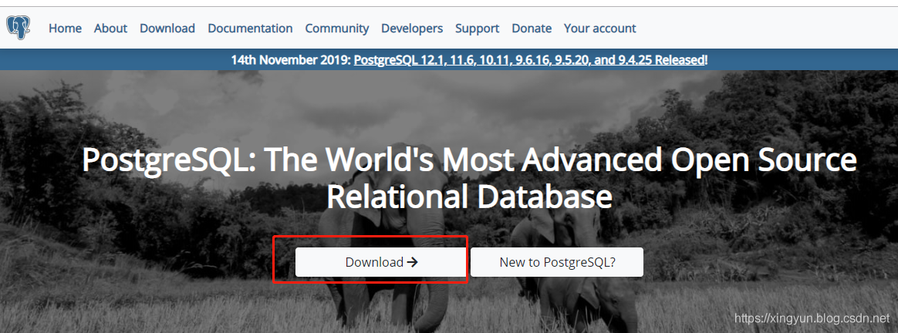
- 点击上图中的 下载按钮 ，我们可以看到下面的界面
  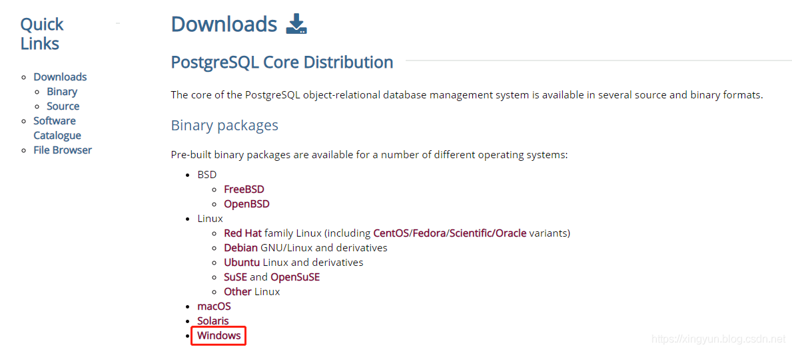
- 点击后我们会来到这个界面
  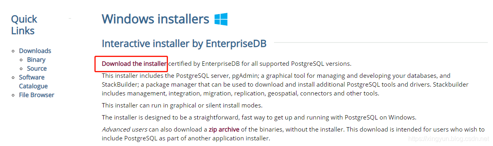
- 再次点击后进入这个界面，这才是真正的下载页面。
  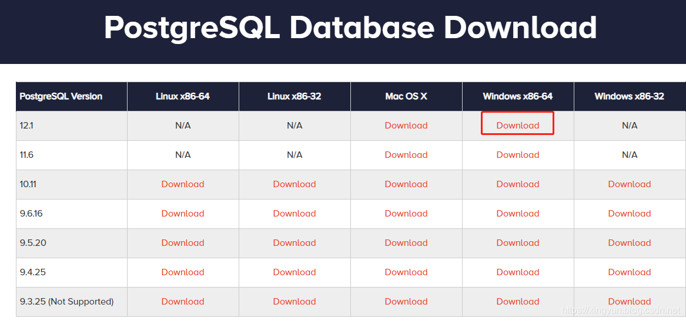
- 下载完成后，管理员权限运行安装即可。

## 1.2 配置环境变量

新建环境变量如下：

```bash
PG_HOME
C:\Program Files\PostgreSQL\12
```

如图所示：  
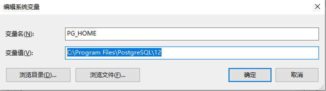  
追加Path 环境变量如下：

```
%PG_HOME%\bin\
```

如图所示：  
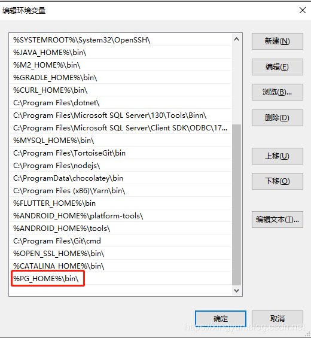  
新建环境变量，配置内容如下：

```
PGDATA
C:\Program Files\PostgreSQL\12\data
```

如图所示:  
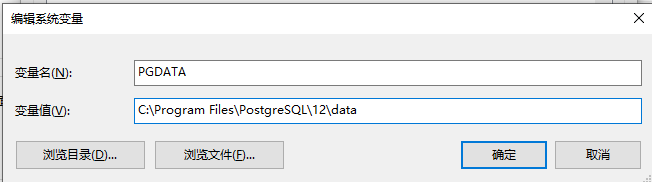  
配置这个是为了简化命令执行,待会详细解释。

> 如果没有-D选项，服务器将尝试使用环境变量PGDATA命名的目录。如果这个环境变量也没有提供则导致失败。

## 1.3 PostgreSQL 初始化

- 安装完成后我们需要对数据库进行初始化，初始化方法是执行initdb.exe.  

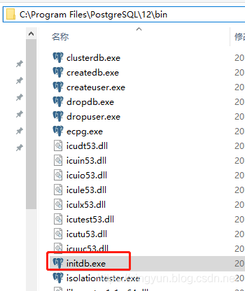
:::tip

- `C:\Program Files\PostgreSQL\12\data` 初始化执行之前是空的
- `C:\Program Files\PostgreSQL\12\data` 初始化执行之后会看到多了很多文件。  
   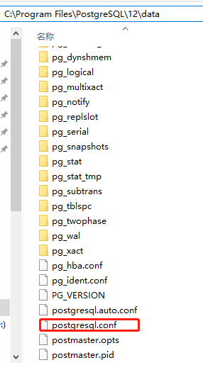  
- 其中包括一个很核心的文件postgresql.conf
- 正如下面我们打开它后看到的，默认只能本地localhost 或127.0.0.1 访问
:::

 ```xml
 #listen_addresses = 'localhost'  # what IP address(es) to listen on;
      # comma-separated list of addresses;
      # defaults to 'localhost'; use '*' for all
      # (change requires restart) 
 ```

> - 如果需要配置远程登录，则需要修改这个`postgresql.conf` 配置文件，添加IP即可。

## 1.4 创建postgres用户

- 在`C:\Program Files\PostgreSQL\12\bin`目录下执行如下命令：

```bash
createuser -s -r postgres
```

## 1.5 启动postgresql

由于我们之前配置了PGDATA 环境变量，因此双击postgres.exe 即可启动
如果没有配置那么需要执行命令

```bash
postgres.exe -D  "C:\Program Files\PostgreSQL\12\data"
```

这种方式其实不是很友好，最佳实践是让他后台启动运行。  
如果想做到这样，只需要输入如下命令即可：

```bash
postgres -D "C:\Program Files\PostgreSQL\12\data" >logfile 2>&1 &
```

:::tip
 除此之外我们也可以执行如下命令启动

 ```bash
  pg_ctl start -l logfile
 ```

 或

 ```bash
  su postgres -c 'pg_ctl start -D /usr/local/pgsql/data -l serverlog' 
 ```

 其实还有一种方法，配置成系统服务

- 注册成系统服务： `pg_ctl register -N PostgreSQL`
- 取消注册成系统服务: `pg_ctl unregister –N PostgreSQL`
- 删除服务`sc delete PostgreSQL`
:::

## 1.6 客户端连接测试

### 1.6.1 SQL Shell (psql)命令行连接测试

 安装完成后自带了一个命令行连接工具  
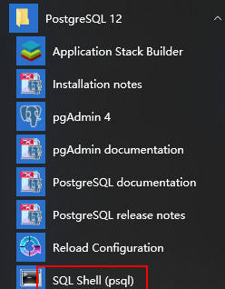  
 会依次提示你输入要连接的相关信息，最后登录完成后可以看到 有一个`postgres=#`  
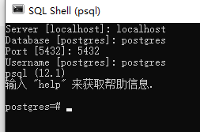  

### 1.6.2 客户端 pdAdmin 4 连接测试

安装完成后，其实这个软件自带了一个连接工具  
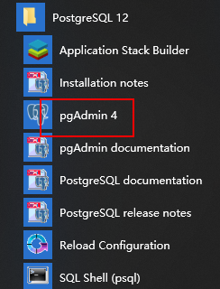  
点击后默认打开网址 <http://127.0.0.1:50010/browser/>  
点击图中的Add New Server ，创建一个服务器连接  
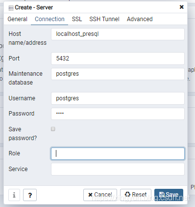  

> 和刚才类似，输入相关信息就可以了。

之后我们可以看到如下内容
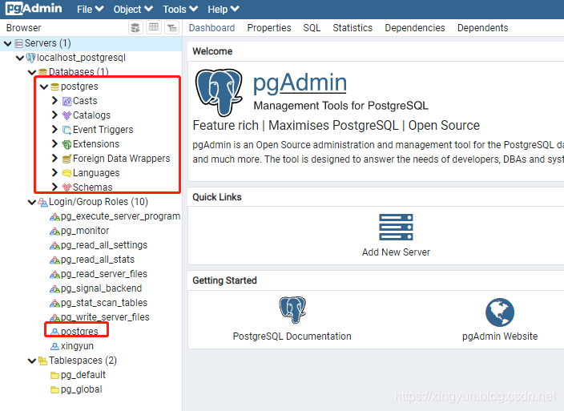

### 1.6.3 客户端Navicat Permium 连接测试

 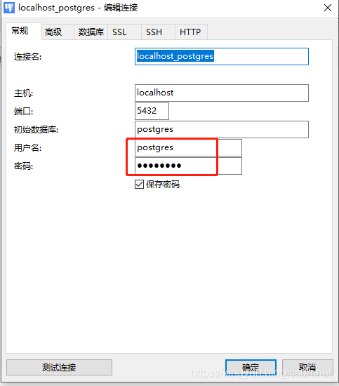

> - 账号就是刚才创建的用户，密码就是安装过程中输入的密码。
> - 默认端口是5432

连接成功后如下所示  
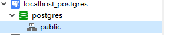

:::tip
如果出现找不到postgres角色的错误  
原因是：PostgreSQL角色没有被创建。运行命令：`createuser -s -r postgres` 即可。

如果找不到createuser这个命令，可以在`\PostgreSQL\16\bin`中找到。添加到系统path中，或cd到这个文件夹再运行
:::

