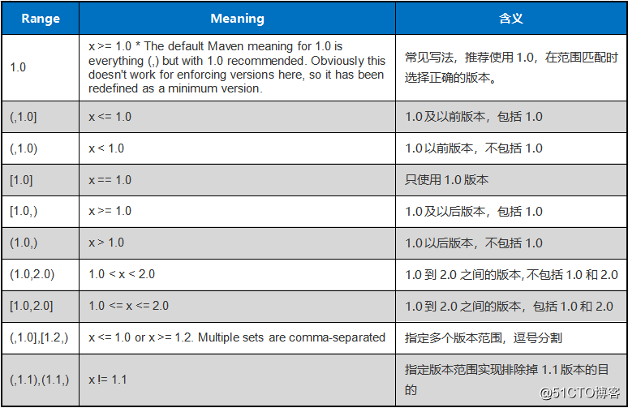
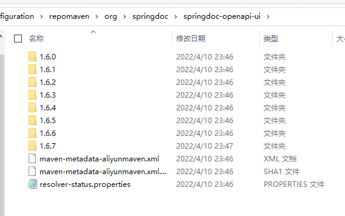

# 添加镜像源

## 全局镜像源

maven的默认配置文件在 `$home/.m2/settings.xml` 需要自己从maven配置文件(maven/conf/settings.xml)复制过来
参见阿里云的依赖教程
[https://maven.aliyun.com/mvn/guide](https://maven.aliyun.com/mvn/guide)

```xml
# 加入如下代码
# 这是本地储存依赖的位置
<localRepository>D:\configuration\repomaven</localRepository>
# 加入阿里镜像源
  <mirror>
      <id>aliyunmaven</id>
      <mirrorOf>*,!papermc-repo,!spigotmc-repo,!placeholderapi,!citizens-repo,!jitpack.io,!dmulloy2-repo</mirrorOf>
      <name>阿里云公共仓库</name>

      <url>https://maven.aliyun.com/repository/public</url>
    </mirror>
```

## 单项目配置

在项目的pom.xml中添加类似下面的

```xml
<repositories>
    <repository>
        <id>aliyunmaven</id>
        <url>https://maven.aliyun.com/repository/public</url>
    </repository>
</repositories>
```

## 版本管理

maven其实也可以使用版本范围  
  

因为JSON协议以及fastjson库的兼容性和稳定性都非常好，所以才可以考虑自动升级到最新版本，pom.xml中依赖配置这样写，将自动引用版本大于等于1.2.60的fastjson

```xml
<dependency>
    <groupId>com.alibaba</groupId>
    <artifactId>fastjson</artifactId>
    <version>[1.2.60, )</version>
</dependency>
```

注意`[1.2.60, )`这种方式会下载1.2.60到最新版直接所有的包的索引,强迫症患者慎用



## 指定maven中jdk版本

### 方法一

```xml
<properties>
 <maven.compiler.source>17</maven.compiler.source>
 <maven.compiler.target>17</maven.compiler.target>
</properties>
```

### 方法二

```xml

<build>
    <plugins>
        <plugin>
            <groupId>org.apache.maven.plugins</groupId>
            <artifactId>maven-compiler-plugin</artifactId>
            <configuration>
                <source>17</source>
                <target>17</target>
            </configuration>
        </plugin>
    </plugins>
</build>
```

### 本地maven设置

我们也可以设置本地的maven的配置，一劳永逸。
在settings.xml中配置，可以找到如下的配置模式
 这里就是maven自带的配置样式，根据这个我们改写为17

```xml
<profile>
    <id>jdk-17</id>
    <activation>
     <activeByDefault>true</activeByDefault>
     <jdk>17</jdk>
    </activation>
    <properties>
     <maven.compiler.source>17</maven.compiler.source>
     <maven.compiler.target>17</maven.compiler.target>
     <maven.compiler.compilerVersion>17</maven.compiler.compilerVersion>
    </properties>
</profile>
```

## vue项目添加到springboot

:::tip
把打包好的资源文件放到`resources`文件夹下的`front`文件夹即可,然后按照下面的方法配置
:::

### 第一种,在`webmvcconfig`里面设置静态文件目录

```java
  @Override
    public void addResourceHandlers(ResourceHandlerRegistry registry) {
        registry.addResourceHandler("/**")
                .addResourceLocations("classpath:/front/");
    }
```

## 第二种,在properties文件里面配置

在 properties文件里面设置  `spring.resources.static-locations=classpath:/front`  
`spring.resources.static-locations`的默认值是：`classpath:/META-INF/resources/,classpath:/resources/,classpath:/static/,classpath:/public/`  
区别：`spring.mvc.static-path-pattern`，这个配置的意思是什么样的路径，才到`spring.resources.static-locations`中查找静态文件, 默认的配置就是`/**`，就是全部的路径  
如：`spring.mvc.static-path-pattern=/static/**`,  当访问`/static/css/demo.css`时，会拿`/css/demo.css`到`spring.resources.static-locations`配置的目录中去查找。

### 在windows上后台运行jar包(类似nohup)

只需要

```shell
javaw -jar zfile.jar
```

如何关闭呢

写一个`powershell`文件

```powershell

$process ="*javaw*"
# 查找和javaw相关的进程
Get-CimInstance Win32_Process | Where {$_.CommandLine -like $process } | select -ExpandProperty CommandLine # | Measure-Object -Line
# 关闭javaw进程
Get-CimInstance Win32_Process | Where {$_.CommandLine -like $process} | Remove-CimInstance
```

## mvn wrapper

<https://maven.apache.org/wrapper/>
只需要在原项目里面

```shell
mvn wrapper:wrapper

```

然后就可以在目录下面运行

```shell
./mvnw clean install

```

## mvnd

<https://github.com/apache/maven-mvnd>
