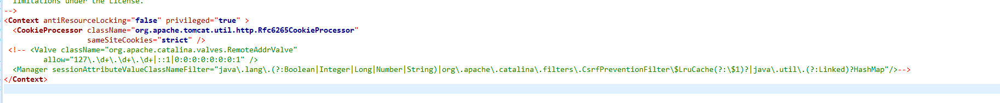

# tomcat使用

进入tomcat/bin目录,运行startup.sh
打开`http://ip:8080`出现tomcat界面

当程序部署在tomcat上后，需要监测tomcat的性能和监测tomcat的各项指标，如内存使用情况，cpu使用情况，jvm实际情况等，对于这些指标的监控，tomcat提供了访问入口，然而tomcat默认的访问只能在部署tomcat服务的服务器上访问，即不能在其他服务器上访问(禁止远程访问)，为了解决远程访问，需要做一些配置，本文旨在解决该问题。

一 问题描述
如下页面，表示不能远程访问tocmat管理里面：

二 解决措施
为了能够远程访问页面，需要做如下配置：

1.配置`apache-tomcat-9.0.27/conf\tomcat-users.xml`
2.配置`apache-tomcat-9.0.27\webapps\manager\META-INF\context.xml`

注释掉如下内容

3.重启tomcat服务

4.访问

重新访问 `ip:port/manager/status`，出现如下界面，表示远程访问设置成功

输入用户名和密码

这里的用户名和密码，就使在`apache-tomcat-9.0.27/conf\tomcat-users.xml`配置文件中设置的密码，我设置的是`admin/admin`
