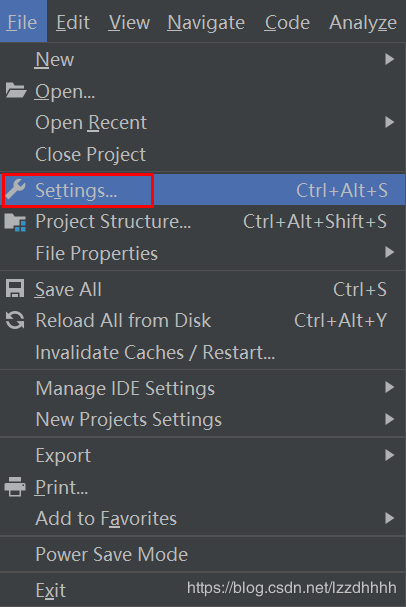
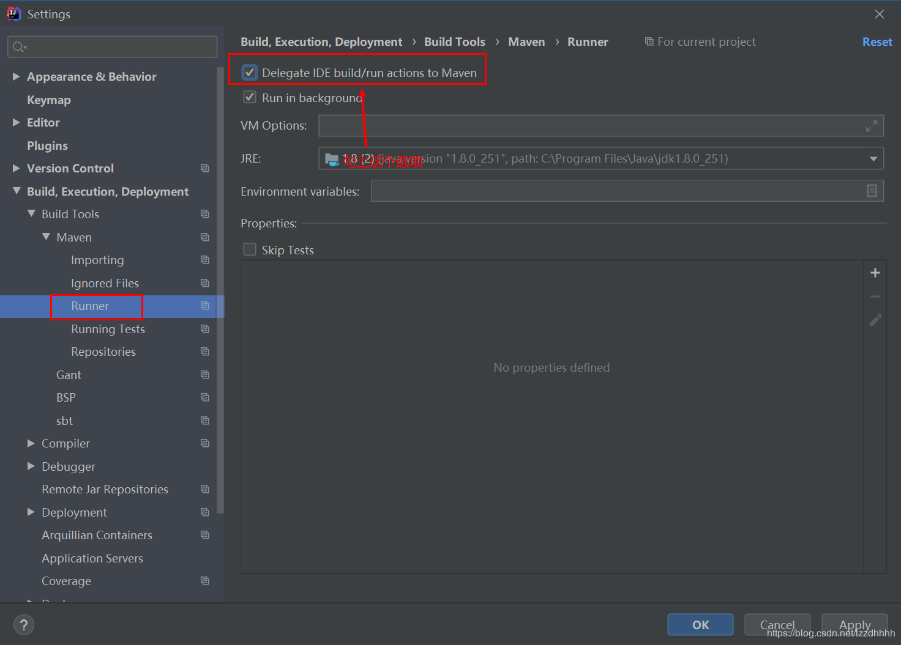

# springboot错误

## yaml错误

```text
found character '@' that cannot start any token
```

这是idea没有识别出来项目,需要重新import一下

```text
Error:(3, 38) java: 程序包org.springframework.stereotype不存在
Error:(4, 47) java: 程序包org.springframework.web.bind.annotation不存在
Error:(5, 47) java: 程序包org.springframework.web.bind.annotation不存在
Error:(7, 2) java: 找不到符号
 符号: 类 Controller
Error:(10, 6) java: 找不到符号
 符号:  类 ResponseBody
 位置: 类 com.test.controller.HelloController
Error:(11, 6) java: 找不到符号
 符号:  类 RequestMapping
 位置: 类 com.test.controller.HelloController
```

解决方案：  



## failed to load response data

当需要根据后台传回地址跳转页面时 即使使用preserve log 可以查看上一个页面获取地址请求，但是此时请求返回值为failed to load response data
当关闭页面跳转可以查看到接口返回值。
​

## 一直是cors的错误

可能是应为interceptor里面不能注入bean,去掉@autowired和@resource改写为utils来查询
在Interceptor中通过@Autowired注入service报空指针错误。就把拦截器作为bean注入

```java
@Configuration
public class MyWebAppConfigurer implements WebMvcConfigurer {
 
    /**
     * 将拦截器作为bean写入配置中
     * @return
     */
    @Bean
    public MyInterceptor myInterceptor() {
        return new MyInterceptor();
    }
 
    @Override
    public void addInterceptors(InterceptorRegistry registry) {
        /*
         * 多个拦截器组成一个拦截器链;
         * addPathPatterns用于添加拦截规则;
         * excludePathPatterns用户排除拦截;
         * 对来自/** 全路径请求进行拦截
         */ 
        registry.addInterceptor(myInterceptor()).addPathPatterns("/**");
    }
}
```

## [Springboot使用alibaba的fastJson,@JSONField不起作用的问题](https://www.cnblogs.com/h-java/p/10220737.html)

在Springboot中默认的JSON解析框架是jackson
今天引入alibaba的fastjson，使用@JSONField(serialize=false),让@RestController转换数据给前端的时候不序列化莫些字段，发现@JSONField根本不起作用
在网上查阅了一番，发现Springboot使用fastjson需要替换默认的json转换器的
具体解决方法有两种：  
本文借鉴地址： [https://blog.csdn.net/qq_28929589/article/details/79245774](https://blog.csdn.net/qq_28929589/article/details/79245774)  
一、（1）启动类继承extends WebMvcConfigurerAdapter （2）覆盖方法configureMessageConverters  
二、（1）在App.java启动类中，注入Bean : HttpMessageConverters  
第一种方式：  
启动类继承WebMvcConfigurerAdapter，然后对configureMessageConverters方法进行重写  

```java
@Override

    public void configureMessageConverters(List<HttpMessageConverter<?>> converters) {

        super.configureMessageConverters(converters);
        FastJsonHttpMessageConverter fastConverter = new FastJsonHttpMessageConverter();

        FastJsonConfig fastJsonConfig = new FastJsonConfig();
        fastJsonConfig.setSerializerFeatures(
                SerializerFeature.PrettyFormat
        );

        fastConverter.setFastJsonConfig(fastJsonConfig);
        converters.add(fastConverter);

    }
```

第二种方式：在App.java启动类中，注入Bean : HttpMessageConverters

```java
@Bean
    public HttpMessageConverters fastJsonHttpMessageConverters() {
        FastJsonHttpMessageConverter fastConverter = new FastJsonHttpMessageConverter();
        FastJsonConfig fastJsonConfig = new FastJsonConfig();
        fastJsonConfig.setSerializerFeatures(SerializerFeature.PrettyFormat);
        fastConverter.setFastJsonConfig(fastJsonConfig);
        HttpMessageConverter<?> converter = fastConverter;
        return new HttpMessageConverters(converter);
    }
```

## springboot多模块运行

见[官方文档](https://spring.io/guides/gs/multi-module/)

比如我有如下module

```txt
root
    ├───common
    ├───main-module (main方法,包含springboot-maven-plugin)
    └───system-module

```

在root目录直接`mvn spring-boot:run -pl main-module`即可
:::tip
关于 maven-compile-plugin和springboot-maven-plugin  
maven-compiler-plugin 是用于在编译（compile）阶段加入定制化参数，而 spring-boot-maven-plugin 是用于 spring boot 项目的打包（package）阶段，两者没什么关系。
:::

目标编译的Java版本可以通过属性指定， 不一定要在plugin的配置里，如

```xml
  <properties>
    <project.build.sourceEncoding>UTF-8</project.build.sourceEncoding>
    <maven.compiler.source>17</maven.compiler.source>
    <maven.compiler.target>17</maven.compiler.target>
    <!-- 或者设置java版本 -->
    <java.version>17</java.version>
  </properties>
```

## LocalDatetime传参数据不对

使用过java8的朋友应该都知道LocalDateTime类型，它作为全新的日期和时间API ，对比Date类型有着很大的优势，极大的方便了我们对于时间和日期的操作。不过，如果在日常使用中，如果我们不对这个类型的字段进行处理的话，在打印或者直接返回到页面的时候往往看到的格式是这样的 2020-11-11T22:12:03.793 。显然这种格式对于用户来说阅读体验很差，那么，今天我们将通过这篇文章来介绍一下在使用LocalDateTime是如何在接受参数和返回信息时进行格式化。
比如我们有一个UserVo.java

```java
public class UserVO {
 
    private String userName;
    private String sex;
    private LocalDateTime birthday;
    //省略Getter and Setter方法
 
}
```

### post请求使用formdata进行传参，这种情况下只需要在变量上添加@DateTimeFormat注解

```java
public class UserVO {
    private String userName;
    private String sex;
    @DateTimeFormat(pattern = "yyyy-MM-dd HH:mm:ss")
    private LocalDateTime birthday;
    //省略Getter and Setter方法
}
```

### 使用post请求传参，并将参数放在请求体中以json格式传参，此时，需要在接口的实体类前添加@RequestBody注解，同时在LocalDateTime类型的变量上添加 @JsonFormat注解

```java
public class UserVo{
    private String userName;
private String sex;
@JsonFormat(pattern = "yyyy-MM-dd HH:mm:ss")
private LocalDateTime birthday;
}
```

## id为数组,使用雪花id,前端出现错误

后端返回了一个超大的数字，前端拿到数据之后在控制台打印出来却跟后端返回的不一样。

```js
const num = 4518777332709233930
console.log(num)  // 4518777332709234000
```

当时看了半天也没找到问题，后来发现其他数字也都跟后端返回的不一样，这个时候才隐约想起 JS 中处理超长数字有精度问题。JS 的最大和最小安全值可以这样获得：

```js
console.log(Number.MAX_SAFE_INTEGER); //9007199254740991
console.log(Number.MIN_SAFE_INTEGER); //-9007199254740991
```

超过这个范围就会出现精度问题。

解决方法:

### id使用字符串

见知乎回答[https://www.zhihu.com/question/281123046](https://www.zhihu.com/question/281123046)

### 使用JsonSerialize

```java
// Jackson
@JsonSerialize(using = com.fasterxml.jackson.databind.ser.std.ToStringSerializer.class)
private long id;

// FastJson
@JSONField(serializeUsing = com.alibaba.fastjson.serializer.ToStringSerializer.class)
private long id;
```

这样前端接收的id就是字符串了
