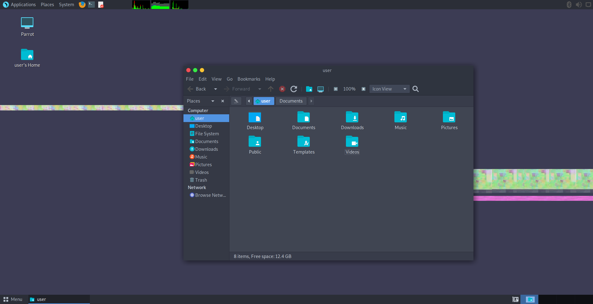

# 常见的linux系统

:::tip
均可在清华镜像源下载 [https://mirrors.tuna.tsinghua.edu.cn](https://mirrors.tuna.tsinghua.edu.cn/#)
:::

## 新手入门使用

## linuxmint

[https://linuxmint.com/](https://linuxmint.com/)  

## zorinos

[https://zorin.com/os/](https://zorin.com/os/)  

## deepin

### manjarokde

[https://manjaro.org/](https://manjaro.org/)

### kubuntu

[https://kubuntu.org/](https://kubuntu.org/)  

### kali

[http://www.kali.org/](http://www.kali.org/)  

### archlinux

[http://www.archlinux.org/](http://www.archlinux.org/)  

### parrot

[https://www.parrotsec.org/](https://www.parrotsec.org/)  

### backbox

[http://www.backbox.org/](http://www.backbox.org/)  

### solus

[https://getsol.us/](https://getsol.us/)  

### freebsd

[https://www.freebsd.org/](https://www.freebsd.org/)

### gentoo

[http://www.gentoo.org/](http://www.gentoo.org/)  

