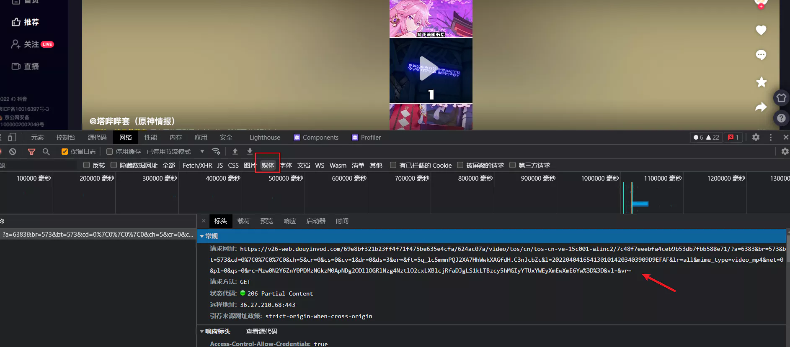

#  抖音爬虫

## 获取html

:::tip
为了伪造浏览器,需要设置user-agent和cookie
:::

```python
url =  'https://www.douyin.com/video/7080363768772971816'
# 1. 发送请求
headers = {
    'Referer': 'https://www.douyin.com/',
    'User-Agent': 'Mozilla/5.0 (Windows NT 10.0; WOW64)pleWebKit/537.36 (KHTML, like Gecko) Chrome/96.0.4651.0 Sa7.36',
    'cookie': '你的cookie'
}
resp = requests.get(url, headers = headers)
html=resp.text # 这里就是html内容
```

看一下我们要爬的视频地址
  

```text
https://v26-web.douyinvod.com/69e8bf321b23ff4f71f475be635e4cfa/624ac07a/video/tos/cn/tos-cn-ve-15c001-alinc2/7c48f7eeebfa4ceb9b53db7fbb588e71/?a=6383&br=573&bt=573&cd=0|0|0|0&ch=5&cr=0&cs=0&cv=1&dr=0&ds=3&er=&ft=5q_lc5mmnPQJ2XA7HhWwkXAGfdH.C3nJcbZc&l=2022040416541301014203403909D9EFAF&lr=all&mime_type=video_mp4&net=0&pl=0&qs=0&rc=Mzw0N2Y6ZnY0PDMzNGkzM0ApNDg2ODllOGRlNzg4NztlO2cxLXBlcjRfaDJgLS1kLTBzcy5hMGIyYTUxYWEyXmEwXmE6Yw==&vl=&vr=
它的末尾是`vr=`,开头是`https://`
```

我们可以构造正则表达式`'src(.*?)vr%3D%22'`,其实就是`src(地址)vr="`来获取视频地址
代码如下

```python
title = re.findall('<title data-react-helmet="true"> (.*?)</title>', resp.text)[0]
href = re.findall('src(.*?)vr%3D%22', resp.text)[1] # 第一个是清晰度最高的
video_url = requests.utils.unquote(href).replace('":"', 'https:') 
```

然后保存数据即可

```python
  video_content = requests.get(url=video_url).content
  with open('抖音高清视频\\' + title + '.mp4', mode='wb') as fin:
      fin.write(video_content)
      print(title+'.mp4文件下载完成！！')
```
