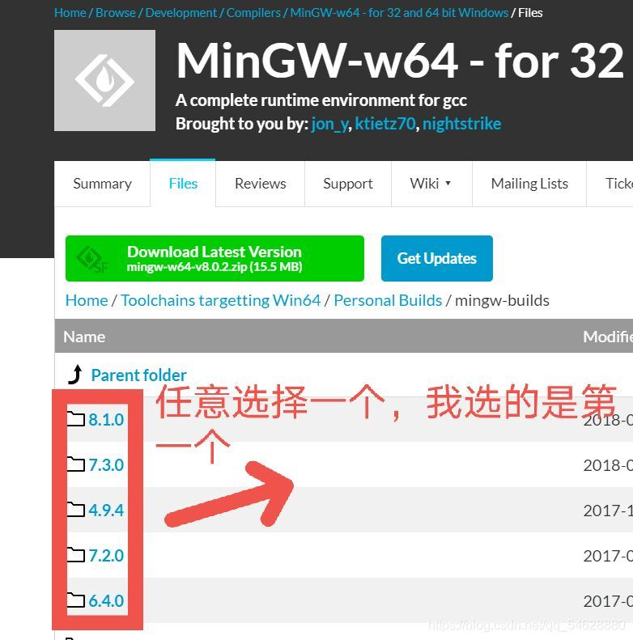

# clion配置

 安装环境cmake用它自带的,mingw64就用codeblocks里面的好了

## 或者在SourceForge上下载

第二步，下载MinGW
链接：[mingw64](https://sourceforge.net/projects/mingw-w64/files/Toolchains%20targetting%20Win64/Personal%20Builds/mingw-builds)
注意：_**不要点击绿色的download！**_！

选择后，点击x86_64-posix-sjlj就可以下载了（可能有点慢），保存到一个喜欢的地址
