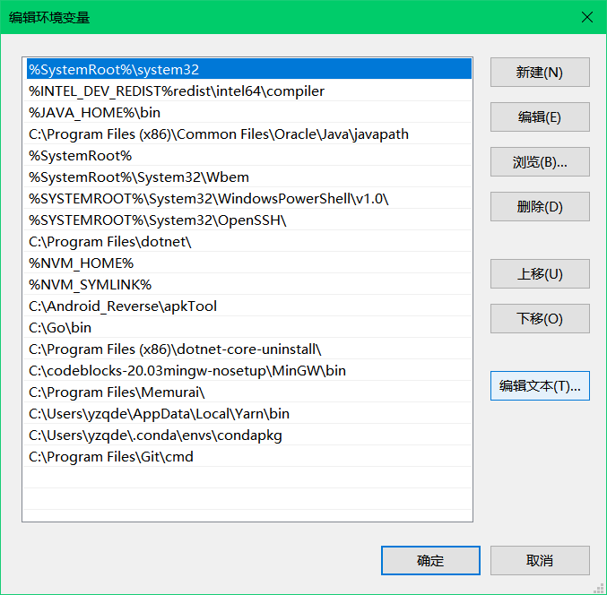
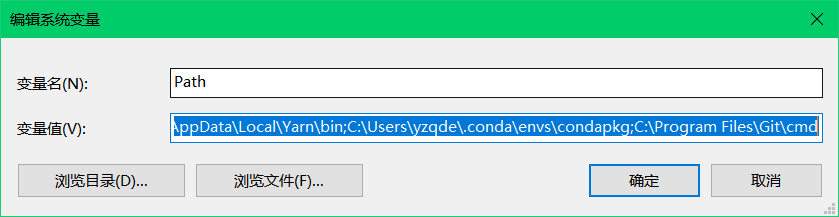

# 环境变量配置

```
%SystemRoot%\system32;%INTEL_DEV_REDIST%redist\intel64\compiler;%JAVA_HOME%\bin;C:\Program Files (x86)\Common Files\Oracle\Java\javapath;%SystemRoot%;%SystemRoot%\System32\Wbem;%SYSTEMROOT%\System32\WindowsPowerShell\v1.0\;%SYSTEMROOT%\System32\OpenSSH\;C:\Program Files\dotnet\;%NVM_HOME%;%NVM_SYMLINK%;C:\Android_Reverse\apkTool;C:\Go\bin;C:\Program Files (x86)\dotnet-core-uninstall\;C:\codeblocks-20.03mingw-nosetup\MinGW\bin;C:\Program Files\Memurai\;C:\Users\yzqde\AppData\Local\Yarn\bin;C:\Users\yzqde\.conda\envs\condapkg;C:\Program Files\Git\cmd
```

环境变量默认编辑界面是这样的

编辑编辑文本会变成


如果出现环境变量path的编辑一直是编辑文本的样式,则需要将`%SystemRoot%\system32` 这个变量移到最前面,这样干就变成了列表的样式

## 使用powershell编辑环境变量

查看微软官方文档 [链接](https://docs.microsoft.com/en-us/powershell/module/microsoft.powershell.core/about/about_environment_variables?view=powershell-7.1)
注意下面的方法只是临时修改了环境变量

```powershell
# 获取path环境变量
$env:path 
# 获取用户名
$env:USERNAME
# env有如下变量: USERPROFILE,username,path,windir,COMPUTERNAME等等

#Powershell设置环境变量

#查看所有环境变量  
ls env:

#搜索环境变量   
ls env:NODE*

#查看单个环境变量 
$env:NODE_ENV

#添加/更新环境变量 
$env:NODE_ENV=development

#删除环境变量        
del evn:NODE_ENV

# 改变path环境变量
$env:PATH += ";$env:ERLANG_HOME\bin;c:\temp"
```

:::tip
使用c#语法操作环境变量

```powershell
# 读取环境变量
[environment]::GetEnvironmentvariable("Path", "Machine")

# 用户变量
[environment]::SetEnvironmentvariable("变量名称", "变量值", "User")

# 系统变量
[environment]::SetEnvironmentvariable("变量名称", "变量值", "Machine")
#新建和追加环境变量
[environment]::SetEnvironmentvariable("GOPATH", "$env:USERPROFILE\gopath", "User")
#调用命令结果：$(命令)
#获取原有用户 PATH 变量：$([environment]::GetEnvironmentvariable("Path", "User"))
#注意 PATH 中条目以分号结尾
[environment]::SetEnvironmentvariable("PATH", "$([environment]::GetEnvironmentvariable("Path", "User"));%GOPATH%\bin", "User")

[environment]::SetEnvironmentvariable("GOROOT", "C:\go", "Machine")
#调用命令结果：$(命令)
#获取原有系统 PATH 变量：$([environment]::GetEnvironmentvariable("Path", "Machine"))
[environment]::SetEnvironmentvariable("PATH", "$([environment]::GetEnvironmentvariable("Path", "Machine"));%GOROOT%\bin", "Machine")

```
