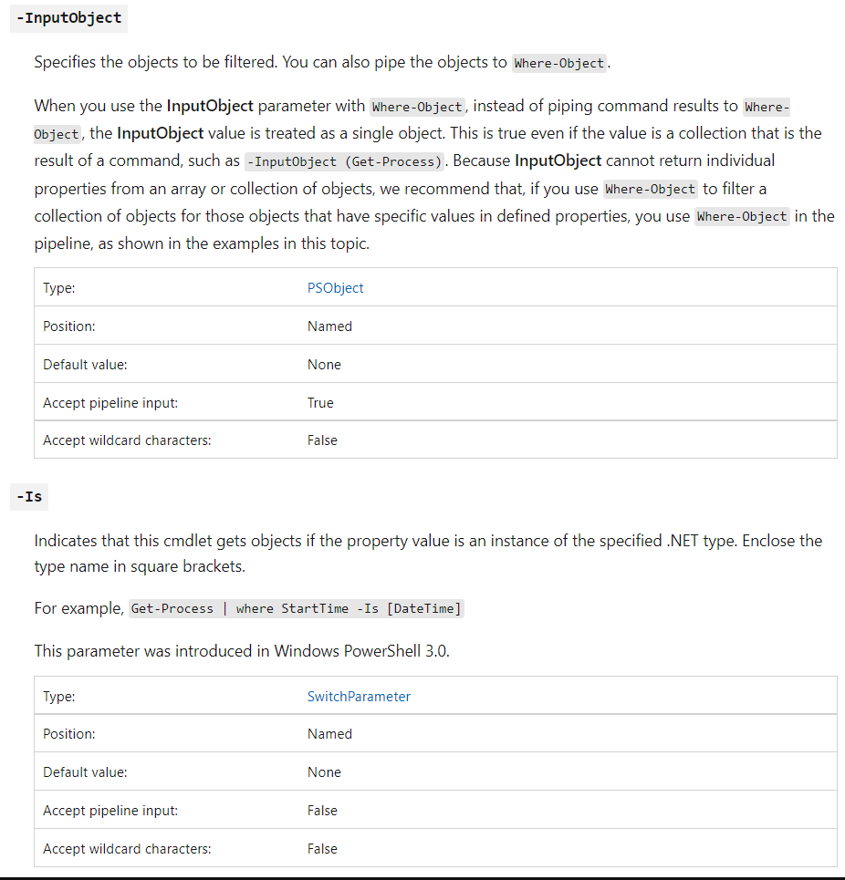

# 管道

## 1.  管道（pipeline）是什么

在Shell中一个重要的基本概念就是管道（pipeline），即在一组命令中，输出的命令结果成为下一个命令的输入参数。管道的概念与真实生活中的生产线比较相似：在不同的生产环节进行连续的再加工，如下图例子：

```powershell
# Get-ChildItem |Where-Object {$_.Length -gt 200}|Sort-Object -Descending Name

    Directory: E:\tmp\ps

Mode                 LastWriteTime         Length Name
----                 -------------         ------ ----
-a---            2022/4/2    23:34           4318 test.txt
-a---            2022/4/2    23:34           4318 Test.md
-a---            2022/4/2    23:34           4318 test-name.md
-a---            2022/4/2    23:34           4318 test-name - 副本.md
-a---            2022/4/2    23:34           4318 test - 副本.txt
-a---            2022/4/2    23:34           4318 Test - 副本.md
-a---           2022/5/11    10:11            559 teeResult.txt
-a---           2022/5/11    10:39            753 outfile.txt
-a---           2022/5/11    10:35            209 ateeResult.txt
```

```powershell
Get-ChildItem |Where-Object {$_.Length -gt 200}|Sort-Object -Descending Name
```

 `Get-ChildItem`意思是获取当前路径的所有项目，`|Where-Object {$_.Length -gt 200}`意思是查看上一步结果，取所有长度大于200的项目， `|Sort-Object -Descending Name`意思是查看上一步结果，按照Name进行倒叙排列。

**在PowerShell****中，使用管道符号（|****）来划分管道中的每个命令，上述例子说明了管道的强大功能，同时PowerShell****在管道中传递的是高保真对象，不仅仅是文本描述。**

下面主要给大家介绍一下常用的管道处理命令。

## 2.  Where-Object：过滤列表项或命令输出结果

可以使用Where-Object（别名是where和?）从列表或者命令输出结果中过滤选择你需要的项目。

对于输入的每一项，Where-Object都会根据{}中定义的脚本块对输入进行计算，如果返回True，则输出，否则不输出。如下例子：
:::tip
其中的where-object可以用where和?代替

```powershell
Get-ChildItem |? {$_.Length -gt 200}|Sort-Object -Descending Name
```

:::

{}表示一个脚本块，可以输入一系列PowerShell命令，其中`$_`代表当前输入对象，在这个例子中，`$_`就代表一个文件项目。-gt是比较操作符，意思是大于，关于比较操作符的介绍如下：

PowerShell中比较操作符是用于对表达式进行比较的。默认情况比较操作符不区分大小写，如果想要区分，需要使用-C前缀，不需要区分的，使用-I前缀。

```powershell
# Get-ChildItem|Where-Object {$_.Name -ilike "Test*"}

    Directory: E:\tmp\ps

Mode                 LastWriteTime         Length Name
----                 -------------         ------ ----
-a---            2022/4/2    23:34           4318 Test - 副本.md
-a---            2022/4/2    23:34           4318 test - 副本.txt
-a---            2022/4/2    23:34           4318 test-name - 副本.md
-a---            2022/4/2    23:34           4318 test-name.md
-a---            2022/4/2    23:34           4318 Test.md
-a---            2022/4/2    23:34           4318 test.txt

# Get-ChildItem|Where-Object {$_.Name -clike "Test*"}

    Directory: E:\tmp\ps

Mode                 LastWriteTime         Length Name
----                 -------------         ------ ----
-a---            2022/4/2    23:34           4318 Test - 副本.md
-a---            2022/4/2    23:34           4318 Test.md
```

所有可用的比较操作符如下表格：

| 操作符       | 意义           | 返回True的例子                  |
| ------------ | -------------- | ------------------------------- |
| -eq          | 相等符         | 10 -eq 10                       |
| -ne          | 不相等符       | 10 -ne 9                        |
| -ge          | 大于等于操作符 | 10 -ge 9                        |
| -gt          | 大于操作符     | 10 -gt 9                        |
| -lt          | 小于操作符     | 10 -lt 11                       |
| -le          | 小于等于操作符 | 10 -le 11                       |
| -like        | 相似操作符     | "Bob" -like "*ob"               |
| -notlike     | 非相似操作符   | "Bob" -notlike "1*ob"           |
| -match       | 匹配操作符     | "Bob" -match "B*ob"             |
| -notmatch    | 非匹配操作符   | "Bob" -notmatch "123*"          |
| -contains    | 包含操作符     | "Bob","Bob1" -contains  "Bob"   |
| -notcontains | 非包含操作符   | "Bob","Bob1" -notcontains  "ob" |
| -is          | 类型操作符     | "Bob" -is "System.String"       |
| -isnot       | 非类型操作符   | "Bob" -isnot "System.Int32"     |

## 3.  ForEach-Object：处理列表或者命令输出的每一个项目

使用ForEach-Object命令（别名是foreach和%）来处理列表中的每一项。

使用例子如下：

```powershell
# 1..10|ForEach-Object {$_ *5}
5
10
15
20
25
30
35
40
45
50
# 1..10|% {$_ *5}
5
10
15
20
25
30
35
40
45
50
```

例子中1..10的意思是简单声明了一个1~10的一组数字。其中处理列表中每一项还可以用for、foreach、do和while等，以后会更详细的介绍。

## 4.  Select-Object：选择列表项或输出结果只输出要的结果

使用Select-Object（别名是select）对象可以选择一个对象或者一组对象的指定属性。还可以从对象的数组中选择唯一的对象，也可以从对象数组的开头或末尾选择指定个数的对象。

如果使用 Select-Object 来选择指定属性，则它会从输入对象中复制这些属性的值，并创建具有指定的属性和复制的值的新对象。使用 Property 参数指定您要选择的属性。或者，使用 First、Last、Unique、Skip 和 Index 参数从输入对象数组中选择特定对象。

使用例子如下：

a)    选择当前路径下所有项目的Name和Length属性：

```powershell
# Get-ChildItem|Select-Object Name,Length

Name                Length
----                ------
ateeResult.txt         209
outfile.txt            753
teeResult.txt          559
Test - 副本.md        4318
test - 副本.txt       4318
test-name - 副本.md   4318
test-name.md          4318
Test.md               4318
test.txt              4318
```

b)   选择当前路径下前2个项目：

```powershell
#  E:/tmp/ps
# Get-ChildItem |Select-Object -First 2

    Directory: E:\tmp\ps

Mode                 LastWriteTime         Length Name
----                 -------------         ------ ----
-a---            2022/4/2    23:34           4318 test-name.md
-a---            2022/4/2    23:34           4318 Test.md
```

c)    选择当前路径下所有项目的Name和自定义属性，名字叫做Last Modified Day，结果是通过LastWriteTime属性算出来的：

```powershell
# dir|select -Property @{Name="上次修改";Expression={$_.LastWriteTime.DayOfWeek}},Name

 上次修改 Name
 -------- ----
Wednesday ateeResult.txt
Wednesday outfile.txt
Wednesday teeResult.txt
 Saturday Test - 副本.md
 Saturday test - 副本.txt
 Saturday test-name - 副本.md
 Saturday test-name.md
 Saturday Test.md
 Saturday test.txt
```

d)   选择当前路径下第一个和第六个项目：

```powershell
# dir|Select-Object -Index 0,5
 
    Directory: E:\tmp\ps

Mode                 LastWriteTime         Length Name
----                 -------------         ------ ----
-a---            2022/4/2    23:34           4318 test-name.md
```

e)   选择当前路径下除第五个项目外的所有项目：

```powershell
# dir|Select-Object -Skip 4
 

    Directory: E:\tmp\ps

Mode                 LastWriteTime         Length Name
----                 -------------         ------ ----
-a---            2022/4/2    23:34           4318 Test.md
-a---            2022/4/2    23:34           4318 test.txt
```

f)    显示数组中的唯一数字：

```powershell
# 1,1,2,2,3,3,4,4,5,5,6,6,"test"|Select-Object -Unique
1
2
3
4
5
6
test
```

## 5.  Sort-Object：对列表项或者输出结果进行排序

使用Sort-Object（别名是sort）可以按照特定属性值对对象进行排序。您可以指定一个属性或多个属性（用于多键排序），也可以选择区分大小写或不区分大小写的排序。您还可以指示 Sort-Object 只显示对于特定属性具有唯一值的对象。

如果某个对象不具有所指定的属性之一，则 cmdlet 会将该对象的属性值解释为 NULL，并将其放置在排序顺序的末尾。

使用例子如下：

a)    对当前路径下所有的项目按照长度从小到大排序：

```powershell

# dir|Sort-Object -Property Length

    Directory: E:\tmp\ps

Mode                 LastWriteTime         Length Name
----                 -------------         ------ ----
-a---            2022/4/2    23:34           4318 Test - 副本.md
-a---            2022/4/2    23:34           4318 test - 副本.txt
-a---            2022/4/2    23:34           4318 test-name - 副本.md
-a---            2022/4/2    23:34           4318 test-name.md
-a---            2022/4/2    23:34           4318 Test.md
-a---            2022/4/2    23:34           4318 test.txt
```

b)   对整个数组的唯一性数字按照降序排列：

```powershell
# 1,1,2,2,3,3,4,4,5,5,6,6,"test"|Sort-Object -Descending -Unique
test
6
5
4
3
2
1
```

## 6.  Tee-Object：保存并输出列表项或者输出结果

使用Tee-Object（别名是tee）命令可以将命令输出结果保存在文件或者变量中，同时将其显示在控制台中。

a)    将当前路径下所有大小大于900的项目都保存到文件中并显示在控制台中：

```powershell
# dir|where {$_.Length -gt 900}|Tee-Object -FilePath teeResult.txt

    Directory: E:\tmp\ps

Mode                 LastWriteTime         Length Name
----                 -------------         ------ ----
-a---            2022/4/2    23:34           4318 Test - 副本.md
-a---            2022/4/2    23:34           4318 test - 副本.txt
-a---            2022/4/2    23:34           4318 test-name - 副本.md
-a---            2022/4/2    23:34           4318 test-name.md
-a---            2022/4/2    23:34           4318 Test.md
-a---            2022/4/2    23:34           4318 test.txt

 
# Get-Content .\teeResult.txt

    Directory: E:\tmp\ps

Mode                 LastWriteTime         Length Name
----                 -------------         ------ ----
-a---            2022/4/2    23:34           4318 Test - 副本.md
-a---            2022/4/2    23:34           4318 test - 副本.txt
-a---            2022/4/2    23:34           4318 test-name - 副本.md
-a---            2022/4/2    23:34           4318 test-name.md
-a---            2022/4/2    23:34           4318 Test.md
-a---            2022/4/2    23:34           4318 test.txt
```

b)   将当前路径下所有大小大于900的项目都保存在变量中并显示在控制台中：

```powershell

# $test="first"
 
# dir|where {$_.Length -gt 900}|Tee-Object -Variable $test

    Directory: E:\tmp\ps

Mode                 LastWriteTime         Length Name
----                 -------------         ------ ----
-a---            2022/4/2    23:34           4318 Test - 副本.md
-a---            2022/4/2    23:34           4318 test - 副本.txt
-a---            2022/4/2    23:34           4318 test-name - 副本.md
-a---            2022/4/2    23:34           4318 test-name.md
-a---            2022/4/2    23:34           4318 Test.md
-a---            2022/4/2    23:34           4318 test.txt
```

## 7.  Group-Object：对列表项或者输出结果进行分组

使用Group-Object（group）对列表项或者输出结果进行分组，指定的属性包含相同值的组对象。Group-Object 返回一个表，其中每个属性值对应一行，同时一个列显示具有该值的项目数。

```powershell
# dir|Group-Object -Property Length

Count Name                      Group
----- ----                      -----
    1 559                       {E:\tmp\ps\teeResult.txt}
    6 4318                      {E:\tmp\ps\Test - 副本.md, E:\tmp\ps\test - 副本.txt, E:\tmp\ps\test-name - 副本.md, E…}

```

还可以让返回的对象是个HashTable——key-value的键值对数组，指定-AsHashTable参数：

```powershell
# dir|Group-Object -Property Length -AsHashTable -AsString

Name                           Value
----                           -----
559                            {E:\tmp\ps\teeResult.txt}
209                            {E:\tmp\ps\ateeResult.txt}
753                            {E:\tmp\ps\outfile.txt}
4318                           {E:\tmp\ps\Test - 副本.md, E:\tmp\ps\test - 副本.txt, E:\tmp\ps\test-name - 副本.md, E}
```

## 8.  Measure-Object：对列表项或输出结果进行计算

使用Measure-Object（measure）计算对象的数字属性以及字符串对象（如文本文件）中的字符数、单词数和行数。它计算某些类型对象的属性值。Measure-Object 执行三种类型测量，具体取决于命令中的参数。可以对对象计数并计算数字值的最小值、最大值、总和及平均值。对于文本对象，它可以计数并计算行数、单词数和字符数。

a)    计算当前路径下项目的总数：

```powershell
# dir |Measure-Object

Count             : 7
Average           :
Sum               :
Maximum           :
Minimum           :
StandardDeviation :
Property          :
```

b)   计算当前路径下项目的长度的最小值、最大值以及平均值：

```powershell
# dir|Measure-Object -Property Length -Minimum -Maximum -Average

Count             : 7
Average           : 3781
Sum               :
Maximum           : 4318
Minimum           : 559
StandardDeviation :
Property          : Length
```

c)    计算当前文件中字符、行、单词的总数：

```powershell
# Get-Content .\teeResult.txt |measure -Character -Line -Word

Lines Words Characters Property
----- ----- ---------- --------
    9    46        523
```

## 9.  Compare-Object：对两组对象进行比较

用Compare-Object（别名是compare和diff）可以将两组对象进行比较，一组对象为Reference组，而另一组为Difference组。比较的结果将指示属性值是只出现在 Reference 组中的对象中（由 <= 符号指示），或是只出现在 Difference 组中的对象中（由 => 符号指示），抑或（在指定了 IncludeEqual 参数的情况下）同时出现在这两个对象中（由 == 符号指示）。

```powershell
# $res=Get-Content .\teeResult.txt

# Get-Content .\ateeResult.txt |Compare-Object $res|fl

InputObject   : -a---            2022/4/2    23:34           4318 Test - .md
SideIndicator : =>

InputObject   : -a---            2022/4/2    23:34           4318 test - .txt
SideIndicator : =>

InputObject   : -a---            2022/4/2    23:34           4318 Test - 副本.md
SideIndicator : <=

InputObject   : -a---            2022/4/2    23:34           4318 test - 副本.txt
SideIndicator : <=
```

## 10. ConvertTo-Html：将对象转换为HTML

用ConvertTo-Html可以将Microsoft.Net Framework对象转换为可在Web浏览器中显示的HTML：

```powershell
# Get-Date |ConvertTo-Html
<!DOCTYPE html PUBLIC "-//W3C//DTD XHTML 1.0 Strict//EN"  "http://www.w3.org/TR/xhtml1/DTD/xhtml1-strict.dtd">
<html xmlns="http://www.w3.org/1999/xhtml">
<head>
<title>HTML TABLE</title>
</head><body>
<table>
<colgroup><col/><col/><col/><col/><col/><col/><col/><col/><col/><col/><col/><col/><col/><col/><col/></colgroup>
<tr><th>DisplayHint</th><th>DateTime</th><th>Date</th><th>Day</th><th>DayOfWeek</th><th>DayOfYear</th><th>Hour</th><th>Kind</th><th>Millisecond</th><th>Minute</th><th>Month</th><th>Second</th><th>Ticks</th><th>TimeOfDay</th><th>Year</th></tr>
<tr><td>DateTime</td><td>2022年5月11日 10:33:47</td><td>2022/5/11 0:00:00</td><td>11</td><td>Wednesday</td><td>131</td><td>10</td><td>Local</td><td>288</td><td>33</td><td>5</td><td>47</td><td>637878620272889291</td><td>10:33:47.2889291</td><td>2022</td></tr>
</table>
</body></html>
```

## 11. Export-Csv：将对象转换为CSV字符串存储在文件中

用Export-Csv（别名是epcsv）将 Microsoft .NET Framework 对象转换为一系列以逗号分隔的、长度可变的 (CSV) 字符串，并将这些字符串保存到一个 CSV 文件中。

```powershell
# dir|select Name,Length|Export-Csv -Path .\ateeResult.txt
# Get-Content .\ateeResult.txt
"Name","Length"
"ateeResult.txt","0"
"teeResult.txt","559"
"Test - 副本.md","4318"
"test - 副本.txt","4318"
"test-name - 副本.md","4318"
"test-name.md","4318"
"Test.md","4318"
"test.txt","4318"
```

## 12. Format-List、Format-Table、Format-Wide：将输出结果格式化

Format-List（别名是fl）可以将输出的格式设置为属性列表，其中每个属性均各占一行显示：

```powershell
# dir|select -Index 0 |Format-List

    Directory: E:\tmp\ps

Name           : ateeResult.txt
Length         : 209
CreationTime   : 2022/5/11 10:26:19
LastWriteTime  : 2022/5/11 10:35:01
LastAccessTime : 2022/5/11 10:35:01
Mode           : -a---
LinkType       :
Target         :
```

Format-Table（别名是ft）可以将输出的格式设置为表：

```powershell
# dir|select -Index 0 |Format-Table

    Directory: E:\tmp\ps

Mode                 LastWriteTime         Length Name
----                 -------------         ------ ----
-a---           2022/5/11    10:35            209 ateeResult.txt

```

Format-Wide（别名是fw）可以将对象的格式设置为只能显示每个对象的一个属性的宽表：

```shell
# dir|select -Index 0,1,2,3,4,5 |Format-Wide -Column 3

    Directory: E:\tmp\ps

ateeResult.txt                          teeResult.txt                           Test - 副本.md
test - 副本.txt                         test-name - 副本.md
```

## 13. Get-Unique：获取输出结果的唯一值

使用Get-Unique（别名是gu）可以从排序列表中返回唯一项目。

```powershell
# 1,1,2,2,3,3,4,4,5,5,6,6,"test"|Sort-Object -Descending|Get-Unique
test
6
5
4
3
2
1
```

## 14. Out-File：将输出结果输出到文件

可以使用Out-File将输出发送到文件：

```powershell
# dir|Out-File outfile.txt
# Get-Content .\outfile.txt

    Directory: E:\tmp\ps

Mode                 LastWriteTime         Length Name
----                 -------------         ------ ----
-a---           2022/5/11    10:35            209 ateeResult.txt
-a---           2022/5/11    10:39              0 outfile.txt
-a---           2022/5/11    10:11            559 teeResult.txt
-a---            2022/4/2    23:34           4318 Test - 副本.md
-a---            2022/4/2    23:34           4318 test - 副本.txt
-a---            2022/4/2    23:34           4318 test-name - 副本.md
-a---            2022/4/2    23:34           4318 test-name.md
-a---            2022/4/2    23:34           4318 Test.md
-a-
```

## 15. Get-Member：如何获取管道操作对象的属性

管道操作的时候经常会用到管道输入对象的属性，使用Get-Member（gm）来获取对象的属性和方法。

a)    获取对象的公有属性：


```powershell
# Get-Process -Name node |Get-Member -MemberType AliasProperty

   TypeName: System.Diagnostics.Process

Name    MemberType    Definition
----    ----------    ----------
Handles AliasProperty Handles = Handlecount
Name    AliasProperty Name = ProcessName
NPM     AliasProperty NPM = NonpagedSystemMemorySize64
PM      AliasProperty PM = PagedMemorySize64
SI      AliasProperty SI = SessionId
VM      AliasProperty VM = VirtualMemorySize64
WS      AliasProperty WS = WorkingSet64
```

b)   获取对象的公有方法：

```powershell
# Get-Process -Name node |Get-Member -MemberType Method

   TypeName: System.Diagnostics.Process

Name                      MemberType Definition
----                      ---------- ----------
BeginErrorReadLine        Method     void BeginErrorReadLine()
BeginOutputReadLine       Method     void BeginOutputReadLine()
CancelErrorRead           Method     void CancelErrorRead()
CancelOutputRead          Method     void CancelOutputRead()
Close                     Method     void Close()
CloseMainWindow           Method     bool CloseMainWindow()
Dispose                   Method     void Dispose(), void IDisposable.Dispose()
Equals                    Method     bool Equals(System.Object obj)
GetHashCode               Method     int GetHashCode()
GetLifetimeService        Method     System.Object GetLifetimeService()
GetType                   Method     type GetType()
InitializeLifetimeService Method     System.Object InitializeLifetimeService()
Kill                      Method     void Kill(), void Kill(bool entireProcessTree)
Refresh                   Method     void Refresh()
Start                     Method     bool Start()
ToString                  Method     string ToString()
WaitForExit               Method     void WaitForExit(), bool WaitForExit(int milliseconds)
WaitForExitAsync          Method     System.Threading.Tasks.Task WaitForExitAsync(System.Threading.CancellationToken c…
WaitForInputIdle          Method     bool WaitForInputIdle(), bool WaitForInputIdle(int milliseconds)

```

当得知对象的公有属性和方法的名字后，就可以在管道操作中使用了。

## 16. 如何判断一个命令是否支持管道输入

学会使用管道后，得学会判断一个命令是否支持管道输入。使用Get-Help命令获取一个命令的使用方法，对于参数，可以看到是否支持管道输入，或者通过MSDN去查询命令帮助。

比如PowerShell Core里面的Where-Object的MSDN的帮助站点是：[msdn](https://msdn.microsoft.com/powershell/reference/5.1/microsoft.powershell.core/Where-Object)。

对于里面的-InputObject则是支持管道输入，-Is则不支持管道输入：



比如PowerShell Core里面的Move-Item的MSDN的帮助站点是：[msdn](https://msdn.microsoft.com/powershell/reference/5.1/microsoft.powershell.management/Move-Item)。

对于里面的-Path则是支持管道输入，-UseTransaction则不支持管道输入：

对于没有任何一个参数支持管道输入的命令则是不支持管道输入的命令。

## 17. 自动化处理数据密集型任务

如果要对大量的数据进行处理简单的任务，可以把数据保存在一个CSV文件里面，使用Import-Csv来导入数据，导入后为每一行自动创建对象，并将列的名字作为对象的属性，之后用foreach对数据的每一项进行操作。


如果你命名的CSV文件中的列的名字和管道使用的参数名一致，PowerShell可以实现这种部分或全部参数的映射。

PowerShell的一个主要的优点就是具有自动化重复性任务的能力。有时候，这些重复性的任务是动作密集的（如系统维护，操作注册表，或者文件清理），并且包括复杂的有顺序的互相调用的命令。在这种情况下，可以通过编写脚本将这些操作组合到一起，这样可以节省时间，降低错误的发生。

上述列举的只是常用的命令和使用方法，PowerShell强大的命令集完全不止这些。
