# 安装简介

**office2021（电脑）**软件就不需要我介绍了吧？我们就直接走安装教程。首先根据文末关键词获取软件包，软件压缩包并不大，只有几十M。下载后解压。然后双击如图文件运行。

如果出现这个提示安装.NET的错误，我们直接点击否，然后再双击这个运行库进行安装。

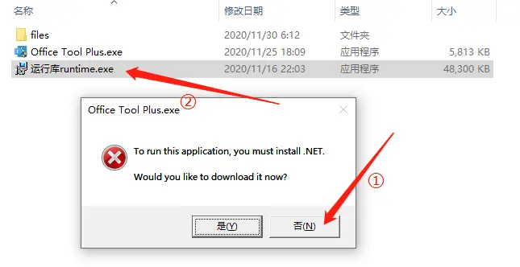

点击安装，并等待安装完成即可。

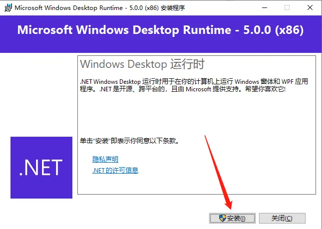

安装完成后，我们再点击第一个安装程序，点击“是”进行安装。

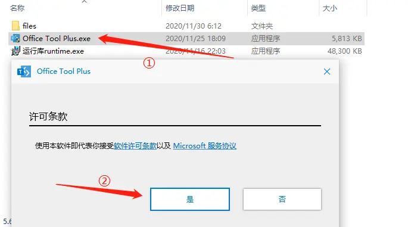

## 卸载旧版office

安装office2021前，我们需要先卸载电脑上已经安装了的其他office，因为他们彼此之间不兼容。（如果电脑上没有安装过office忽略这一步）

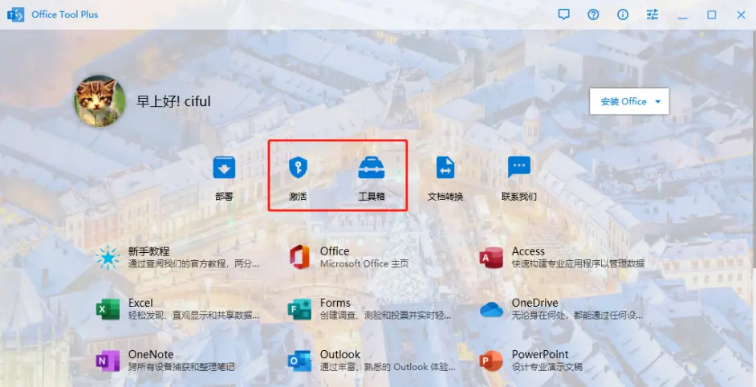

首先点击**工具箱→移除office→开始**，等待移除完成即可。移除期间界面可能会有一两次短暂的黑屏，这都是正常情况。

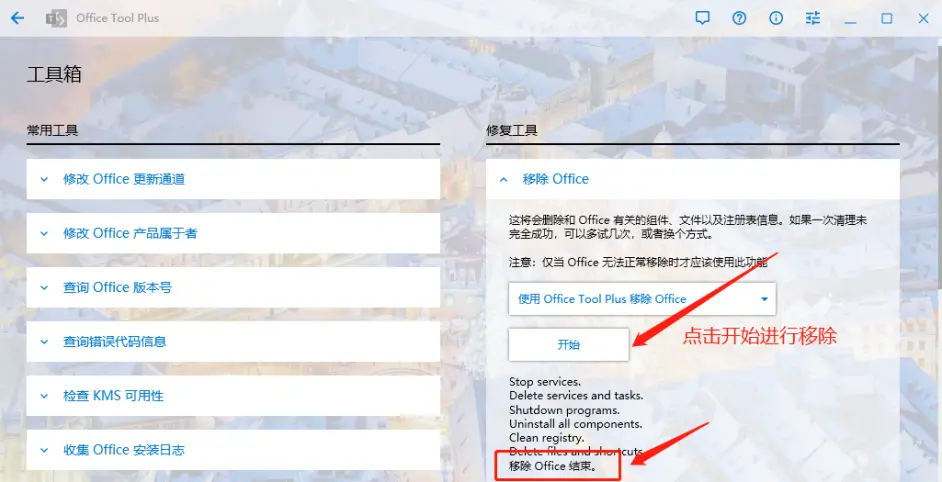

然后点击**激活→许可证管理→清除激活状态**，等待清除完成即可。

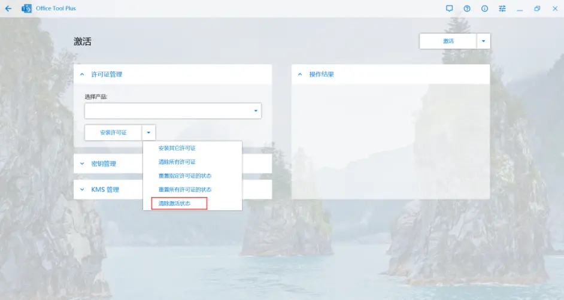

## 安装office

上面两步完成之后，我们回到最开始的界面，点击**部署**，然后选择**产品、通道、部署模式，安装模块**（这几项必须和我选的一样）。然后是否创建桌面快捷键和安装ISlide插件，根据自己的喜好勾选即可。设置完成后点击**开始部署**。

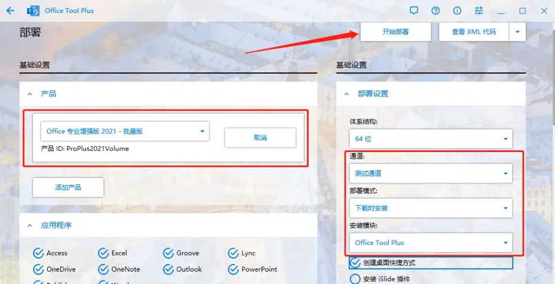

确认一下设置信息，没错就点击是，有错点击否进行修改，再部署。

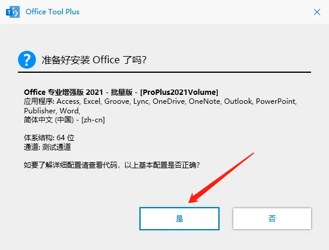

等待office自动下载安装。这期间必须保持网络畅通。尽量不要切换程序去做其他事，因为自动安装的时候需要一些内存，避免卡顿。安装完成后点击关闭即可。

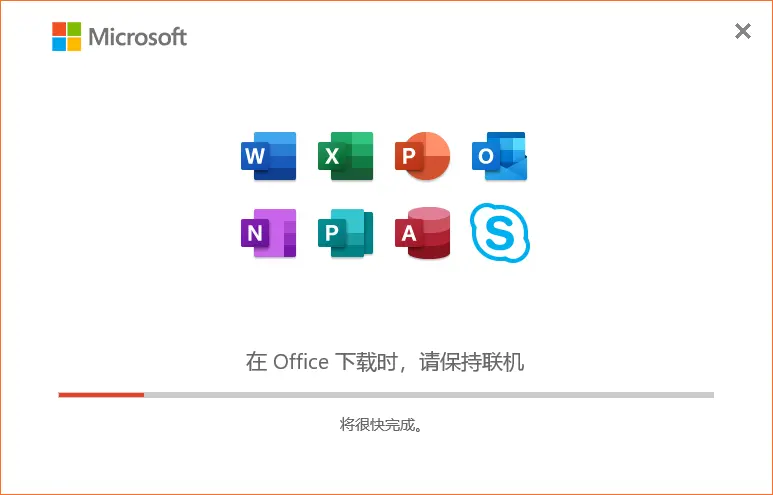

然后如果勾选了桌面快捷键桌面上就有，没有勾选就点击左下角开始菜单，最近添加里面。

 

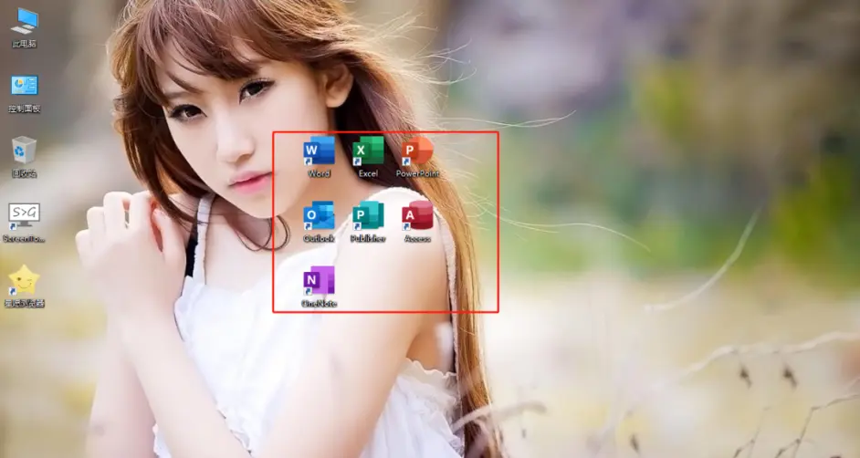

## 激活状态

一般来说安装完成就是已经激活的状态。如果显示没激活可以先退出去一分钟再打开看看。如果还是没有激活就进行下一步操作。

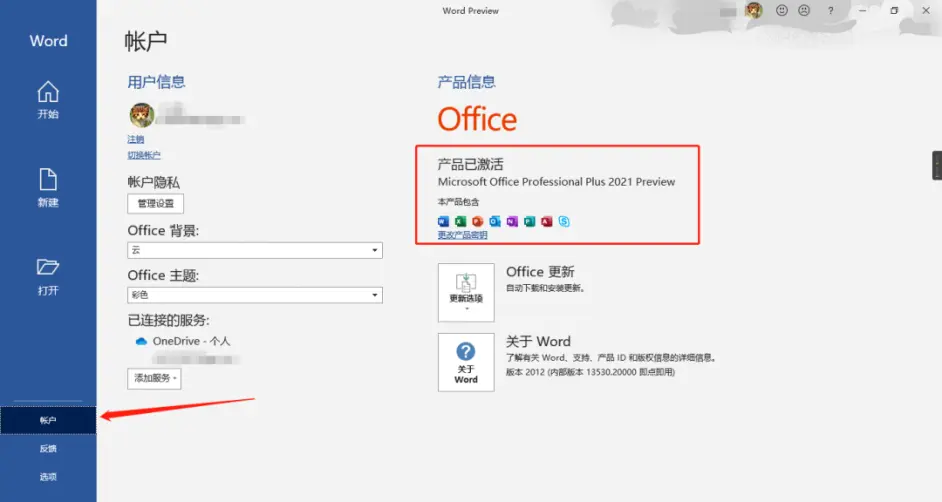

回到部署工具里的“激活”，在kms管理里面设定kms地址为**kms.luochenzhimu.com**并保存，最后点击右上角的“激活”按钮即可。

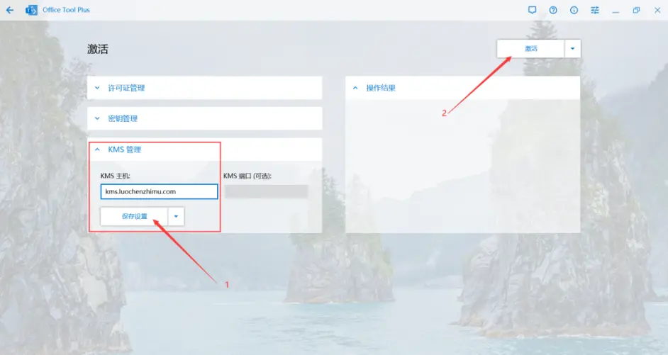

为了大家更好的白嫖，安装不出错，教程写得非常详细，基本每一步都有截图。所以有点长，大家可以根据步骤来一步一步操作。有问题可以在群里问。
