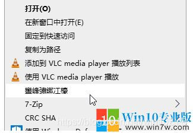
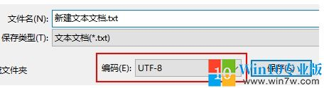
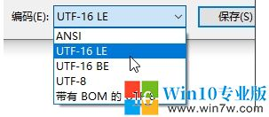

# windows常用注册表

:::tip

常用注册表管理工具
regedit  
[https://registry-finder.com/](https://registry-finder.com/)
registry workshop(收费)
:::

## 常见问题

在使用电脑过程中，很多时候为了设置系统会使用注册表导入操作，但是有时用户会发现，如我们导入一些添加右键菜单功能的注册表，左导入之后菜单、选项变成乱码的问题，那么这是怎么回事，如何解决呢。



解决方法：
1、Windows 10的记事本不断升级有了更多功能，但它也改变了默认保存文件的编码，以前默认的编码是ANSI，但现在默认保存文件的编码是UTF-8。



记事本非常的轻巧，但使用它编辑保存reg文件需要注意编码问题，将使用UTF-8保存的reg文件导入注册表会出现中文乱码。

2、避免中文乱码的方法也很简单，在记事本中将reg文件另存为，使用ANSI或UTF-16 LE编码保存即可，其中UTF-16 LE是系统导出注册表文件的默认编码。



3、保存后重新导入，可以看到添加的中文菜单已正常显示。

## 常用的注册表

添加右键打开cmd(已经不需要了,因为有terminal)

```reg
Windows Registry Editor Version 5.00
[HKEY_LOCAL_MACHINE\SOFTWARE\Classes\Directory\background\shell\cmd_here]
@="在此处打开命令行"
"Icon"="cmd.exe"
[HKEY_LOCAL_MACHINE\SOFTWARE\Classes\Directory\background\shell\cmd_here\command]
@="\"C:\\Windows\\System32\\cmd.exe\""
[HKEY_LOCAL_MACHINE\SOFTWARE\Classes\Folder\shell\cmdPrompt]
@="在此处打开命令行"
[HKEY_LOCAL_MACHINE\SOFTWARE\Classes\Folder\shell\cmdPrompt\command]
@="\"C:\\Windows\\System32\\cmd.exe\" \"cd %1\""
[HKEY_LOCAL_MACHINE\SOFTWARE\Classes\Directory\shell\cmd_here]
@="在此处打开命令行"
"Icon"="cmd.exe"
[HKEY_LOCAL_MACHINE\SOFTWARE\Classes\Directory\shell\cmd_here\command]
@="\"C:\\Windows\\System32\\cmd.exe\""
```

添加用记事本打开

```regex
Windows Registry Editor Version 5.00
[HKEY_LOCAL_MACHINE\SOFTWARE\Microsoft\Windows NT\CurrentVersion\Image File Execution Options\notepad.exe]
"Debugger"="\"D:\\\\Program Files\\\\Notepad3\\\\Notepad3.exe\" /z"
[HKEY_CLASSES_ROOT\*\shell\用记事本打开]
"Icon"="D:\\Program Files\\Notepad3\\Notepad3.exe"
@="用记事本打开"
[HKEY_CLASSES_ROOT\*\shell\用记事本打开\command]
@="notepad %1 "
```

txt拓展无法用记事本打开

```reg
Windows Registry Editor Version 5.00
[HKEY_CLASSES_ROOT\.txt]
@="txtfile"
"Content Type"="text/plain"
[HKEY_CLASSES_ROOT\.txt\ShellNew]
"NullFile"="" [HKEY_CLASSES_ROOT\txtfile]
@="文本文档"
[HKEY_CLASSES_ROOT\txtfile\shell]
[HKEY_CLASSES_ROOT\txtfile\shell\open]
[HKEY_CLASSES_ROOT\txtfile\shell\open\command]
@="NOTEPAD.EXE %1"
```
