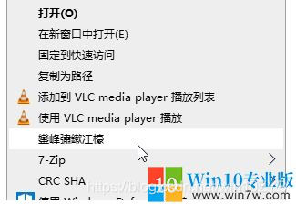
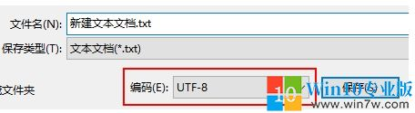
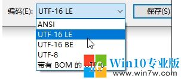

# windows常用注册表

:::tip

常用注册表管理工具
regedit
[https://registry-finder.com/](https://registry-finder.com/)
registry workshop(收费)
:::

## 常见问题

在使用电脑过程中，很多时候为了设置系统会使用注册表导入操作，但是有时用户会发现，如我们导入一些添加右键菜单功能的注册表，左导入之后菜单、选项变成乱码的问题，那么这是怎么回事，如何解决呢。



解决方法：
1、Windows 10的记事本不断升级有了更多功能，但它也改变了默认保存文件的编码，以前默认的编码是ANSI，但现在默认保存文件的编码是UTF-8。



记事本非常的轻巧，但使用它编辑保存reg文件需要注意编码问题，将使用UTF-8保存的reg文件导入注册表会出现中文乱码。

2、避免中文乱码的方法也很简单，在记事本中将reg文件另存为，使用ANSI或UTF-16 LE编码保存即可，其中UTF-16 LE是系统导出注册表文件的默认编码。



3、保存后重新导入，可以看到添加的中文菜单已正常显示。

## 右键菜单增强

### 添加"用VS Code打开"

```reg
Windows Registry Editor Version 5.00

[HKEY_CLASSES_ROOT\*\shell\VSCode]
@="用 VS Code 打开"
"Icon"="D:\\Program Files\\Microsoft VS Code\\Code.exe"

[HKEY_CLASSES_ROOT\*\shell\VSCode\command]
@="\"D:\\Program Files\\Microsoft VS Code\\Code.exe\" \"%1\""

[HKEY_CLASSES_ROOT\Directory\shell\VSCode]
@="用 VS Code 打开文件夹"
"Icon"="D:\\Program Files\\Microsoft VS Code\\Code.exe"

[HKEY_CLASSES_ROOT\Directory\shell\VSCode\command]
@="\"D:\\Program Files\\Microsoft VS Code\\Code.exe\" \"%1\""

[HKEY_CLASSES_ROOT\Directory\Background\shell\VSCode]
@="用 VS Code 打开"
"Icon"="D:\\Program Files\\Microsoft VS Code\\Code.exe"

[HKEY_CLASSES_ROOT\Directory\Background\shell\VSCode\command]
@="\"D:\\Program Files\\Microsoft VS Code\\Code.exe\" \"%V\""
```

> 注意：将 `D:\\Program Files\\Microsoft VS Code\\Code.exe` 替换为你的 VS Code 实际安装路径。

### 添加"Open Terminal Here"（在当前目录打开终端）

```reg
Windows Registry Editor Version 5.00

[HKEY_CLASSES_ROOT\Directory\Background\shell\wt]
@="在此处打开终端"
"Icon"="C:\\Program Files\\WindowsApps\\Microsoft.WindowsTerminal_*\\WindowsTerminal.exe"

[HKEY_CLASSES_ROOT\Directory\Background\shell\wt\command]
@="\"C:\\Program Files\\WindowsApps\\Microsoft.WindowsTerminal_*\\WindowsTerminal.exe\" -d \"%V\""

[HKEY_CLASSES_ROOT\Directory\shell\wt]
@="在此处打开终端"
"Icon"="C:\\Program Files\\WindowsApps\\Microsoft.WindowsTerminal_*\\WindowsTerminal.exe"

[HKEY_CLASSES_ROOT\Directory\shell\wt\command]
@="\"C:\\Program Files\\WindowsApps\\Microsoft.WindowsTerminal_*\\WindowsTerminal.exe\" -d \"%1\""
```

> 注意：路径中的星号 `*` 请替换为实际版本号，可在 `C:\Program Files\WindowsApps\` 下查看。

### 添加"复制文件路径"到右键菜单

```reg
Windows Registry Editor Version 5.00

[HKEY_CLASSES_ROOT\*\shell\copypath]
@="复制文件路径"
"Icon"="imageres.dll,19"

[HKEY_CLASSES_ROOT\*\shell\copypath\command]
@="mshta VBScript:ClipboardData.SetData(\"text\",\"%1\")(close)"

[HKEY_CLASSES_ROOT\Directory\shell\copypath]
@="复制文件夹路径"
"Icon"="imageres.dll,19"

[HKEY_CLASSES_ROOT\Directory\shell\copypath\command]
@="mshta VBScript:ClipboardData.SetData(\"text\",\"%1\")(close)"
```

### 删除"用画图3D编辑"（删除无用右键菜单项）

```reg
Windows Registry Editor Version 5.00

; 删除"用画图3D编辑"
[-HKEY_CLASSES_ROOT\SystemFileAssociatives\.bmp\Shell\3D Edit]
[-HKEY_CLASSES_ROOT\SystemFileAssociatives\.gif\Shell\3D Edit]
[-HKEY_CLASSES_ROOT\SystemFileAssociatives\.jpg\Shell\3D Edit]
[-HKEY_CLASSES_ROOT\SystemFileAssociatives\.jpeg\Shell\3D Edit]
[-HKEY_CLASSES_ROOT\SystemFileAssociatives\.png\Shell\3D Edit]
[-HKEY_CLASSES_ROOT\SystemFileAssociatives\.tif\Shell\3D Edit]
[-HKEY_CLASSES_ROOT\SystemFileAssociatives\.tiff\Shell\3D Edit]
```

### 删除"使用Windows Defender扫描"

```reg
Windows Registry Editor Version 5.00

[-HKEY_CLASSES_ROOT\*\shellex\ContextMenuHandlers\EPP]
[-HKEY_CLASSES_ROOT\Directory\shellex\ContextMenuHandlers\EPP]
[-HKEY_CLASSES_ROOT\Drive\shellex\ContextMenuHandlers\EPP]
```

### 删除"包含到库"右键菜单

```reg
Windows Registry Editor Version 5.00

[-HKEY_CLASSES_ROOT\Folder\shellex\ContextMenuHandlers\LibraryLocation]
```

### 删除"还原以前的版本"右键菜单

```reg
Windows Registry Editor Version 5.00

[-HKEY_CLASSES_ROOT\AllFilesystemObjects\shellex\ContextMenuHandlers\{596AB062-B4D2-4215-9F74-E9109B0A8153}]
```

### 删除"授予访问权限"右键菜单

```reg
Windows Registry Editor Version 5.00

[-HKEY_CLASSES_ROOT\AllFilesystemObjects\shellex\ContextMenuHandlers\Sharing]
```

### 禁用Windows自动重启

```reg
Windows Registry Editor Version 5.00

[HKEY_LOCAL_MACHINE\SOFTWARE\Policies\Microsoft\Windows\WindowsUpdate\AU]
"NoAutoRebootWithLoggedOnUsers"=dword:00000001
"AUOptions"=dword:00000002
"ScheduledInstallDay"=dword:00000000
"ScheduledInstallTime"=dword:00000003
```

### 性能优化

### 禁用透明效果

```reg
Windows Registry Editor Version 5.00

[HKEY_CURRENT_USER\SOFTWARE\Microsoft\Windows\CurrentVersion\Themes\Personalize]
"EnableTransparency"=dword:00000000
```

### 禁用动画效果

```reg
Windows Registry Editor Version 5.00

[HKEY_CURRENT_USER\Control Panel\Desktop]
"MenuShowDelay"="0"
"WaitToKillAppTimeout"="2000"
"HungAppTimeout"="2000"
"AutoEndTasks"="1"

[HKEY_CURRENT_USER\SOFTWARE\Microsoft\Windows\CurrentVersion\Explorer\Advanced]
"DisallowShaking"=dword:00000001
```

### 禁用Windows Search索引（节省CPU）

```reg
Windows Registry Editor Version 5.00

[HKEY_LOCAL_MACHINE\SOFTWARE\Policies\Microsoft\Windows\Windows Search]
"AllowIndexingEncryptedStoresOrItems"=dword:00000000
"PreventIndexOnBattery"=dword:00000001
"PreventIndexingLowDiskSpaceMB"=dword:00000005
```

### 禁用Windows Ink工作区

```reg
Windows Registry Editor Version 5.00

[HKEY_CURRENT_USER\SOFTWARE\Policies\Microsoft\Windows\WindowsInkWorkspace]
"AllowWindowsInkWorkspace"=dword:00000000
"AllowSuggestedAppsInWindowsInkWorkspace"=dword:00000000
```

## 高级功能

### 启用Windows上帝模式（God Mode）

创建一个新文件夹，重命名为（包括花括号）：

```
GodMode.{ED7BA470-8E54-465E-825C-99712043E01C}
```

这不是注册表操作，但效果类似，会在文件夹中显示所有系统设置。

### 禁用UAC（用户账户控制）

```reg
Windows Registry Editor Version 5.00

[HKEY_LOCAL_MACHINE\SOFTWARE\Microsoft\Windows\CurrentVersion\Policies\System]
"EnableLUA"=dword:00000000
"ConsentPromptBehaviorAdmin"=dword:00000000
"PromptOnSecureDesktop"=dword:00000000
```

> 警告：禁用UAC会降低系统安全性，请谨慎操作。

### 加快关机速度

```reg
Windows Registry Editor Version 5.00

[HKEY_LOCAL_MACHINE\SYSTEM\CurrentControlSet\Control]
"WaitToKillServiceTimeout"="2000"

[HKEY_CURRENT_USER\Control Panel\Desktop]
"HungAppTimeout"="2000"
"WaitToKillAppTimeout"="2000"
"AutoEndTasks"="1"
```

### 网络优化

### 禁用IPv6（部分场景需要）

```reg
Windows Registry Editor Version 5.00

[HKEY_LOCAL_MACHINE\SYSTEM\CurrentControlSet\Services\Tcpip6\Parameters]
"DisabledComponents"=dword:000000ff
```

### 禁用TCP自动调优

```reg
Windows Registry Editor Version 5.00

[HKEY_LOCAL_MACHINE\SYSTEM\CurrentControlSet\Services\Tcpip\Parameters]
"EnableTCPA"=dword:00000000
"TCPWindowSize"=dword:0000ffff
```

### 禁用Windows更新P2P分发（节省带宽）

```reg
Windows Registry Editor Version 5.00

[HKEY_LOCAL_MACHINE\SOFTWARE\Microsoft\Windows\CurrentVersion\DeliveryOptimization\Config]
"DODownloadMode"=dword:00000000
"DOAbsoluteMaxCacheSize"=dword:00000000
"DOMaxCacheAge"=dword:00000000
```

## 常用网络命令对应的注册表路径

### 修改Hosts文件

路径：`C:\Windows\System32\drivers\etc\hosts`

（Hosts文件不是注册表，但作用类似，用于域名解析覆盖）

### 重置网络配置（等效于cmd命令）

```bat
netsh int ip reset
netsh winsock reset
ipconfig /flushdns
```

对应的注册表项：

- `HKEY_LOCAL_MACHINE\SYSTEM\CurrentControlSet\Services\Tcpip\Parameters`
- `HKEY_LOCAL_MACHINE\SYSTEM\CurrentControlSet\Services\Winsock`
- `HKEY_LOCAL_MACHINE\SYSTEM\CurrentControlSet\Services\Winsock2`

## 常用的注册表

添加用记事本打开

```regex
Windows Registry Editor Version 5.00
[HKEY_LOCAL_MACHINE\SOFTWARE\Microsoft\Windows NT\CurrentVersion\Image File Execution Options\notepad.exe]
"Debugger"="\"D:\\\\Program Files\\\\Notepad3\\\\Notepad3.exe\" /z"
[HKEY_CLASSES_ROOT\*\shell\用记事本打开]
"Icon"="D:\\Program Files\\Notepad3\\Notepad3.exe"
@="用记事本打开"
[HKEY_CLASSES_ROOT\*\shell\用记事本打开\command]
@="notepad %1 "
```

txt拓展无法用记事本打开

```reg
Windows Registry Editor Version 5.00
[HKEY_CLASSES_ROOT\.txt]
@="txtfile"
"Content Type"="text/plain"
[HKEY_CLASSES_ROOT\.txt\ShellNew]
"NullFile"="" [HKEY_CLASSES_ROOT\txtfile]
@="文本文档"
[HKEY_CLASSES_ROOT\txtfile\shell]
[HKEY_CLASSES_ROOT\txtfile\shell\open]
[HKEY_CLASSES_ROOT\txtfile\shell\open\command]
@="NOTEPAD.EXE %1"
```

## 注册表相关

1.打开注册表键：`HKEY_CURRENT_USER\Software\Microsoft\Windows\CurrentVersion\Explorer\FileExts\.extension\OpenWithList .extension`指你所要修改的文件扩展名。删除值和你所要去掉的程序名称相同的键就可以了。

2.在工具---文件夹选项---文件类型---把不要的文件类型删除

3.打开注册表编辑器，在`[HKEY_CURRENT_USER\Software\Microsoft\Windows\CurrentVersion\Explorer\FileExts]`和`[HKEY_CLASSES_ROOT＼SystemFileAssociations]`分支下中找到相应扩展名分支，然后在“OpenWithList”项中删除不需要的键值或项即可。

以上三种方法全是删除“打开方式”中的图标的。

在`HKEY_CLASSES_ROOT\Applications`里可以删除“打开方式－选择程序－其他程序”中的无用的程序的。打开`HKEY_CLASSES_ROOT\Applications`，找到你要删除的打开方式的程序，再找到你不想让它支持的扩展名并删除。
通过在我机子上对.mp3,.wma,.wmv等格式文件的试验，我发现对于不同的软件写入注册表的位置和方式是不同的，所以解决方法也不同，上面三种方法你都试一下。不懂注册表的话先了解一下，修改注册表前先备份，以防万一。

## notepad镜像

`HKEY_LOCAL_MACHINE\SOFTWARE\Microsoft\Windows NT\CurrentVersion\Image File Execution Options\notepad.exe`
修改这个可以通过notepad命令执行你添加的程序

## 修改拓展名对应打开的软件

`HKEY_CLASSES_ROOT\txtfile\shell\open\command`类似这样的,可以自行查看
`HKEY_CLASSES_ROOT\.yml`查看拓展名
`HKEY_CURRENT_USER\SOFTWARE\Microsoft\Windows\CurrentVersion\Explorer\FileExts\.json\OpenWithList` 这里显示openwithlist

### 修改文件默认打开方式

推荐使用filetypes manager
请百度搜索`修改注册表实现文件默认打开方式`
例如[链接](https://blog.csdn.net/a302549450/article/details/84308175)
`HKEY_CLASSES_ROOT\xmlfile\shell\Open\command`,把里面的`默认`的值改为`"C:\Program Files\Kate\bin\kate.exe" %1`
